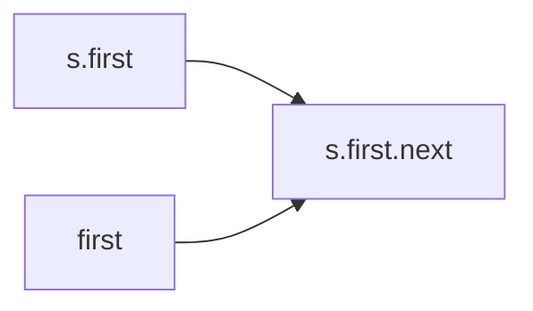
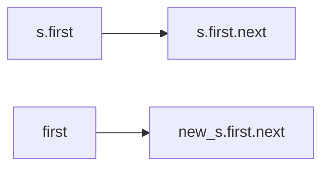

[toc]

# 栈

## 动态数组

implements Iterable<Item>的泛型一定要写，不然使用for each循环时，编译器会认为Object

pop记得检查stack是否为空，pop完要防止对象游离

```java
import java.util.Iterator;
import java.util.NoSuchElementException;

public class ResizingArrayStack<Item> implements Iterable<Item>{
    private static final int INIT_CAPACITY = 8;
    private Item[] a = (Item[]) new Object[8];
    private int N = 0;
	
    public ResizingArrayStack() {
        a = (Item[]) new Object[INIT_CAPACITY];
        N = 0;
    }
    
    public boolean isEmpty(){
        return N == 0;
    }

    public int size(){
        return N;
    }
    
    // resize the underlying array holding the elements
    private void resize(int capacity) {
        assert capacity >= N;
        
        Item[] copy = (Item[]) new Object[capacity];
        for (int i = 0; i < N; i++) {
            copy[i] = a[i];
        }
        a = copy;

       // alternative implementation
       // a = java.util.Arrays.copyOf(a, capacity);
    }
    
    public void push(Item item){
        //如果没有足够空间，将数组长度翻倍
        if (N == a.length){
            resize(a.length *2);
        }
        a[N++] = item;
    }
    public Item pop(){
        if (isEmpty()){
        	throw new NoSuchElementException();
        }
        Item item = a[--N];
        //避免对象游离
        a[N] = null;
        //如果栈大小小于数组的四分一，数组长度减半
        if (N > 0 && N < a.length/4){
            resize(a.length/2);
        }
        return item;
    }

    @Override
    public Iterator<Item> iterator() {
        return new ReverseArrayIterator();
    }

    private class ReverseArrayIterator implements Iterator<Item>{
        //支持后进先出的迭代
        //用i而不用N是因为iterator遍历时不能改变stack里的N
        private int i;

        public ReverseArrayIterator() {
            i = N - 1;
        }
        
        @Override
        public boolean hasNext() {
            return i >= 0;
        }

        @Override
        public Item next() {
            if (!hasNext()) throw new NoSuchElementException();
            return a[i--];
        }
    }
}

```

## 链表

头插法，push时不用检查stack为不为空。尾插法时通常都要检查

如果需要在尾部添加一个新节点，则需要一个指向链表最后一个节点的链接。

这种实现达成了：

-   可以处理任意类型的数据
-   所需的空间总是和集合的大小成正比
-   操作所需的时间总是和集合的大小无关

```java
import java.util.Iterator;
import java.util.NoSuchElementException;

public class Stack <Item> implements Iterable<Item>{
    //栈顶
    private Node first;
    private int N;

    private class Node{
        Item item;
        Node next;
    }
	
    public Stack() {
        first = null;
        N = 0;
    }
    
    public boolean isEmpty(){
        //or N == 0;
        return first == null;
    }

    public int size(){
        return N;
    }

    public void push(Item item){
        //向栈顶添加元素，头插法
        Node oldFirst = first;
        first = new Node();
        first.item = item;
        first.next = oldFirst;
        N++;
    }

    public Item pop(){
        //从栈顶删除元素
        if (isEmpty()) throw new NoSuchElementException("Stack underflow");
        Item item = first.item;
        first = first.next;
        N--;
        return item;
    }
	
    public String toString() {
        StringBuilder s = new StringBuilder();
        for (Item item : this) {
            s.append(item);
            s.append(' ');
        }
        return s.toString();
    }
    
    @Override
    public Iterator<Item> iterator() {
        return new StackIterator();
    }

    private class StackIterator implements Iterator<Item>{
        private Node current = first;

        @Override
        public boolean hasNext() {
            return current != null;
        }

        @Override
        public Item next() {
            if (!hasNext()) throw new NoSuchElementException();
            Item item = current.item;
            current = current.next;
            return item;
        }
    }
}
```


## 题
### 双栈算术表达式求值

-   将操作数压入操作数栈
-   将运算符压入运算符栈
-   忽略左括号
-   遇到右括号时，弹出一个运算符，弹出所需数量的操作数，并将运算结果压入操作数栈

```java
import java.util.Stack;

public class Evaluate {
    public static void main(String[] args) {
        Stack<String> ops = new Stack<>();
        Stack<Double> vals = new Stack<>();
        String equation = "(1+((2+3)*(4*5)))";
        for (int i = 0; i < equation.length(); i++) {
            String s = String.valueOf(equation.charAt(i));
            //如果时运算符则压入ops栈
            if (s.equals("(")){
                ;
            }
            else if (s.equals("+")){
                ops.push(s);
            }
            else if (s.equals("-")){
                ops.push(s);
            }
            else if (s.equals("*")){
                ops.push(s);
            }
            else if (s.equals("/")){
                ops.push(s);
            }
            else if (s.equals("sqrt")){
                ops.push(s);
            }
            //如果字符为“)”，弹出运算符和操作数，计算结果并压入栈
            else if (s.equals(")")){
                String op = ops.pop();
                //因为有运算顺序的问题，先pop的是后面的operand
                double v = vals.pop();
                if (op.equals("+")){
                    v = vals.pop() + v;
                }
                else if (op.equals("-")){
                    v = vals.pop() - v;
                }
                else if (op.equals("*")){
                    v = vals.pop() * v;
                }
                else if (op.equals("/")){
                    v = vals.pop() / v;
                }
                else if (op.equals("sqrt")){
                    v = Math.sqrt(v);
                }
                vals.push(v);
            }
            //字符不是运算符也不是括号1，将它作为值压入vals
            else{
                vals.push(Double.parseDouble(s));
            }
        }
        System.out.println(vals.pop());
    }
}

```

### 配对的括号

>   使用栈判断括号是否匹配完整。[ ( ) ] { } { [ ( ) ( ) ] ( ) } 打印 true。[ ( ] ) 打印 false

遇到左括号就push进stack，遇到右括号就pop一个，pop出来的这个必须跟右括号匹配。

注意pop时检查stack是否为空，否则为NullPointer

```java
public class Parentheses {
    private static final char LEFT_PAREN     = '(';
    private static final char RIGHT_PAREN    = ')';
    private static final char LEFT_BRACE     = '{';
    private static final char RIGHT_BRACE    = '}';
    private static final char LEFT_BRACKET   = '[';
    private static final char RIGHT_BRACKET  = ']';

    public static boolean isBalanced(String s) {
        Stack<Character> stack = new Stack<Character>();
        for (int i = 0; i < s.length(); i++) {
            if (s.charAt(i) == LEFT_PAREN)   stack.push(LEFT_PAREN);
            if (s.charAt(i) == LEFT_BRACE)   stack.push(LEFT_BRACE);
            if (s.charAt(i) == LEFT_BRACKET) stack.push(LEFT_BRACKET);

            if (s.charAt(i) == RIGHT_PAREN) {
                if (stack.isEmpty())           return false;
                if (stack.pop() != LEFT_PAREN) return false;
            }

            else if (s.charAt(i) == RIGHT_BRACE) {
                if (stack.isEmpty())           return false;
                if (stack.pop() != LEFT_BRACE) return false;
            }

            else if (s.charAt(i) == RIGHT_BRACKET) {
                if (stack.isEmpty())             return false;
                if (stack.pop() != LEFT_BRACKET) return false;
            }
        }
        return stack.isEmpty();
    }


    public static void main(String[] args) {
        In in = new In();
        String s = in.readAll().trim();
        StdOut.println(isBalanced(s));
    }
}

```

### 补全括号

>   得到一个缺少左括号的表达式并打印出补全括号之后的中序表达式
>
>   输入：1+2 ) * 3-4 ) * 5-6 ) ) )
>
>   输出：( ( 1+2 ) * ( ( 3-4) * ( 5-6 ) ) )

遇到 ），ops pop出一个运算符，vales pop出两个值，写成 (val1 ? val2) 再push到vales里

```java
package LinkedPrac;

import java.util.Stack;

public class InfixMakeup {
    public static void main(String[] args) {
        Stack<String> ops = new Stack<>();
        Stack<String> vales = new Stack<>();

        String s = "1+2)*3-4)*5-6)))";
        for (int i = 0; i < s.length(); i++) {
            String s1 = String.valueOf(s.charAt(i));
            if ("+".equals(s1) || "*".equals(s1) || "-".equals(s1)){
                ops.push(s1);
            }
            else if ("(".equals(s1)){ }
            else if (")".equals(s1)){
                String op = ops.pop();
                String val = vales.pop();
                StringBuilder sb = new StringBuilder();
                sb.append("(")
                        .append(vales.pop())
                        .append(op)
                        .append(val)
                        .append(")");
                vales.push(sb.toString());
            }
            else {
                vales.push(s1);
            }
        }
        System.out.println(vales.pop());
    }
}

```

### 中序表达式转后序 表达式

只能转换有括号和只有+和*的中序表达式

>   输入：( 2 + ( ( 3 + 4 ) * ( 5 * 6 ) ) )
>
>   输出：2 3 4 + 5 6 * * + 
>
>   输入：( ( ( 5 + ( 7 * ( 1 + 1 ) ) ) * 3 ) + ( 2 * ( 1 + 1 ) ) )
>
>   输出：5 7 1 1 + * + 3 * 2 1 1 + * + 

```java
Stack<String> stack = new Stack<String>();
while (!StdIn.isEmpty()) {
    String s = StdIn.readString();
    if      (s.equals("+")) stack.push(s);
    else if (s.equals("*")) stack.push(s);
    else if (s.equals(")")) StdOut.print(stack.pop() + " ");
    else if (s.equals("(")) StdOut.print("");
    else                    StdOut.print(s + " ");
}
StdOut.println();
```

法二：

1）我们使用一个stack栈结构存储操作符，用一个List结构存储后缀表达式结果

　　2）首先读取到数字，直接存入list中

　　3）当读取到左括号"("时，直接压栈，当读取到运算符时，分两种情况讨论

　　　　a.当运算符栈为空或者栈顶操作符的优先级小于当前运算符优先级时(如+和-的优先级低于 * 和 /)，直接入栈

　　　　b.当运算符不为空时且栈顶操作符的优先级大于或等于当前运算符优先级时，循环执行出栈操作并加入list中，直到遇到优先级小于当前运算符的元素为止。循环执行完后再将当前运算符压栈。另外需要注意的是，只有遇到右括号时，左括号才出栈

　　4) 当遇到右括号")"时，循环执行出栈操作并加入到list中，直到遇到左括号为止。并将左括号弹出，但不加入list中

　　5) 表达式的值读取完后，将操作符栈中的所有元素弹出并加入到list中

　　执行完上面步骤后，list中存储的顺序即为我们转换后的后缀表达式的结果

```java
private static List<String> parseToSuffixExpression(List<String> expressionList) {
        //创建一个栈用于保存操作符
        Stack<String> opStack = new Stack<>();
        //创建一个list用于保存后缀表达式
        List<String> suffixList = new ArrayList<>();
        for(String item : expressionList){
            //得到数或操作符
            if(isOperator(item)){
                //是操作符 判断操作符栈是否为空
                if(opStack.isEmpty() || "(".equals(opStack.peek()) || priority(item) > priority(opStack.peek())){
                    //为空或者栈顶元素为左括号或者当前操作符大于栈顶操作符直接压栈
                    opStack.push(item);
                }else {
                    //否则将栈中元素出栈如队，直到遇到大于当前操作符或者遇到左括号时
                    while (!opStack.isEmpty() && !"(".equals(opStack.peek())){
                        if(priority(item) <= priority(opStack.peek())){
                            suffixList.add(opStack.pop());
                        }
                    }
                    //当前操作符压栈
                    opStack.push(item);
                }
            }else if(isNumber(item)){
                //是数字则直接入队
                suffixList.add(item);
            }else if("(".equals(item)){
                //是左括号，压栈
                opStack.push(item);
            }else if(")".equals(item)){
                //是右括号 ，将栈中元素弹出入队，直到遇到左括号，左括号出栈，但不入队
                while (!opStack.isEmpty()){
                    if("(".equals(opStack.peek())){
                        opStack.pop();
                        break;
                    }else {
                        suffixList.add(opStack.pop());
                    }
                }
            }else {
                throw new RuntimeException("有非法字符！");
            }
        }
        //循环完毕，如果操作符栈中元素不为空，将栈中元素出栈入队
        while (!opStack.isEmpty()){
            suffixList.add(opStack.pop());
        }
        return suffixList;
    }
    /**
     * 判断字符串是否为操作符
     * @param op
     * @return
     */
    public static boolean isOperator(String op){
        return op.equals("+") || op.equals("-") || op.equals("*") || op.equals("/");
    }

    /**
     * 判断是否为数字
     * @param num
     * @return
     */
    public static boolean isNumber(String num){
        return num.matches("\\d+");
    }

    /**
     * 获取操作符的优先级
     * @param op
     * @return
     */
    public static int priority(String op){
        if(op.equals("*") || op.equals("/")){
            return 1;
        }else if(op.equals("+") || op.equals("-")){
            return 0;
        }
        return -1;
    }
```

### 后序表达式求值

跟双栈算术表达式求值差不多

```java
Stack<Integer> stack = new Stack<Integer>();

while (!StdIn.isEmpty()) {
    String s = StdIn.readString();
    if      (s.equals("+")) stack.push(stack.pop() + stack.pop());
    else if (s.equals("*")) stack.push(stack.pop() * stack.pop());
    else stack.push(Integer.parseInt(s));
}
StdOut.println(stack.pop());
```

### 复制栈

>   为基于链表实现的栈编写一个新的构造函数，使以下代码
>
>   Stack<Item> t = new Stack<Item>(s);
>
>   得到的t指向栈s的一个新的独立副本

递归做法

```java
Node(Node x) {
   item = x.item;
   if (x.next != null) 
       next = new Node(x.next);
}

public Stack(Stack<Item> s) {
    first = new Node(s.first); 
}
```

循环做法

new Node(x)新建出来的Node的next还是指向原来的Node.next。所以要修改新建出来Node.next，让他指向新的copy



先复制头节点（让新栈的first指向new Node(s.first)），然后一个个修改x.next




```java
Node(Node x) {
    this.item = x.item; 
    this.next = x.next; 
}

public Stack(Stack<Item> s) {
   if (s.first != null) {
      first = new Node(s.first);
      for (Node x = first; x.next != null; x = x.next)
         x.next = new Node(x.next);
   }
}
```


# 队列

## 动态数组

```java
import java.util.Iterator;
import java.util.NoSuchElementException;

public class ResizingArrayQueue<Item> implements Iterable<Item> {
    // initial capacity of underlying resizing array
    private static final int INIT_CAPACITY = 8;

    private Item[] q;       // queue elements
    private int n;          // number of elements on queue
    private int first;      // index of first element of queue
    private int last;       // index of next available slot


    /**
     * Initializes an empty queue.
     */
    public ResizingArrayQueue() {
        q = (Item[]) new Object[INIT_CAPACITY];
        n = 0;
        first = 0;
        last = 0;
    }

    /**
     * Is this queue empty?
     * @return true if this queue is empty; false otherwise
     */
    public boolean isEmpty() {
        return n == 0;
    }

    /**
     * Returns the number of items in this queue.
     * @return the number of items in this queue
     */
    public int size() {
        return n;
    }

    // resize the underlying array
    private void resize(int capacity) {
        assert capacity >= n;
        Item[] copy = (Item[]) new Object[capacity];
        for (int i = 0; i < n; i++) {
            copy[i] = q[(first + i) % q.length];
        }
        q = copy;
        first = 0;
        last  = n;
    }

    /**
     * Adds the item to this queue.
     * @param item the item to add
     */
    public void enqueue(Item item) {
        // double size of array if necessary and recopy to front of array
        if (n == q.length) resize(2*q.length);   // double size of array if necessary
        q[last++] = item;                        // add item
        if (last == q.length) last = 0;          // wrap-around
        n++;
    }

    /**
     * Removes and returns the item on this queue that was least recently added.
     * @return the item on this queue that was least recently added
     * @throws java.util.NoSuchElementException if this queue is empty
     */
    public Item dequeue() {
        if (isEmpty()) throw new NoSuchElementException("Queue underflow");
        Item item = q[first];
        q[first] = null;                            // to avoid loitering
        n--;
        first++;
        if (first == q.length) first = 0;           // wrap-around
        // shrink size of array if necessary
        if (n > 0 && n == q.length/4) resize(q.length/2); 
        return item;
    }

    /**
     * Returns the item least recently added to this queue.
     * @return the item least recently added to this queue
     * @throws java.util.NoSuchElementException if this queue is empty
     */
    public Item peek() {
        if (isEmpty()) throw new NoSuchElementException("Queue underflow");
        return q[first];
    }


    /**
     * Returns an iterator that iterates over the items in this queue in FIFO order.
     * @return an iterator that iterates over the items in this queue in FIFO order
     */
    public Iterator<Item> iterator() {
        return new ArrayIterator();
    }

    // an iterator, doesn't implement remove() since it's optional
    private class ArrayIterator implements Iterator<Item> {
        private int i = 0;
        public boolean hasNext()  { return i < n;                               }
        public void remove()      { throw new UnsupportedOperationException();  }

        public Item next() {
            if (!hasNext()) throw new NoSuchElementException();
            Item item = q[(i + first) % q.length];
            i++;
            return item;
        }
    }

   /**
     * Unit tests the {@code ResizingArrayQueue} data type.
     *
     * @param args the command-line arguments
     */
    public static void main(String[] args) {
        ResizingArrayQueue<String> queue = new ResizingArrayQueue<String>();
        while (!StdIn.isEmpty()) {
            String item = StdIn.readString();
            if (!item.equals("-")) queue.enqueue(item);
            else if (!queue.isEmpty()) StdOut.print(queue.dequeue() + " ");
        }
        StdOut.println("(" + queue.size() + " left on queue)");
    }

}

```


## 链表

enqueue和dequeue时需要检查队列是否为空

```java
import java.util.Iterator;
import java.util.NoSuchElementException;

public class Queue<Item> implements Iterable<Item> {
    //指向最早添加的节点的链接
    private Node first;
    //指向最迟添加的节点的链接
    private Node last;
    private int N;

    private class Node {
        Item item;
        Node next;
    }
	
    public Queue() {
        first = null;
        last  = null;
        N = 0;
    }
    
    public boolean isEmpty() {
        return first == null;
    }

    public int size() {
        return N;
    }

    public void enqueue(Item item) {
        //向表尾添加元素
        Node oldLast = last;
        last = new Node();
        last.item = item;
        last.next = null;
        if (isEmpty()) {
            first = last;
        } else {
            oldLast.next = last;
        }
        N++;
    }

    public Item dequeue() {
        if (isEmpty()) throw new NoSuchElementException("Queue underflow");
        //从表头删除元素
        Item item = first.item;
        first = first.next;
        if (isEmpty()) {
            last = null;
        }
        N--;
        return item;
    }

    public String toString() {
        StringBuilder s = new StringBuilder();
        for (Item item : this) {
            s.append(item);
            s.append(' ');
        }
        return s.toString();
    } 
    
    @Override
    public Iterator<Item> iterator() {
        return new QueueIterator();
    }


    private class QueueIterator implements Iterator<Item> {
        private Node current = first;

        @Override
        public boolean hasNext() {
            return current != null;
        }

        @Override
        public Item next() {
            if (!hasNext()) throw new NoSuchElementException();
            Item item = current.item;
            current = current.next;
            return item;
        }
    }
}

```

## 题

### 约瑟夫环

>N个身陷绝境的人用以下方式减少生存的人数。他们围坐成一圈（位置从0到N-1）并从第一个人开始报数，报到M的人会被杀死，直到最后一个人留下来。传说中Josephus找到了不会被杀死的位置。编写一个Queue，打印出人们被杀死的顺序
>
>输入：7 2
>
>输出：1 3 5 0 4 2 6

从1报道M-1的人不会被杀，出队完再入队

报M的人出队

```java
package LinkedPrac;

import Chapter1.Queue;
import java.util.Scanner;

public class Josephus {
    public static void main(String[] args) {
        Scanner sc = new Scanner(System.in);
        int M = sc.nextInt();
        int N = sc.nextInt();
        Queue<Integer> queue = new Queue<Integer>();
        for (int i = 0; i < M; i++) {
            queue.enqueue(i);
        }
        while (!queue.isEmpty()){
            for (int j = 1; j < N; j++) {
                queue.enqueue(queue.dequeue());
            }
            System.out.print(queue.dequeue()+ " ");
        }
    }
}

```

# 背包

```java
import java.util.Iterator;
import java.util.NoSuchElementException;

public class Bag<Item> implements Iterable<Item> {
    private Node<Item> first;    // beginning of bag
    private int n;               // number of elements in bag

    private static class Node<Item> {
        private Item item;
        private Node<Item> next;
    }

    public Bag() {
        first = null;
        n = 0;
    }

    public boolean isEmpty() {
        return first == null;
    }

    public int size() {
        return n;
    }

    public void add(Item item) {
        Node<Item> oldfirst = first;
        first = new Node<Item>();
        first.item = item;
        first.next = oldfirst;
        n++;
    }

    public Iterator<Item> iterator()  {
        return new LinkedIterator(first);  
    }

    private class LinkedIterator implements Iterator<Item> {
        private Node<Item> current;

        public LinkedIterator(Node<Item> first) {
            current = first;
        }

        public boolean hasNext()  { return current != null;                     }
        
        public Item next() {
            if (!hasNext()) throw new NoSuchElementException();
            Item item = current.item;
            current = current.next; 
            return item;
        }
    }
}
```

