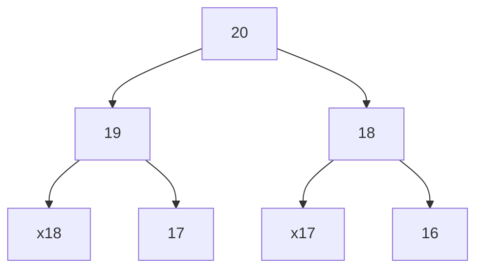

[toc]

# 动态规划

特点：重叠子问题，状态转移方程式，最优子结构

题型：求最值

核心：穷举（最值肯定要把所有的答案的可行解都求出来）

套路：明确状态（函数参数/数组索引），明确选择，明确dp函数/数组的定义，明确base case

框架：

```bash
#初始化 base case
dp[0][0][..] = base
#进行状态转移
for 状态1 in 状态1的所有取值:
	for 状态2 in 状态2的所有取值:
		for..
			dp[状态1][状态2][..] = 求最值(选择1，选择2, ..)
```

核心思想是：将大问题划分为小问题进行解决，从而一步步获取最优解。与分治不同的是，动态规划求解的问题，经分解得到的子问题往往不是互相独立的（即下一个阶段的求解是建立在上一个阶段的解的基础上）。可以通过填表的方式来逐步推进。

## 斐波那契数列 Fibonacci

### 暴力递归

有很多重复的计算

递归函数的时间复杂度 = 递归调用的次数 x 函数本身的复杂度。调用次数相当于满二叉树的结点数。




$O(1) \times O(2^n) = O(2^n)$ 

```java
public int fib(int n) {
	//base case
    if (n == 0 || n == 1) return n;
    return fib(n - 1) + fib(n - 2);
}
```

### 记忆递归

自顶向下 O(N)

```java
    public int fib(int N) {
        int[] memo = new int[N + 1];
        return helper(memo, N);
    }

    private int helper(int[] memo, int n) {
        if (n == 0 || n == 1) return n;
        if (memo[n] != 0) return memo[n];
        memo[n] = helper(memo, n - 1) + helper(memo, n - 2);
        return memo[n];
    }
```

### 数组迭代

自底向上 O(N)

```java
    public int fib(int N) {
        if (N == 0) return 0;
        int[] dp = new int[N + 1];
        //base case
        dp[0] = 0;
        dp[1] = 1;
        //状态转移
        for (int i = 2; i <= N; i++) {
            dp[i] = dp[i - 1] + dp[i - 2];
        }
        return dp[N];
    }
```

优化空间复杂度：

```java
    public int fib(int N) {
        //base case
        if (N == 0 || N == 1) return N;
        //递推关系
        int prev = 0, curr = 1;
        for (int i = 2; i <= N; i++) {
            int sum = prev + curr;
            prev = curr;
            curr = sum;
        }
        return curr;
    }
```

## 零钱兑换

>   给定不同面额的硬币coins和一个总金额amout。计算可以凑成总金额所需的最少的硬币个数。如果没有任何一种硬币组合能组成金额，返回-1
>
>   可以认为每种硬币的数量是无限的
>
>   示例1：
>
>   输入：coins = [1,2,5] amount = 1
>
>   输出：3
>
>   11 = 5+5+1
>
>   示例2：
>
>   输入：coins = [2] amount = 3
>
>   输出：-1
>
>   示例3：
>
>   输入：coins = [1] amount = 0
>
>   输出：0

### 暴力递归

可能会超时

状态：amount

选择：coins数组中列出的所有硬币面额

函数的定义：凑出的总金额amount，至少需要coinChange(coins, amount)枚硬币

base case：amount == 0，0枚硬币。amount < 0 时，不可能凑出

coinChange([1,2,5], 11) = 1 + min(coinChange([1,2,5], 10), coinChange([1,2,5], 9), coinChange([1,2,5], 6))

```java
    public int coinChange(int[] coins, int amount) {
        //base case
        if (amount == 0) return 0;
        if (amount < 0) return -1;
        
        int res = Integer.MAX_VALUE;
        for (int coin : coins) {
            //计算子问题结果
            int subProblem = coinChange(coins, amount - coin);
            //子问题无解则跳过
            if (subProblem == -1) continue;
            //在子问题选择最优解，加一
            res = Math.min(res, subProblem + 1);
        }
        return  res == Integer.MAX_VALUE ? -1 : res;
    }
```

### 自顶向下递归

假设有k个coins，amount为n，时间复杂度为O(k) x O(n) = O(kn)

```java
public class Solution {
    int[] memo;

    public int coinChange(int[] coins, int amount) {
        memo = new int[amount + 1];
        Arrays.fill(memo, -666);
        return dp(coins, amount);
    }

    private int dp(int[] coins, int amount) {
        //base case
        if (amount == 0) return 0;
        if (amount < 0) return -1;
		//防止重复计算
        if (memo[amount] != -666)
            return memo[amount];

        int res = Integer.MAX_VALUE;
        for (int coin : coins) {
            //计算子问题结果
            int subProblem = coinChange(coins, amount - coin);
            //子问题无解则跳过
            if (subProblem == -1) continue;
            //在子问题选择最优解，加一
            res = Math.min(res, subProblem + 1);
        }
        memo[amount] = (res == Integer.MAX_VALUE) ? -1 : res;
        return memo[amount];
    }
}
```

### 自底向上迭代

```java
    public int coinChange(int[] coins, int amount) {
        int[] dp = new int[amount + 1];
        //最多需要amount枚一元，所以都初始化为amount+1
        Arrays.fill(dp, amount + 1);
        //base case
        dp[0] = 0;
        //遍历所有状态
        for (int i = 0; i < dp.length; i++) {
            //求所有选择的最小值
            for (int coin : coins) {
                //子问题无解，跳过
                if (i - coin < 0) continue;
                //状态转移
                dp[i] = Math.min(dp[i], 1 + dp[i - coin]);
            }
        }
        //看看amount能否被凑出来
        return (dp[amount] == amount + 1) ? -1 : dp[amount];
    }
```


## 背包问题

一个给定容量的背包，若干具有一定价值和重量的物品。如何选择物品放入背包使背包的价值最大，又分01背包和完全背包（每种物品有无限件）

e.g 有一个01背包，容量为4榜，有以下物品

| 物品 | 重量 | 价格 |
| ---- | ---- | ---- |
| 吉他 | 1    | 1500 |
| 音响 | 4    | 3000 |
| 电脑 | 3    | 2000 |

动态规划，每次遍历到第i个物品，根据w[i]和v[i]来确定是否需要将物品放入背包中，即对于给定的n个物品，设v[i], w[i]分别为第i个物品的价值和重量，C为背包的容量。再令v [i] [j] 为前i个物品能够装如容量为 j 的背包的最大价值

| 物品 | 0磅  | 1       | 2       | 3       | 4                |
| ---- | ---- | ------- | ------- | ------- | ---------------- |
|      | 0    | 0       | 0       | 0       | 0                |
| G    | 0    | 1500(G) | 1500(G) | 1500(G) | 1500(G)          |
| S    | 0    | 1500(G) | 1500(G) | 1500(G) | 3000(S)          |
| L    | 0    | 1500(G) | 1500(G) | 2000(L) | 2000(L) +1500(G) |

```java
public class KnapsackProblem {
    public static void main(String[] args) {
        int[] w = {1, 4, 3}; //物品重量
        int[] val = {1500, 3000, 2000}; //物品价值
        int m = 4; //背包容量
        int n = val.length; //物品个数

        //v[i][j]表示在前i个物品中能装入容量为j的背包中的最大价值
        int[][] v = new int[n + 1][m + 1];

        for (int i = 1; i < v.length; i++) {    //不处理第一行和第一列
            for (int j = 1; j < v[0].length; j++) {
                //由于w和val数组下标都是从0开始,故注意第i个物品的重量为w[i-1],价值为v[i-1]
                //新增商品的容量大于当前背包的容量，直接使用上一格装入策略
                if (w[i - 1] > j) {
                    v[i][j] = v[i - 1][j];
                } 
                else {
                    v[i][j] = Math.max(v[i - 1][j], val[i - 1] + v[i - 1][j - w[i - 1]]);
                }
            }
        }

        //最大价值
        int maxVal = v[n][m];

        //加入的物品
        int j = v[0].length - 1;
        String item = "";
        for (int i = v.length - 1; i > 0; i--) {
            //若果v[i][j]>v[i-1][j],这说明第i件物品是放入背包的
            if (v[i][j] > v[i - 1][j]) {
                item = i + " " + item;
                j -= w[i - 1];
            }
            if (j == 0) {
                break;
            }
        }
        System.out.println(item);
    }
}

```

### 完全背包

01背包由于一个物品只能放一次，在前一次（i-1种物品）基础上解决当前问题（i种物品），所以是v [i-1] [j - w[i - 1]]。完全背包可以考虑放入一个物品 i 时应当考虑还可能继续放入 i，所以公式变成

```java
Math.max(v[i - 1][j], val[i - 1] + v[i][j - w[i - 1]])
```

