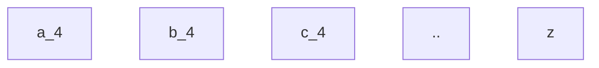

[toc]

# 排序

## 数组的相对位置

>   给你两个数组，arr1 和 arr2，
>
>   arr2 中的元素各不相同
>
>   arr2 中的每个元素都出现在 arr1 中
>
>   对 arr1 中的元素进行排序，使 arr1 中项的相对顺序和 arr2 中的相对顺序相同。未在 arr2 中出现过的元素需要按照升序放在 arr1 的末尾。
>
>   示例：
>
>   输入：arr1 = [2,3,1,3,2,4,6,7,9,2,19], arr2 = [2,1,4,3,9,6]
>   输出：[2,2,2,1,4,3,3,9,6,7,19]

法一：自定义排序

由于数组 arr2 规定了比较顺序，因此我们可以使用哈希表对该顺序进行映射：即对于数组arr 2中的第 i 个元素，我们将(arr2[i],i) 这一键值对放入哈希表rank 中，就可以很方便地对数组arr1中的元素进行比较。

```java
public int[] relativeSortArray(int[] arr1, int[] arr2) {
        Map<Integer, Integer> map = new HashMap<>();
        List<Integer> list = new ArrayList<>();
        for(int num : arr1) list.add(num);
        for(int i = 0; i < arr2.length; i++) map.put(arr2[i], i);
        Collections.sort(list, (x, y) -> {
            if(map.containsKey(x) || map.containsKey(y)) return map.getOrDefault(x, 1001) - map.getOrDefault(y, 1001);
            return x - y;
        });
        for(int i = 0; i < arr1.length; i++) arr1[i] = list.get(i);
        return arr1;
    }
```

注：最大的值是1000，这里设置为1001的目的是确保不在arr2中的数一定排在arr2后面

法二：计算排序

把arr1中元素以及出现的次数放到map当中，遍历arr2，将出现次数个arr2中的元素加入答案中。最后再遍历map，答案加入arr1独有的元素。

```java
public int[] relativeSortArray(int[] arr1, int[] arr2) {
        Map<Integer, Integer> map = new HashMap<>();
        List<Integer> list = new ArrayList<>();
        for(int num : arr1){
            if (map.containsKey(num)){
                map.put(num, map.get(num)+1);
            }else{
                map.put(num,1);
            }
        }
        for(int i = 0; i < arr2.length; i++){
            int times = map.get(arr2[i]);
            map.remove(arr2[i]);
            for (int j  = 0 ; j < times; j++) list.add(arr2[i]);
        }
        List<Integer> tmp = new  ArrayList<>();
        for (Map.Entry<Integer, Integer> s : map.entrySet()){
            for (int k = 0; k < s.getValue(); k++) tmp.add(s.getKey());
        }
        tmp.sort(Integer::compareTo);
        list.addAll(tmp);
        for(int i = 0; i < arr1.length; i++) arr1[i] = list.get(i);
        return arr1;
    }

```

## 上升下降字符串

>   给你一个字符串 s ，请你根据下面的算法重新构造字符串：
>
>   从 s 中选出 最小 的字符，将它 接在 结果字符串的后面。
>   从 s 剩余字符中选出 最小 的字符，且该字符比上一个添加的字符大，将它 接在 结果字符串后面。
>   重复步骤 2 ，直到你没法从 s 中选择字符。
>   从 s 中选出 最大 的字符，将它 接在 结果字符串的后面。
>   从 s 剩余字符中选出 最大 的字符，且该字符比上一个添加的字符小，将它 接在 结果字符串后面。
>   重复步骤 5 ，直到你没法从 s 中选择字符。
>   重复步骤 1 到 6 ，直到 s 中所有字符都已经被选过。
>   在任何一步中，如果最小或者最大字符不止一个 ，你可以选择其中任意一个，并将其添加到结果字符串。
>
>   请你返回将 s 中字符重新排序后的 结果字符串 。
>
>   示例 1：
>
>   输入：s = "aaaabbbbcccc"
>   输出："abccbaabccba"
>   解释：第一轮的步骤 1，2，3 后，结果字符串为 result = "abc"
>   第一轮的步骤 4，5，6 后，结果字符串为 result = "abccba"
>   第一轮结束，现在 s = "aabbcc" ，我们再次回到步骤 1
>   第二轮的步骤 1，2，3 后，结果字符串为 result = "abccbaabc"
>   第二轮的步骤 4，5，6 后，结果字符串为 result = "abccbaabccba"
>
>   示例 2：
>
>   输入：s = "rat"
>   输出："art"
>   解释：单词 "rat" 在上述算法重排序以后变成 "art"
>
>   示例 3：
>
>   输入：s = "leetcode"
>   输出："cdelotee"

这道题是让从字符串s中先选出升序的字符，然后再选出降序字符。一直这样循环，直到选完为止。因为题中的提示中说了s只包含小写英文字符，我们可以申请一个大小为26的数组，相当于26个桶。

-   把s中的每个字符分别放到对应的桶里，比如a放到第一个桶里，b放到第2个桶里……。
-   第1次从左往右遍历26个桶，从每个桶里拿出一个字符(如果没有就不用拿)
-   第2次从右往左遍历26个桶，从每个桶里拿出一个字符(如果没有就不用拿)
    ……
-   一直这样循环下去，直到所有的桶里的元素都拿完为止。

s = "aaaabbbbcccc"

第一遍：



第二遍：


```java
    public String sortString(String s) {
        //相当于26个桶
        int[] bucket = new int[26];
        char[] charArr = s.toCharArray();
        //把s中的字符分别放到对应的桶里
        for (char c : charArr) {
            bucket[c - 'a']++;
        }
        //存储计算的结果
        char[] res = new char[s.length()];
        int index = 0;
        while (index < s.length()) {
            //先从左往右找，遍历26个桶,如果当前桶不为空，
            //就从当前桶里拿出一个元素出来
            for (int i = 0; i < 26; i++) {
                if (bucket[i] != 0) {
                    res[index++] = (char) (i + 'a');
                    bucket[i]--;//拿出之后桶中元素的个数要减1
                }
            }
            //从右往左拿，同上
            for (int i = 25; i >= 0; i--) {
                if (bucket[i] != 0) {
                    res[index++] = (char) (i + 'a');
                    bucket[i]--;
                }
            }
        }
        //把结果转化为字符串
        return new String(res);
    }
```

