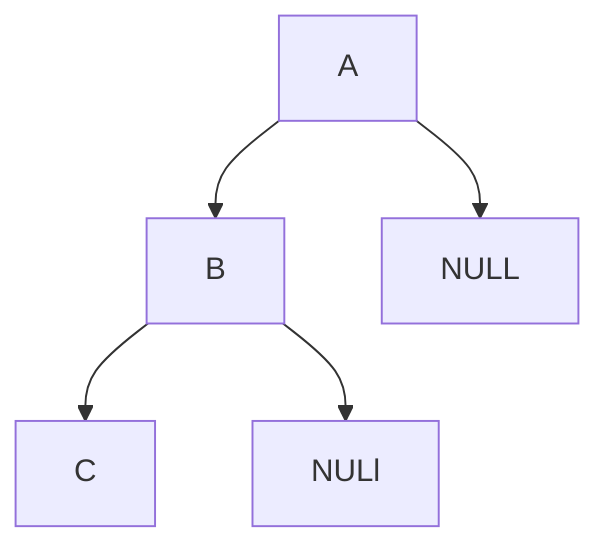
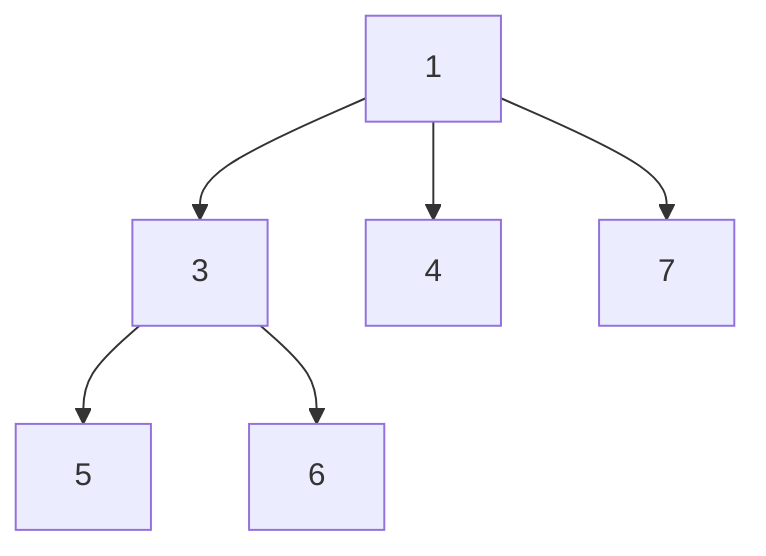
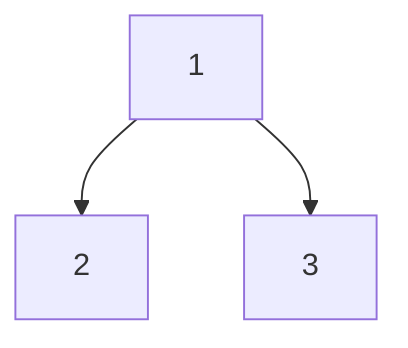
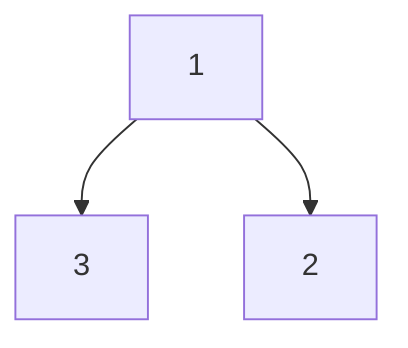

[toc]

# 树

## 二叉树的最大深度

>   给定一个二叉树，找出其最大深度。单节点的深度为1。

递归

```java
public int maxDepth(TreeNode root) {
    if (root == null){
        return 0;
    }
    return 1 + Math.max(maxDepth(root.left), maxDepth(root.right));
}
```

广度优先搜索

此时我们广度优先搜索的队列里存放的是「当前层的所有节点」。每次拓展下一层的时候，不同于广度优先搜索的每次只从队列里拿出一个节点，我们需要将队列里的所有节点都拿出来进行拓展，这样能保证每次拓展完的时候队列里存放的是当前层的所有节点，即我们是一层一层地进行拓展，最后我们用一个变量 ans 来维护拓展的次数，该二叉树的最大深度即为ans。

```java
public int maxDepth(TreeNode root) {
    if (root == null) {
        return 0;
    }
    Queue<TreeNode> queue = new LinkedList<TreeNode>();
    queue.offer(root);
    int ans = 0;
    while (!queue.isEmpty()) {
        int size = queue.size();
        while (size > 0) {
            TreeNode node = queue.poll();
            if (node.left != null) {
                queue.offer(node.left);
            }
            if (node.right != null) {
                queue.offer(node.right);
            }
            size--;
        }
        ans++;
    }
    return ans;
}
```

## 二叉树最小深度

不能直接Math.min(left,right)，这个的最小深度应该是3而不是1。




```java
if(root == null) return 0;
//这道题递归条件里分为三种情况
//1.左孩子和有孩子都为空的情况，说明到达了叶子节点，直接返回1即可
if(root.left == null && root.right == null) return 1;
//2.如果左孩子和由孩子其中一个为空，那么需要返回比较大的那个孩子的深度        
int m1 = minDepth(root.left);
int m2 = minDepth(root.right);
//这里其中一个节点为空，说明m1和m2有一个必然为0，所以可以返回m1 + m2 + 1;
if(root.left == null || root.right == null) return m1 + m2 + 1;

//3.最后一种情况，也就是左右孩子都不为空，返回最小深度+1即可
return Math.min(m1,m2) + 1;
 
public int minDepth(TreeNode root) {
        if(root == null) return 0;
        int m1 = minDepth(root.left);
        int m2 = minDepth(root.right);
        //1.如果左孩子和右孩子有为空的情况，直接返回m1+m2+1
        //2.如果都不为空，返回较小深度+1
        return root.left == null || root.right == null ? m1 + m2 + 1 : Math.min(m1,m2) + 1;
    }
```


## N叉树的最大深度

```java
// 节点定义
/*
class Node {
  public int val;
  public List<Node> children;

  public Node() {}

  public Node(int _val,List<Node> _children) {
    val = _val;
    children = _children;
  }
}
*/
public int maxDepth(Node root) {
    if (root == null) {
      return 0;
    } else if (root.children.isEmpty()) {
      return 1;  
    } else {
      List<Integer> heights = new LinkedList<>();
      for (Node item : root.children) {
        heights.add(maxDepth(item)); 
      }
      return Collections.max(heights) + 1;
    }
  }
```

## 递增顺序查找树

>   给你一个树，请你 按中序遍历 重新排列树，使树中最左边的结点现在是树的根，并且每个结点没有左子结点，只有一个右子结点。
>
>   示例 ：
>
>   输入：[5,3,6,2,4,null,8,1,null,null,null,7,9]
>     5
>       / \
>      3    6
>     / \    \
>    2   4    8
>   /        / \ 
>   1        7   9
>
>   输出：[1,null,2,null,3,null,4,null,5,null,6,null,7,null,8,null,9]
>
>   1
>   \
>     2
>      \
>       3
>        \
>         4
>          \
>           5
>            \
>             6
>              \
>               7
>                \
>                 8
>                  \
>                   9  

方法一：中序遍历 + 构造新的树
我们在树上进行中序遍历，就可以从小到大得到树上的节点。我们把这些节点的对应的值存放在数组中，它们已经有序。接着我们直接根据数组构件题目要求的树即可。

```java
public TreeNode increasingBST(TreeNode root) {
    List<Integer> vals = new ArrayList();
    inorder(root, vals);
    TreeNode ans = new TreeNode(0), cur = ans;
    for (int v: vals) {
        cur.right = new TreeNode(v);
        cur = cur.right;
    }
    return ans.right;
}

public void inorder(TreeNode node, List<Integer> vals) {
    if (node == null) return;
    inorder(node.left, vals);
    vals.add(node.val);
    inorder(node.right, vals);
}
```

方法二：中序遍历 + 更改树的连接方式
和方法一类似，我们在树上进行中序遍历，但会将树中的节点之间重新连接而不使用额外的空间。具体地，当我们遍历到一个节点时，把它的左孩子设为空，并将其本身作为上一个遍历到的节点的右孩子。

不修改方式可能会有环

```java
    TreeNode cur;
    public TreeNode increasingBST(TreeNode root) {
        TreeNode ans = new TreeNode(0);
        cur = ans;
        inorder(root);
        return ans.right;
    }

    public void inorder(TreeNode node) {
        if (node == null) return;
        inorder(node.left);
        node.left = null;
        cur.right = node;
        cur = node;
        inorder(node.right);
    }
```

## 二叉搜索树的第k大结点

>给定一棵二叉搜索树，请找出其中第k大的节点。
>
>输入: root = [5,3,6,2,4,null,null,1], k = 3
>5
>/ \
>3   6
>/ \
>2   4
>/
>1
>输出: 4

二叉搜索树的中序遍历为递增序列 , 中序遍历倒序 为递减序列。求 “二叉搜索树第 k大的节点” 可转化为求 “此树的中序遍历倒序的第 k 个节点”。

```java
// 打印中序遍历
void dfs(TreeNode root) {
    if(root == null) return;
    dfs(root.left); // 左
    System.out.println(root.val); // 根
    dfs(root.right); // 右
}

// 打印中序遍历倒序
void dfs(TreeNode root) {
    if(root == null) return;
    dfs(root.right); // 右
    System.out.println(root.val); // 根
    dfs(root.left); // 左
}

```

```java
    int ans = 0;
    int count = 0;
    int rank = 0;
    public int kthLargest(TreeNode root, int k) {
        rank = k;
        dfs(root);
        return ans;
    }
    private void dfs(TreeNode x){
        if (x == null) {
            return;
        }
        dfs(x.right);
        count++;
        if (count == rank){
            ans = x.val;
            return;
        }
        dfs(x.left);
    }
```

## N叉树的前序遍历

>   给定一个 N 叉树，返回其节点值的前序遍历。
>
>   输出：1 3 5 6 4 7




```java
/*
class Node {
    public int val;
    public List<Node> children;
    public Node() {}
    public Node(int _val) {
        val = _val;
    }
    public Node(int _val, List<Node> _children) {
        val = _val;
        children = _children;
    }
};
*/
	List<Integer> ans = new ArrayList<>();
    public List<Integer> preorder(Node root) {
        if (root == null) return ans;
        ans.add(root.val);
        for (Node x : root.children){
            preorder(x);
        }
        return ans;
    }
```

## 路径总和

>   给你二叉树的根节点 root 和一个表示目标和的整数 targetSum ，判断该树中是否存在 根节点到叶子节点 的路径，这条路径上所有节点值相加等于目标和 targetSum 。
>
>   叶子节点 是指没有子节点的节点。
>
>   输入：root，3
>
>   输出：true



使用广度优先搜索的方式，记录从根节点到当前节点的路径和，以防止重复计算。这样我们使用两个队列，分别存储将要遍历的节点，以及根节点到这些节点的路径和即可。

```java
    public boolean hasPathSum(TreeNode root, int targetSum) {
        if (root == null) return false;
        Queue<TreeNode> q = new LinkedList<>();
        Queue<Integer> vals = new LinkedList<>();
        q.offer(root);
        vals.offer(root.val);
        while (!q.isEmpty()){
            TreeNode node = q.poll();
            int a = vals.poll();
            if (node.left == null && node.right == null){
                if (a == targetSum) return true;
            }
            if (node.left != null){
                q.offer(node.left);
                vals.offer(node.left.val + a);
            }
            if (node.right != null){
                q.offer(node.right);
                vals.offer(node.right.val + a);
            }
        }
        return false;
    }
```

观察要求我们完成的函数，我们可以归纳出它的功能：询问是否存在从当前节点 root 到叶子节点的路径，满足其路径和为 sum。

假定从根节点到当前节点的值之和为 val，我们可以将这个大问题转化为一个小问题：是否存在从当前节点的子节点到叶子的路径，满足其路径和为 sum - val。

不难发现这满足递归的性质，若当前节点就是叶子节点，那么我们直接判断 sum 是否等于 val 即可（因为路径和已经确定，就是当前节点的值，我们只需要判断该路径和是否满足条件）。若当前节点不是叶子节点，我们只需要递归地询问它的子节点是否能满足条件即可。

```java
public boolean hasPathSum(TreeNode root, int sum) {
    if (root == null) {
        return false;
    }
    if (root.left == null && root.right == null) {
        return sum == root.val;
    }
    return hasPathSum(root.left, sum - root.val) || hasPathSum(root.right, sum - root.val);
}
```

## 叶子相似的树

>   请考虑一棵二叉树上所有的叶子，这些叶子的值按从左到右的顺序排列形成一个叶值序列 。如果有两棵二叉树的叶值序列是相同，那么我们就认为它们是叶相似的。
>
>   输入：root1 = [1,2,3], root2 = [1,3,2]
>   输出：false




```java
    public boolean leafSimilar(TreeNode root1, TreeNode root2) {
        ArrayList<Integer> a1 = new ArrayList<>();
        ArrayList<Integer> a2 = new ArrayList<>();
        dfs(root1,a1);
        dfs(root2,a2);
        return a1.equals(a2);
    }

    private void dfs(TreeNode x, ArrayList<Integer> arr){
        if (x==null) return;
        if (x.left == null && x.right == null){
            arr.add(x.val);
        }
        dfs(x.left, arr);
        dfs(x.right, arr);
    }
```

