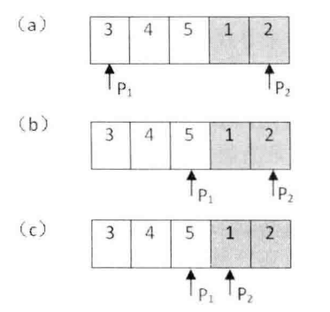
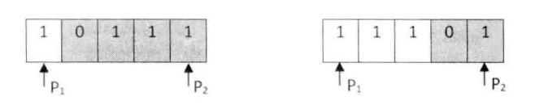

# 题目

把一个数组最开始的若干个元素搬到数组的末尾，我们称之为数组的旋转。 输入一个非减排序的数组的一个旋转，输出旋转数组的最小元素。 例如数组{3,4,5,1,2}为{1,2,3,4,5}的一个旋转，该数组的最小值为1。 

# 解法

## 对比头尾两头法

**如果遇到从排序的数组（或者部分排序的数组）中查找数字或者统计某个数字出现的次数，可以尝试二分查找法。**

**思路：**旋转之后的数组实际上可以划分为两个排序的子数组 ，而且前面子数组的元素都大于或者等于后面子数组的元素。 我们还注意到最小的元素刚好是这两个子数组的分界线。本题给出的数组在一定程度上是排序的，因此我们可以试着用二分查找法的思路来寻找这个最小的元素。

**方法：**我们利用两个指针分别指向数组的第一个元素和最后一个元素，我们可以先找到数组中间的元素

-   如果该中间元素大于或等于第一个指针所指的元素，则位于前面的非递减子数组，此时我们就可以把第一个指针指向该中间元素，这样就可以缩小寻找的范围，移动以后，第一个指针依然指向前面的非递减数组；
-   如果元素小于或等于第二个指针所指的元素，则中间元素位于后面的非递减数组。此时该数组中最小的元素应该位于该中间元素的前面。 我们可以把第二个指针指向该中间元素，这样也可以缩小寻找的范围。移动之后的第二个指针仍然位于后面的递增子数组 。

不管是移动第一个指针还是第二个指针，查找范围都会缩小到原来的一半 。最终第一个指针将指向前面子数组的
最后一个 元素，而第二个指针会指向后面子数组的第一个元素 。也就是它们最终会指向两个相邻的元素，而第二个指针指向的刚好是最小的元素。这就是循环结束的条件 。



**特殊情况：**

-   如果把排序数组的前面的0个元素搬到最后面 ，即排序数组本身 ，这仍然是数组的一个旋转，我们的代码需要支持这种情况 。 此时，数组中的第一个数字就是最小的数字 ，可以直接返回 （这就是把 indexMid 初始化为 0 的原因 ）
-   三个指针指的元素都相等。数组{ 1, 0, 1, 1, 1} 和数组 {1 , 1, 1, 0, 1 } 都可以看成递增排序数组 {0, 1, 1, 1, 1 } 的旋转。在这两个数组 中，第一个数字 、最后 一个数字和中间数字都是1，我们无法确定中间的数字1是属于第一个递增子数组还是属于第二个递增子数组



```java
    public static int min(int[] numbers) {
        if (numbers == null || numbers.length == 0) {
            throw new RuntimeException("Invalid parameters");
        }

        int index1 = 0;
        int index2 = numbers.length - 1;
        int indexMid = 0;

        while (numbers[index1] >= numbers[index2]) {
            // 结束条件
            if (index2 - index1 == 1) {
                indexMid = index2;
                break;
            }

            indexMid = index1 + (index2 - index1) / 2;

            // 如果三个数字都相等，就只能顺序查找
            if (numbers[index1] == numbers[index2] &&
                    numbers[index1] == numbers[indexMid]) {
                return min(numbers, index1, index2);
            }

            if (numbers[indexMid] >= numbers[index1]) {
                index1 = indexMid;
            }
            else if (numbers[indexMid] <= numbers[index2]) {
                index2 = indexMid;
            }
        }

        return numbers[indexMid];
    }

    public static int min(int[] numbers, int index1, int index2) {
        int result = numbers[index1];
        for (int i = index1 + 1; i <= index2; i++) {
            if (numbers[i] < result) {
                result = numbers[i];
            }
        }
        return result;
    }
```

## 只对比尾巴法

这种二分查找难就难在，arr[mid]跟谁比.
我们的目的是：当进行一次比较时，一定能够确定答案在mid的某一侧。一次比较为 arr[mid]跟谁比的问题。
一般的比较原则有：

-   如果有目标值target，那么直接让arr[mid] 和 target 比较即可。
-   如果没有目标值，一般可以考虑 **端点**

这里我们把target 看作是**右端点**，来进行分析，那就要分析以下三种情况，看是否可以达到上述的目标。

1.  情况1，

    ```
    arr[mid] > target：4 5 6 1 2 3
    ```

    -   arr[mid] 为 6， target为右端点 3， `arr[mid] > target`, 说明[first ... mid] 都是 >= target 的，因为原始数组是非递减，所以可以确定答案为 [mid+1...last]区间,所以 `first = mid + 1`

2.  情况2，

    ```
    arr[mid] < target:5 6 1 2 3 4
    ```

    -   arr[mid] 为 1， target为右端点 4， `arr[mid] < target`, 说明答案肯定不在[mid+1...last]，但是arr[mid] 有可能是答案,所以答案在[first, mid]区间，所以`last = mid`;

3.  情况3，

    ```
    arr[mid] == target:
    ```

    -   如果是 1 0 1 1 1， arr[mid] = target = 1, 显然答案在左边
    -   如果是 1 1 1 0 1, arr[mid] = target = 1, 显然答案在右边
        所以这种情况，不能确定答案在左边还是右边，那么就让last = last - 1;慢慢缩少区间，同时也不会错过答案。

误区：那我们肯定在想，能不能把左端点看成target， 答案是不能。

原因：
情况1 ：1 2 3 4 5 ， arr[mid] = 3. target = 1, arr[mid] > target, 答案在mid 的左侧
情况2 ：3 4 5 1 2 ， arr[mid] = 5, target = 3, arr[mid] > target, 答案却在mid 的右侧
所以不能把左端点当做target

```java
class Solution {
    public int minArray(int[] numbers) {
        if (numbers == null || numbers.length == 0) {
            return 0;
        }
        int low = 0, high = numbers.length - 1;
        while (low < high) {
            int mid = (low + high) / 2;
            if (numbers[mid] < numbers[high]) {
                high = mid;
            } else if (numbers[mid] > numbers[high]) {
                low = mid + 1;
            } else {
                high--;
            }
        }
        return numbers[low];
    }
}
```

