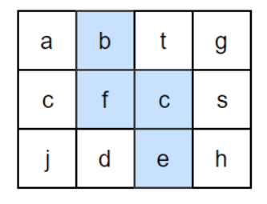
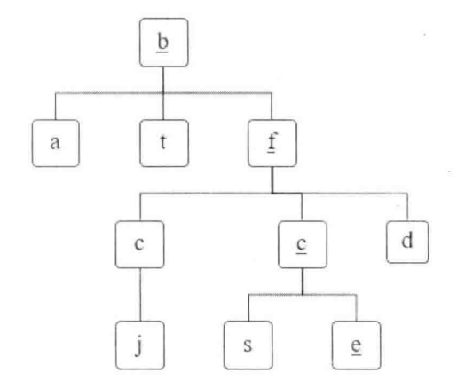

# 题目

请设计一个函数，用来判断在一个矩阵中是否存在一条包含某字符串所有字符的路径。路径可以从矩阵中的任意一个格子开始，每一步可以在矩阵中向左，向右，向上，向下移动一个格子。如果一条路径经过了矩阵中的某一个格子，则该路径不能再进入该格子。

例如下面的矩阵包含了一条 bfce 路径。但是矩阵中不包含"abcb"路径，因为字符串的第一个字符b占据了矩阵中的第一行第二个格子之后，路径不能再次进入该格子。



# 解法

## 回溯法

回溯法可以看成蛮力法的升级版，它非常适合由多个步骤组成的问题，并且每个步骤都有多个选项，当我们在某一步选择了其中一个选项时，就进行下一步，如果下一步不行不符合条件，则回溯到之前那一步，不然则继续选择一个选项进行下一步，就这样重复选择，直至到达最终的状态。

用回溯法解决的问题的所有选项可以形象地用树状结构表示 。在某一步有 n 个可能的选项，那么该步骤可以看成是树状结构中的一个节点，每个选项看成树中节点连接线，经过这些连接线到达该节点的 n 个子节点 。树的叶节点对应着终结状态 。 如果在叶节点的状态满足题目的约束条件 ，那么我们找到了 一个可行的解决方案 。如果在叶节点的状态不满足约束条件，那么只好回溯到它的上一个节点再尝试其他的选项 。 如果上一个节点所有可能的选项都已经试过 ，并且不能到达满足约束条件的终结状态，则再次回溯到上一个节点 。如果所有节点的所有选项都已经尝试过仍然不能到达满足约束条件的终结状态，则该问题无解 。

例子：从字母b开始的选项组成的树状结构



## 具体实现

首先，在矩阵中任选一个格子作为路径的起点。

由于回朔法的递归特性，路径可以被看成一个栈。当在矩阵中定位了路径中前n个字符的位置之后，在与第n个字符对应的格子的周围都没有找到第n+1个字符，这个时候只要在路径上回到第n-1个字符，重新定位第n个字符。一直重复这个过程，直到路径字符串上所有字符都在矩阵中找到合适的位置。

由于路径不能重复进入矩阵的格子，还需要定义和字符矩阵大小一样的布尔值矩阵，用来标识路径是否已经进入每个格子。

```java
    public static boolean hasPath(char[][] matrix, char[] str) {
        if (matrix == null || matrix.length < 1 || matrix[0].length < 1 || str == null) {
            return false;
        }
        int rows = matrix.length;
        int cols = matrix[0].length;
        boolean[][] visited = new boolean[rows][cols];

        // 选取任意一个格子为起点
        for (int row = 0; row < rows; row++) {
            for (int col = 0; col < cols; col++) {
                if (hasPath(matrix, row, col, str, 0, visited)) {
                    return true;
                }
            }
        }
        return false;
    }

    public static boolean hasPath(char[][] matrix, int row, int col, char[] str,
                                  int index, boolean[][] visited) {
        // 找到一条路径
        if (index == str.length) {
            return true;
        }
        int rows = matrix.length;
        int cols = matrix[0].length;
        if (row >= 0 && row < rows && col >= 0 && col < cols && !visited[row][col]
                && matrix[row][col] == str[index]) {
            // 标记为已访问
            visited[row][col] = true;
            // 看上下左右格子有无字符串中下标为index+1的字符
            if (hasPath(matrix, row - 1, col, str, index + 1, visited) ||
                    hasPath(matrix, row + 1, col, str, index + 1, visited) ||
                    hasPath(matrix, row, col - 1, str, index + 1, visited) ||
                    hasPath(matrix, row, col + 1, str, index + 1, visited)) {
                return true;
            }
            // 此路不通，标记为未访问，回溯到前一个
            visited[row][col] = false;
        }
        return false;
    }

```

