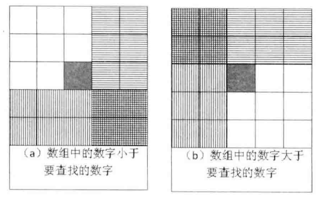
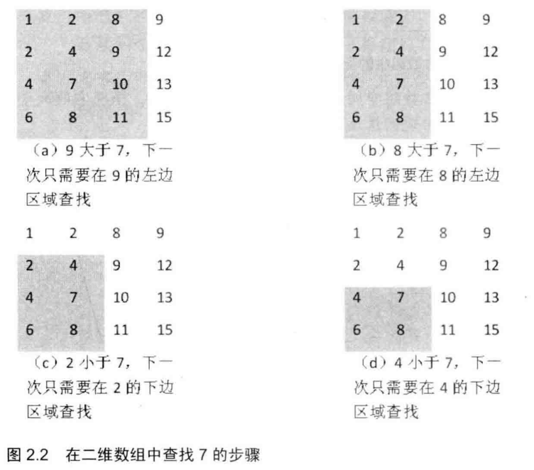

# 题目

在一个二维数组中，每一行都按照从左到右递增的顺序排序，每一列都按照从上到下递增的顺序排序。请完成一个函数，输入这样的一个二维数组和一个整数，判断数组中是否含有该整数。

例如下面的二维数组就是每行、每列都是递增排序，如果在这个数组中查找数字7，则放回true；如果查找数字5，由于数组不含该数字，则返回false。

```
1 2 8 9
2 4 6 12
4 7 10 13
6 8 11 15
```

# 解法

在分析这个问题的时候，很多应聘者都会把二维数组画成矩形，然后从数组中选取一个数字，分3 种情况来分析查找的过程。当数组中选取的数字刚好和要查找的数字相等时，就结束查找过程 。如果选取的数字小于要查找的数字 ，那么根据数组排序的规则，要查找的数字应该在当前选取位置的右边或者下边。同样，如果选取的数字大于要查找的数字，那么要查找的数字应该在当前选取位置的上边或者左边



在上面的分析中，由下要查找的数字相对于当前选取的位置有可能在两个区域中出现 ，而且这两个区域还有重叠，这问题看起来就复杂了，于是很多人就卡在这里束手无策了。如果我们从数组的一个角上选取数字来和要查找的数字进行比较，那么情况会不会变简单呢？

## 具体实现

首先选取数组中右上角（左下角也可以）的数字，如果该数字等于要查找的数字，那么查找过程结束；如果该数字大于要查找的数字，则**剔除这个数字所在的列**，因为它所在的列的所有值都比要查找的数字大；如果该数字小于要查找的数字，则**剔除这个数字所在的行**，因为它所在的行的所有值都比要查找的数字小；也就是说，如果查找的数字不在数组(新查找范围)的右上角，则每次都能剔除一行或者一列，每次都可以缩小查找的范围，直到找到要查找的数字，或者查找不到。



```java
    public static boolean find(int[][] matrix, int target) {
        if (matrix == null || matrix.length == 0 || matrix[0].length == 0) {
            return false;
        }

        int i = 0;
        int j = matrix[0].length - 1;

        while (j >= 0 && i < matrix.length) {
            int number = matrix[i][j];
            if (target == number) {
                return true;
            }
            else if (target > number) {
                i++;
            } else {
                j--;
            }
        }
        return false;
    }
```

