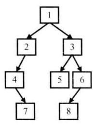
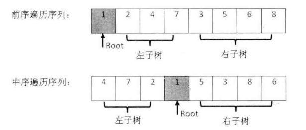

# 题目

输入某二叉树的前序遍历和中序遍历的结果，请重建该二叉树。假设输入的前序遍历和中序遍历的结果中都不含重复的数字。例如前序遍历序列 {1, 2, 4, 7, 3, 5, 6, 8} 和中序遍历序列 {4, 7, 2, 1, 5, 3, 8, 6}

二叉树的节点的定义如下：

```java
public class TreeNode {
    int val;
    TreeNode left;
    TreeNode right;

    public TreeNode(){}

    public TreeNode(int x) {
        val = x;
    }

}
```

# 解法

在二叉树的**前序遍历**序列中，**第一个数字总是树的根节点的值** 。但在中序遍历序列中，根节点的值在序列的中间，左子树的节点的值位于根节点的值的左边，而右子树的节点的值位于根节点的值的右边 。因此我们需要扫描中序遍历序列，才能找到根节点的值 。使用这个值将遍历结果分成两部分， 这样我们就在前序遍历和中序遍历两个序列中分别找到 了左、右子树对应的子序列， 可以用同样的方法分别构建左、右子树 。也就是说接下来的事情可以用递归的方法去完成 。





```java
    public static TreeNode reConstructBinaryTree(int[] preOrder, int[] inOrder) {
        if (preOrder == null || inOrder == null ||
                preOrder.length == 0 || inOrder.length == 0 ||
                preOrder.length != inOrder.length) {
            return null;
        }
        return construct(preOrder, 0, preOrder.length - 1, inOrder, 0, inOrder.length - 1);
    }

    private static TreeNode construct(int[] preOrder, int preStart, int preEnd,
                                      int[] inOrder, int inStart, int inEnd) {
        if (preStart > preEnd || inStart > inEnd) {
            return null;
        }

        // 前序遍历序列的笫一个数字是根节点的值
        int rootValue = preOrder[preStart];
        TreeNode root = new TreeNode(rootValue);

        // 在中序遍历序列中找到根节点的值
        int rootInOrder = inStart;
        while (rootInOrder < inEnd && inOrder[rootInOrder] != rootValue) {
            rootInOrder++;
        }
        if (rootInOrder == inEnd && inOrder[rootInOrder] != rootValue) {
            System.out.println("Invalid Input");
        }

        int leftLength = rootInOrder - inStart;
        // 构建左子树
        root.left = construct(preOrder, preStart + 1, preStart + leftLength,
                inOrder, inStart, rootInOrder - 1);
        // 构建右子树
        root.right = construct(preOrder, preStart + leftLength + 1, preEnd,
                inOrder, rootInOrder + 1, inEnd);

        return root;
    }
```

