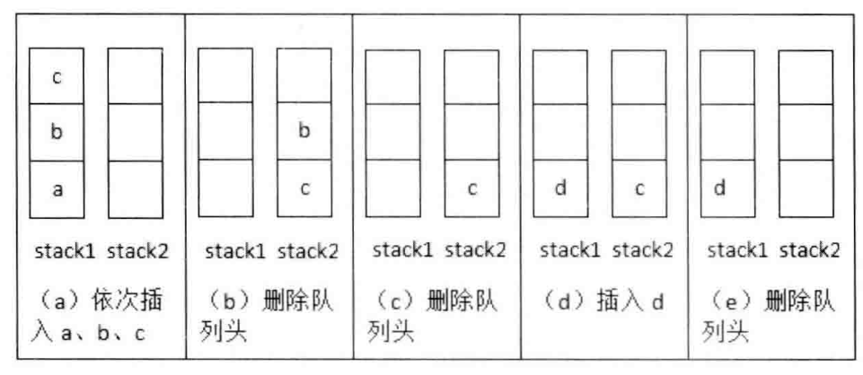

# 题目

用两个栈来实现一个队列，完成队列的 appendTail 和 deleteHead 操作。

# 解法

假设元素都放stack1，如果这个时候需要弹出元素时，分为两种情况：

-   当stack2为空时，我们把stack1栈的元素逐个弹出并压入stack2栈，此时我们会发现最先进入的元素已经在stack2栈顶，可以直接弹出
-   当stack2不为空，在stack2中的栈顶元素就是最先进入队列的元素，可以弹出。



```java
public class CQueue {

    Stack<Integer> stack1 = new Stack<>();
    Stack<Integer> stack2 = new Stack<>();

    public void appendTail(int i) {
        stack1.push(i);
    }

    public int deleteHead() {
        if (stack2.isEmpty()) {
            while (!stack1.isEmpty()) {
                Integer data = stack1.pop();
                stack2.push(data);
            }
        }
        
        if (stack2.isEmpty()) {
            throw new RuntimeException("Queue is empty");
        }

        return stack2.pop();
    }
}

```

