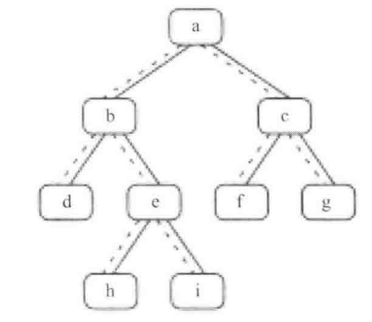

# 题目

给定一个二叉树和其中的一个结点，请找出中序遍历顺序的下一个结点并且返回。注意，树中的结点不仅包含左右子结点，同时包含指向父结点的指针。

节点代码如下：

```java
public class TreeLinkNode {
    int val;
    TreeLinkNode left = null;
    TreeLinkNode right = null;
    TreeLinkNode parent = null;

    TreeLinkNode(int val) {
        this.val = val;
    }
}
```

# 解法

-   如果一个节点有右子树，那么它的下一个节点就是它的右子树中的最左子节点。也就是说，从右子节点出发一直沿着指向左子节点的指针 ，我们就能找到它的下一个节点 。
-   如果一个节点没有右子树的话：
    -   如果节点是它父节点的左子节点，那么它的下一个节点就是它的父节点
    -   如果一个节点既没有右子树 ，并且它还是它父节点的右子节点，沿着指向父节点的指针一直向上遍历 ，直到找到一个是它父节点的左子节点的节点

例子：中序遍历序列是 { d , b, h, e, i, a, f, c, g} 



```java
    public static TreeLinkNode getNext(TreeLinkNode node) {
        if (node == null) {
            return null;
        }
        // 如果一个节点有右子树，那么它的下一个节点就是它的右子树中的最左子节点
        if (node.right != null) {
            node = node.right;
            while (node.left != null) {
                node = node.left;
            }
            return node;
        }
        // 如果一个节点既没有右子树 ，并且它还是它父节点的右子节点，沿着指向父节点的指针一直向上遍历 ，直到找到一个是它父节点的左子节点的节点
        else {
            TreeLinkNode p = node.parent;
            while (p != null && node == p.right) {
                node = p;
                p = p.parent;
            }
            return p;
        }
    }
```

