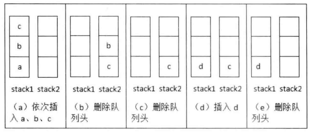
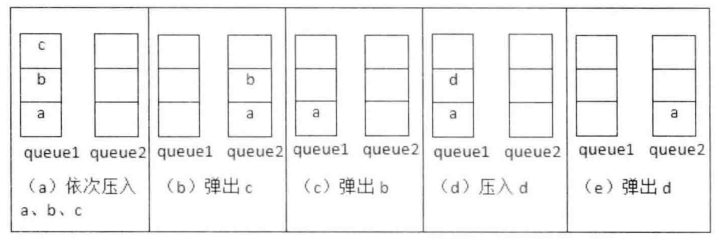

# 题目

用两个栈来实现一个队列，完成队列的 appendTail 和 deleteHead 操作。

# 解法

假设元素都放stack1，如果这个时候需要弹出元素时，分为两种情况：

-   当stack2为空时，我们把stack1栈的元素逐个弹出并压入stack2栈，此时我们会发现最先进入的元素已经在stack2栈顶，可以直接弹出
-   当stack2不为空，在stack2中的栈顶元素就是最先进入队列的元素，可以弹出。



```java
public class CQueue {

    Stack<Integer> stack1 = new Stack<>();
    Stack<Integer> stack2 = new Stack<>();

    public void appendTail(int i) {
        stack1.push(i);
    }

    public int deleteHead() {
        if (stack2.isEmpty()) {
            while (!stack1.isEmpty()) {
                Integer data = stack1.pop();
                stack2.push(data);
            }
        }
        
        if (stack2.isEmpty()) {
            throw new RuntimeException("Queue is empty");
        }

        return stack2.pop();
    }
}

```

# 相关题目

用两个队列实现一 个栈 。

我们通过一系列栈的压入和弹出操作来分析用两个队列模拟一个栈的过程。我们先往栈内压入一个元素a 。由于两个队列现在都是空的， 我们可以选择把 a 插入两个队列的任意一个。 我们不妨把a插入queue1。 接下来继续往栈内压入b、c 两个元素 ，我们把它们都插入queue1。 这个时候queue包含 3个元素 a、b 和 c, 其中 a 位于队列的头部，c 位于队列的尾部 。现在我们考虑从栈内弹出一个元素。 根据栈的后入先出原则，最后被压入栈的 c 应该最先被弹出 。由于 c 位于 queue1的尾部，而我们每次只能从队列的头部删除元素 ，因此我们可以先从queue1中依次删除元素a 、b并插入 queue2，再从 queue1中删除元素c 。 这就相当于从栈中弹出元素c了，我们可以用同样的方法从栈内弹出元素 b。


