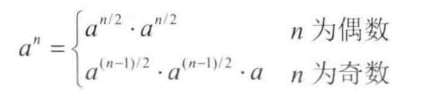

# 题目

实现函数double power(double base, int exponent)，求base的exponent次方。不得使用库函数，同时不需要考虑大数问题。

# 解法

## 以为题目简单的解法

只考虑了指数是正数的情况，没有考虑输入的指数  (exponent ) 小于1(零和负数）的时候该怎么办

```java
    public static double power(double base, int exponent) {
        double result = 1.0;
        for (int i = 1; i <= exponent; i++) {
            result *= base;
        }
        return result;
    }
```

## 全面但不够高效的解法

当指数为负数的时候，我们可以先对指数取绝对值，算出次方的结果之后再取倒数。在想到取倒数的时候，我们又要想到对0取倒数的问题，这就要我们进行错误处理，处理的方式主要有三种：返回值、全局变量和异常。面试的时候可以阐述每种方法的优缺点，然后一起讨论决定选用哪种方法。

|          | 优点                                                 | 缺点                                       |
| -------- | ---------------------------------------------------- | ------------------------------------------ |
| 返回值   | 和系统API一致                                        | 不能方便得使用计算结果                     |
| 全局变量 | 能够方便使用计算结果                                 | 用户可能会忘记检查全局变量                 |
| 异常     | 可以为不用的出错原因定义不同的异常类型，逻辑清晰明了 | 有些语言不支持，抛出异常时对性能有负面影响 |

值得注意的是，由于0的0次方在数学上是没有意义，因此无论输出是0还是1都可以接受，但这都需要和面试官说清楚，表明我们已经考虑到这个边界值了。

```java
    public static double power(double base, int exponent) {
        if (Double.compare(base, 0.0) == 0 && exponent == 0) {
            throw new RuntimeException("0的0次方没有意义");
        }
        // 指数绝对值
        int absExponent = Math.abs(exponent);
        double result = powerWithPositiveExponent(base, absExponent);
        // 如果指数为负，取倒数
        if (exponent < 0) {
            result = 1.0 / result;
        }
        return result;
    }

    public static double powerWithPositiveExponent(double base, int exponent) {
        double result = 1.0;
        for (int i = 1; i <= exponent; i++) {
            result *= base;
        }
        return result;
    }
```

## 既全面又高效的解法

如果输入的指数为32，`powerWithPositiveExponent` 的循环需要做32次乘法。可以换一种思路考虑：我们的目标是求出一个数字 的 32 次方，如果我们已经知道了它的16 次方 ，那么只要在16次方的基础上再平方一次就可以了。而16次方是8次方的平方。这样以此类推，我们求 32 次方只 需要做 5 次乘法：先求平方，在平方的基础上求 4次方 ，在4次方的基础上求 8 次方，在8次方的基础上求16 次方，最后在16次方的基础上求 32 次方。公式：

 

```java
    public static double powerWithPositiveExponent(double base, int exponent) {
        if (exponent == 0) {
            return 1.0;
        }
        if (exponent == 1) {
            return base;
        }
        // 用右移代替除以2
        double result = powerWithPositiveExponent(base, exponent >> 1);
        result *= result;
        // 如果指数为奇数
        if ((exponent & 0x1) == 1) {
            result *= base;
        }
        return result;
    }
```

