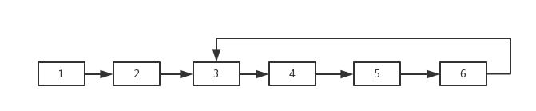
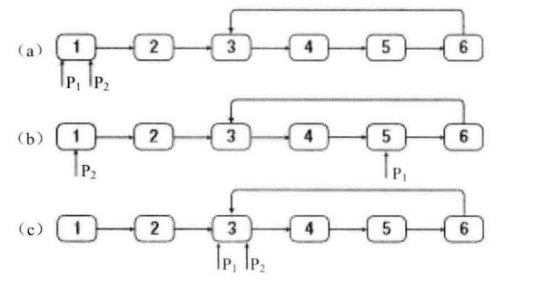

# 题目

如果一个链表中包含环，如何找出环的入口节点？例如，在如下图所示的链表中，环的入口节点是节点3。



# 解法

1.  确定一个链表中包含环

    用两个指针指向头节点，同时从链表的头节点触发，一个指针一次走一步，另一个指针一次走两步。如果走得快的指针追上了走得慢的指针，那么链表就包含环，如果的走得快的指针走到了链表的末尾都没有追上走得慢的指针，那么链表就不包含环。

2.  找到环的入口

    用两个指向头节点的指针P1和P2，如果链表中的环有n个节点，则一个指针P1指针先向前移动n步，然后两个指针以相同的速度向前移动。当P2指向指向环的入口节点时，P1已经围绕环走了一圈，又回到了入口节点。

    

    设链表长度为n个节点，非环部分的长度为x个节点，环部分的长度为y个节点，那么就有n = x + y。P1先移动了y步，在第y + 1个节点上，此时P1距离链表末尾还有x - 1个节点，移动x个节点后回到环的入口，而P2移动x步也会到环的入口。

3.  环中节点的数目

    我们在前面提到判断一个链表里是否有环时用到了一快一慢两个指针。如果两个指针相遇，则表明链表中存在环。两个指针相遇的节点一定是在环中。可以从这个节点出发，一边继续向前移动一边计数，当再次回到这个节点时，就可以得到环中节点数了。

```java
    public static ListNode entryNodeOfLoop(ListNode head) {
        ListNode meetingNode = meetingNode(head);
        if (meetingNode == null) {
            return null;
        }
        // 得到环中节点的数目
        int nodeInLoop = 1;
        ListNode node = meetingNode;
        while (node.next != meetingNode) {
            node = node.next;
            nodeInLoop++;
        }
        ListNode p1 = head;
        ListNode p2 = head;
        // 先移动p1，次数为环中节点的个数
        for (int i = 0; i < nodeInLoop; i++) {
            p1 = p1.next;
        }
        // 再同时移动p1，p2，当p1 = p2时，即为入口节点
        while (p1 != p2) {
            p1 = p1.next;
            p2 = p2.next;
        }
        return p1;
    }

    private static ListNode meetingNode(ListNode head) {
        // 在链表中存在环的前提下，找到一快一慢两个指针相遇的节点
        if (head == null || head.next == null) {
            return null;
        }
        ListNode slow = head;
        ListNode fast = head.next;
        while (slow != null && fast != null) {
            if (slow == fast) {
                return fast;
            }
            slow = slow.next;
            fast = fast.next;
            if (fast != null) {
                fast = fast.next;
            }
        }
        return null;
    }
```

