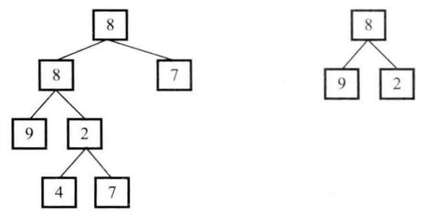

# 题目

输入两棵二叉树A和B，判断B是不是A的子结构，二叉树的节点定义如下：

```java
public class TreeNode {
    int val = 0;
    TreeNode left = null;
    TreeNode right = null;

    public TreeNode(int val) {
        this.val = val;
    }
}
```

两棵二叉树A和B，右边的树B是左边的树A的子结构：



# 解法

```java
    public static boolean hasSubTree(TreeNode root1, TreeNode root2) {
        if (root1 == null || root2 == null) {
            return false;
        }

        if (isSubTree(root1, root2)) {
            return true;
        }
        // 判断root1的左子树或右子树含不含有root2结构
        return hasSubTree(root1.left, root2) || hasSubTree(root1.right, root2);
    }
	
	// 判断以root2为根的树是不是以root1为根的树的子树
    private static boolean isSubTree(TreeNode root1, TreeNode root2) {
        if (root2 == null) {
            return true;
        }
        if (root1 == null) {
            return false;
        }
        if (root1.val != root2.val) {
            return false;
        }
        return isSubTree(root1.left, root2.left) && isSubTree(root1.right, root2.right);
    }
```

