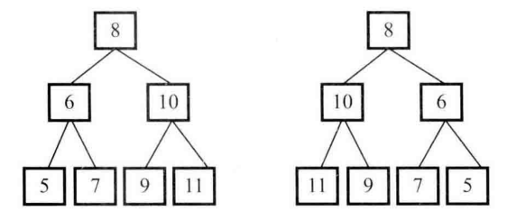

# 题目

请完成一个函数，输入一颗二叉树，请函数输出它的镜像。二叉树节点的定义如下：

```java
public class TreeNode {
    int val = 0;
    TreeNode left = null;
    TreeNode right = null;

    public TreeNode(int val) {
        this.val = val;
    }
}
```

两棵互为镜像的二叉树：



# 解法

递归交换左右结点

```java
    public static void mirror(TreeNode root) {
        if (root == null) {
            return;
        }
        if (root.left == null && root.right == null) {
            return;
        }
        TreeNode temp = root.left;
        root.left = root.right;
        root.right = temp;
        mirror(root.left);
        mirror(root.right);
    }
```

