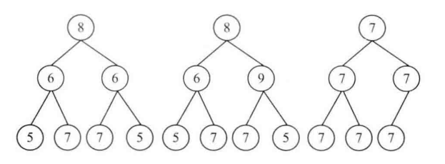

# 题目

请实现一个函数，用来判断一颗二叉树是不是对称的。如果一颗二叉树和它的镜像一样，那么它是对称的。树节点：

```java
public class TreeNode {
    int val = 0;
    TreeNode left = null;
    TreeNode right = null;

    public TreeNode(int val) {
        this.val = val;
    }
}
```

第一棵二叉树是对称的，另外两棵不是



# 解法

首先root1的值必须和root2一样，然后root1的左子树需要与root2的右子树对称，root1的右子树需要与root2的左子树对称，这样root1和root2才对称。

```java
    public static boolean isSymmetrical(TreeNode root) {
        if (root == null) {
            return false;
        }
        return isSymmetrical(root.left, root.right);
    }

    private static boolean isSymmetrical(TreeNode root1, TreeNode root2) {
        if (root1 == null && root2 == null) {
            return true;
        }
        if (root1 == null || root2 == null) {
            return false;
        }
        if (root1.val != root2.val) {
            return false;
        }
        return isSymmetrical(root1.left, root2.right) && isSymmetrical(root1.right, root2.left);
    }
```

