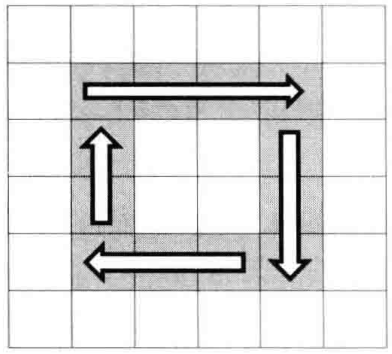
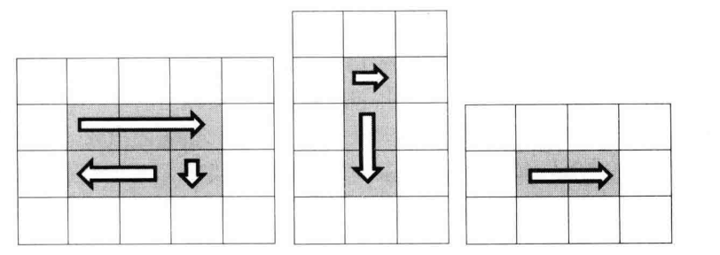

# 题目

输入一个矩阵，按照从外向里以顺时针的顺序依次打印出每一个数字。例如输入以下矩阵：

```
1  2  3  4
5  6  7  8
9  10 11 12
13 14 15 16
```

依次打印出数字1，2，3，4，8，12，16，15，14，13，9，5，6，7，11，10。

# 解法

可以把矩阵想象成若干个图，用一个循环来打印矩阵，每次打印矩阵中的一个圈



接下来分析循环结束的条件。假设这个矩阵的行数是rows，列数是columns 。打印第一圈的左上角的坐标(0, 0)，第二 圈的左上角的坐标是 (1 , 1) ,以此类推 。我们注意到，左上角的坐标中行标和列标总是相同的，于是可以在矩阵中选取左上角为 (start, start) 的一 圈作为我们分析的目标 。对千一个 5 X 5 的矩阵而言 ， 最后一 圈只有一个数字，对应的坐标为(2 , 2) ，我们发现 5 > 2 * 2。对于一个 6 X 6 的 矩阵而言，最后一圈有4个数字，其左上角的坐标仍然为 (2,2）。我们发现 6 > 2 * 2 依然成立 。于是可以得出，让循环继续的条件是columns > startX * 2 并且 rows > startY * 2。

接着我们考虑如何打印一圈的功能：从左到右打印一行，从上到下打印一列，从右到左打印一行，从下到上打印一列。不过值得注意的是，最后一圈有可能退化成只有一行、只有一列，甚至只有一 个数字 ，因此打印这样的一圈就不再需要四步。因此需要仔细分析打印时每一步的前提条件。



注：if判断是必须的，因为比如当最后只剩一行时，endRow是等于start的，所以会从左到右打印这一行，再从右到左重复打印一遍。

```java
    public static ArrayList<Integer> printMatrix(int[][] matrix) {
        if (matrix == null || matrix.length == 0) {
            return null;
        }
        ArrayList<Integer> result = new ArrayList<>();
        for (int i = 0; i * 2 < matrix.length && i * 2 < matrix[0].length; i++) {
            printMatrix(matrix, i, result);
        }
        return result;
    }

    private static void printMatrix(int[][] matrix, int start, ArrayList<Integer> result) {
        int endRow = matrix.length - 1 - start;
        int endCol = matrix[0].length - 1 - start;
        // 从左到右打印一行
        for (int i = start; i <= endCol; i++) {
            result.add(matrix[start][i]);
        }
        // 至少两行
        if (start < endRow) {
            // 从上到下打印一列
            for (int i = start + 1; i <= endRow; i++) {
                result.add(matrix[i][endCol]);
            }
            // 至少两列
            if (start < endCol) {
                // 从右到左打印一行
                for (int i = endCol - 1; i >= start; i--) {
                    result.add(matrix[endRow][i]);
                }
                // 至少三行
                if (start + 1 < endRow) {
                    // 从下到上打印一列
                    for (int i = endRow - 1; i > start; i--) {
                        result.add(matrix[i][start]);
                    }
                }
            }
        }
    }
```


