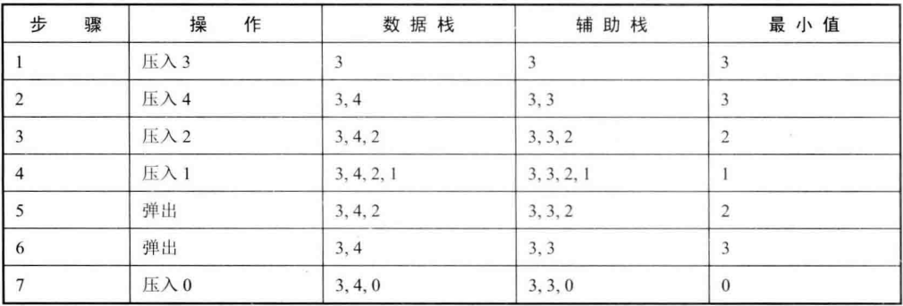

# 题目

定义栈的数据，请在该类型中实现一个能够找到栈的最小元素的min函数。在该栈中，调用min、push及pop的时间复杂度都是O(1)。

# 解法

栈里添加一个成员变量存放最小的元素。 每次压一个新元素进栈的时候，如果该元素比当前最小的元素还要小，则更新最小元素 。面试官听到这种思路之后就会问：如果当前最小的元素被弹出栈了，那么如何得到下 一个最小的元素呢？所以仅仅添加一个成员变量存放最小元素是不够的，也就是说当最小元素被弹出栈的时候，我们希望能够得到次小元素。因此，在压入这个最小元素之前，我们要把次小元素保存起来。

可以把每次的最小元素（之前的最小元素和新压入栈的元素两者的较小值）都保存起来放到另外一个辅助栈 



```java
importpublic class Solution {
    private Stack<Integer> dataStack = new Stack<>();
    private Stack<Integer> minStack = new Stack<>();

    public void push(int node) {
        dataStack.push(node);
        if (minStack.isEmpty() || node < minStack.peek()) {
            minStack.push(node);
        } else {
            minStack.push(minStack.peek());
        }
    }

    public void pop() {
        if (!dataStack.isEmpty()) {
            dataStack.pop();
            minStack.pop();
        }
    }

    public int min() {
        return minStack.peek();
    }
}

```

