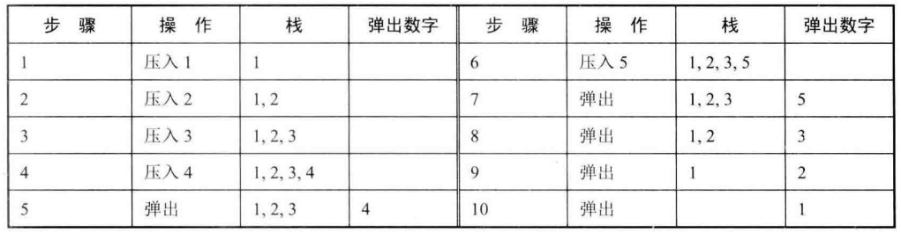
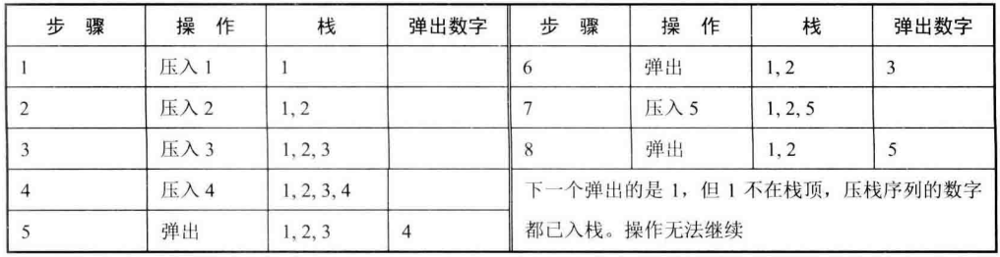

# 题目

输入两个整数序列，第一个序列表示栈的压入顺序，请判断第二个序列是或否为该栈的弹出顺序。假设压入栈的所有数字均不相等。例如序列 {1,2,3,4,5} 是某栈的压栈序列，序列 {4,5,3,2,1} 是该栈序列对应的一个弹出序列，但 {4,3,5,1,2} 就不可能是该压栈序列的弹出序列。

压栈序列为 {1,2,3,4,5}、弹出序列为 {4,5,3,2,1}对应的压栈和弹出过程：



—个压入顺序为 {1,2,3,4,5} 的 栈没有 — 个 弹出序列为 {4,3,5,1,2}：



# 解法

如果下一个弹出的数字刚好是栈顶数字，那么直接弹出；如果 下一个弹出的数字不在栈顶 ，则把压栈序列中还没有入栈的数字压入辅助栈， 直到把下一个需要弹出的数字压入栈顶为止；如果所有数字都压入栈后仍然没有找到 下一个弹出的数字 ，那么该序列不可能是一个弹出序列

```java
    public static boolean validateStackSequences(int[] pushed, int[] poped) {
        Stack<Integer> stack = new Stack<>();
        int i = 0;
        for (int num : pushed) {
            stack.push(num);
            while (!stack.isEmpty() && stack.peek() == poped[i]) {
                stack.pop();
                i++;
            }
        }
        return stack.isEmpty();
    }
```

