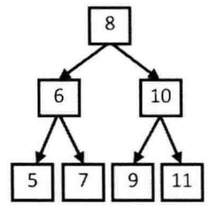
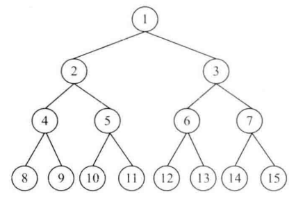
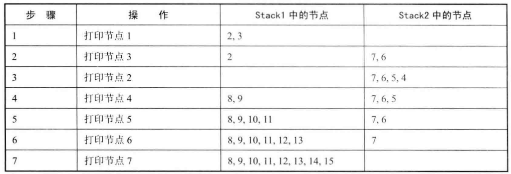

# 题目

从上到下打印二叉树的每个节点，同一层的节点按照从左到右的顺序打印。例如下图，则依次打印出8, 6, 10, 5, 7, 9, 11。



## 解法

BFS

```java
    public static ArrayList<Integer> printFromTopToBottom(TreeNode root) {
        ArrayList<Integer> result = new ArrayList<>();
        if (root == null) {
            return result;
        }
        Queue<TreeNode> queue = new LinkedList<>();
        queue.offer(root);
        while (!queue.isEmpty()) {
            TreeNode node = queue.poll();
            result.add(node.val);
            if (node.left != null) {
                queue.offer(node.left);
            }
            if (node.right != null) {
                queue.offer(node.right);
            }
        }
        return result;
    }
```

# 题目二

从上到下按层打印二叉树，同一层的节点按从左到右的顺序打印，每一层打印到一行。

```
8
6 10
5 7 9 11
```

## 解法

将本层全部节点打印到一行，并将下一层全部节点加入队列，以此类推，即可分为多行打印

```java
    public List<List<Integer>> levelOrder(TreeNode root) {
        List<List<Integer>> ret = new ArrayList<List<Integer>>();
        if (root == null) {
            return ret;
        }

        Queue<TreeNode> queue = new LinkedList<TreeNode>();
        queue.offer(root);
        while (!queue.isEmpty()) {
            List<Integer> level = new ArrayList<>();
            int currentLevelSize = queue.size();
            for (int i = 1; i <= currentLevelSize; i++) {
                TreeNode node = queue.poll();
                level.add(node.val);
                if (node.left != null) {
                    queue.offer(node.left);
                }
                if (node.right != null) {
                    queue.offer(node.right);
                }
            }
            ret.add(level);
        }
        
        return ret;
    }
```

# 题目三

请实现一个函数按照之字形顺序打印二叉树，即第一行按照从左到右的顺序打印，第二层按照从右到左的顺序打印，第三行再按照从左到右的顺序打印，其他行以此类推。



```
1
3 2
4 5 6 7
15 14 13 12 11 10 9 8
```

## 解法

## 双端队列

```java
    public List<List<Integer>> levelOrder(TreeNode root) {
        Queue<TreeNode> queue = new LinkedList<>();
        List<List<Integer>> res = new ArrayList<>();
        if(root != null) queue.add(root);
        while(!queue.isEmpty()) {
            LinkedList<Integer> tmp = new LinkedList<>();
            for(int i = queue.size(); i > 0; i--) {
                TreeNode node = queue.poll();
                // 偶数层 -> 队列头部
                if(res.size() % 2 == 0) {
                    tmp.addLast(node.val); 
                }
                // 奇数层 -> 队列尾部
                else {
                   	tmp.addFirst(node.val);
                }  
                if(node.left != null) queue.add(node.left);
                if(node.right != null) queue.add(node.right);
            }
            res.add(tmp);
        }
        return res;
    }
```

## 双栈法

需要两个栈 ：我们在打印某一层的节点时，把下一层的子节点保存到相应的栈里。如果当前打印的是奇数层（第一层、第三层等），则先保存左子节点再保存右子节点到第一个栈里；如果当前打印的是偶数层（第二层 、第四层等），则先保存右子节点再保存左子节点到第二个栈里



```java
    public ArrayList<ArrayList<Integer> > Print(TreeNode pRoot) {
        ArrayList<ArrayList<Integer>> result = new ArrayList<>();
        if (pRoot == null) {
            return result;
        }
        Stack<TreeNode>[] stacks = new Stack[2];
        stacks[0] = new Stack<>();
        stacks[1] = new Stack<>();
        int current = 0;
        stacks[0].push(pRoot);
        ArrayList<Integer> levelList = new ArrayList<>();
        while (!stacks[0].isEmpty() || !stacks[1].isEmpty()) {
            TreeNode node = stacks[current].pop();
            levelList.add(node.val);
            if (current == 0) {
                if (node.left != null) {
                    stacks[1].push(node.left);
                }
                if (node.right != null) {
                    stacks[1].push(node.right);
                }
            } else {
                if (node.right != null) {
                    stacks[0].push(node.right);
                }
                if (node.left != null) {
                    stacks[0].push(node.left);
                }
            }
            if (stacks[current].isEmpty()) {
                result.add(levelList);
                levelList = new ArrayList<>();
                current = 1 - current;
            }
        }
        return result;
    }
```


