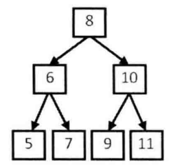

# 题目

输入一个整数数组，判断该数组是不是某二叉搜索树的后序遍历结构。如果是则返回true，否则返回false。假设输入数组的任意两个两个数组都互不相同，例如输入数组 {5，7，6，9，11，10，8} ，则返回true，因为这个整数序列是下图二叉搜索树的后序遍历结果。如果输入的数组是{7，4，6，5}，由于没有哪颗二叉搜索树的后序遍历结果是这个序列，因此返回false。



# 解法

在后序遍历得到的序列中，最后一个数字是树的根节点的值 。数组中前面的数字可以分为两部分：第一部分是左子树节点的值，它们都比根节点的值小；第二部分是右子树节点的值，它们都比根节点的值大 

以数组 {5，7，6，9，11，10，8} 为例，后序遍历结果的最后一个数字8就是根节点的值 。在这个数组中，前3个数字5、7 和 6 都比 8 小，是值为 8 的节点的左子树节点；后3个数字9、11和10 都比8大 ，是值为8的节点的右子树节点 。我们接下来用同样的方法确定数组每一部分对应的子树的结构。这其实就是一个递归的过程 。

我们再来分析另一个整数数组{7，4，6，5} 。 后序遍历的最后一个数字是根节点 ，因此根节点的值是5。由于第一个数字7大于5，因此在对应的二叉搜索树中，根节点上是没有左子树的，数字7、4 和6都是右子树节点 的值 。 但我们发现在右子树中有一个节点的值是 4，比根节点的值5小，这违背了二叉搜索树的定义 。因此，不存在一棵二叉搜索树，它的后序遍历结果是 {7，4，6，5}。

```java
    public static boolean verifySequenceOfBST(int[] sequence) {
        if (sequence == null || sequence.length == 0) {
            return false;
        }
        return verify(sequence, 0, sequence.length - 1);
    }

    private static boolean verify(int[] sequence, int start, int end) {
        if (start >= end) {
            return true;
        }
        int root = sequence[end];
        // 二叉搜索树中的左子树节点的值小于根结点的值
        int i = start;
        while (i < end && sequence[i] < root) {
            i++;
        }
        // 二叉搜索树中的右子树节点的值大于根结点的值
        int j = i;
        while (j < end) {
            if (sequence[j] < root) {
                return false;
            }
            j++;
        }
        return verify(sequence, start, i - 1) && verify(sequence, i, j - 1);
    }
```

# 相关题目

输入一个整数数组，判断该数组是不是某二叉搜索树的前序遍历结果 。这和前面问题的后序遍历很类似，只是在前序遍历得到的序列中，第一个数字是根节点的值 。

# 举一反三

如果面试题要求处理一棵二又树的遍历序列，则可以先找到二叉树的根节点，再基于根节点把整棵树的遍历序列拆分成左子树对应的子序列和右子树对应的子序列，接下来再递归地处理这两个子序列。本面试题应用的是这种思路，面试题 7"重建二叉树”应用的也是这种思路。

