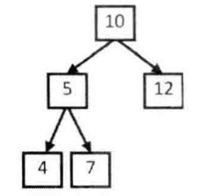

# 题目

输入一颗二叉树的根节点和一个整数，打印出二叉树中结点值的和为输入整数的所有路径。路径定义为从树的根结点开始往下一直到叶结点所经过的结点形成一条路径。节点定义：

```java
public class TreeNode {
    int val = 0;
    TreeNode left = null;
    TreeNode right = null;

    public TreeNode(int val) {
        this.val = val;
    }
}
```

如图，二叉树中有两条和为22的路径：一条路径经过节点10、5 、7；另一条路径经过节点10、12。



# 解法

当用前序遍历的方式访问到某一节点时，我们把该节点添加到路径上，并累加该节点的值 。如果该节点为叶节点 ，并且路径中节点值的和刚好等于输入的整数，则当前路径符合要求，我们把它打印出来。如果当前节点不是叶节点，则继续访问它的子节点。当前节点访问结束后，递归函数将自动回到它的父节点。因此，我们在函数退出之前要在路径上删除当前节点并减去当前节点的值，以确保返回父节点时路径刚好是从根节点到父节点。 我们不难看出保存路径的数据结构实际上是一个栈，因为路径要与递归调用状态一致 ，而递归调用的本质就是一个压栈和出栈的过程 。

```java
    public static ArrayList<ArrayList<Integer>> findPath(TreeNode root, int target) {
        ArrayList<ArrayList<Integer>> result = new ArrayList<>();
        if (root == null) {
            return result;
        }
        find(root, target, 0, new ArrayList<Integer>(), result);
        return result;
    }

    private static void find(TreeNode node, int target, int sum, ArrayList<Integer> path, ArrayList<ArrayList<Integer>> result) {
        sum += node.val;
        path.add(node.val);
        // 如果是叶节点，并且路径上节点值的和等于输入的值，则打印出这条路径
        if (node.left == null && node.right == null) {
            if (sum == target) {
                ArrayList<Integer> list = new ArrayList<>(path);
                result.add(list);
            }
        } else {
            // 如果不是叶节点，则遍历它的子节点
            if (node.left != null) {
                find(node.left, target, sum, path, result);
            }
            if (node.right != null) {
                find(node.right, target, sum, path, result);
            }
        }
        // 在返回父节点之前，在路径上删除当前节点
        path.remove(path.size() - 1);
    }
```

