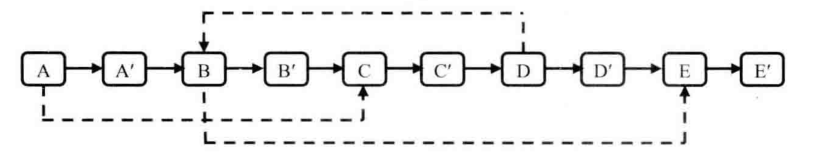

# 题目

输入一个复杂链表（每个节点中有节点值，以及两个指针，一个指向下一个节点，另一个特殊指针指向任意一个节点），返回结果为复制后复杂链表的head。节点定义：

```java
public class RandomListNode {
    int label;
    RandomListNode next = null;
    RandomListNode random = null;

    RandomListNode(int label) {
        this.label = label;
    }
}
```


如图，是一个含有5个节点的复杂链表，除了有指向下一个节点的指针（实线箭头），还有指向任意节点的指针（虚线箭头）

# 解法

听到这个问题之后，很多应聘者的第一反应是把复制过程分成两步：第一步是复制原始链表上的每个节点，并用next链接起来；第二步是设置每个节点的random指针。设置random指针时，由于要从头找，对于一个含有n个节点的链表，复杂度为O(n^2)。为了优化定位random的时间，可以使用哈希表把节点N与复制出来的N'存起来：<N, N'>，这样就可以在O(1)的时间设置random：`clonedNode.random = map.get(node.random)`。

不使用辅助空间的方法：

1.   根据原始链表的每个节点N创建对应的N'。 这一次，我们把N'链接在N的后面。

     

2.   设置复制出来的节点的random。 假设原始链表上的N的random指向节点S，则它对应的复制节点N'的random指向S的复制节点S' （复制节点都是在节点的下一个节点）。

     

3.   将上面的链表拆成两个链表，原始链表和复制链表

     

```java
    public static RandomListNode clone(RandomListNode head) {
        if (head == null) {
            return null;
        }
        cloneNodes(head);
        connectRandomNodes(head);
        return reconnectNodes(head);
    }

    private static void cloneNodes(RandomListNode head) {
        // 根据原始链表的每个节点 N 创建对应的 N'
        RandomListNode node = head;
        while (node != null) {
            RandomListNode cloned = new RandomListNode(node.label);
            cloned.next = node.next;
            node.next = cloned;
            node = cloned.next;
        }
    }

    private static void connectRandomNodes(RandomListNode head) {
        // 设置复制出来的节点的 random
        RandomListNode node = head;
        RandomListNode cloned;
        while (node != null) {
            cloned = node.next;
            if (node.random != null) {
                cloned.random = node.random.next;
            }
            node = cloned.next;
        }
    }

    private static RandomListNode reconnectNodes(RandomListNode head) {
        // 把这个长链表拆分成两个链表
        RandomListNode node = head;
        RandomListNode clonedHead = head.next;
        RandomListNode cloned;
        while (node != null) {
            cloned = node.next;
            node.next = cloned.next;
            // 在链表末尾时，node.next = null
            if (node.next != null) {
                cloned.next = node.next.next;
            }
            node = node.next;
        }
        return clonedHead;
    }
```

