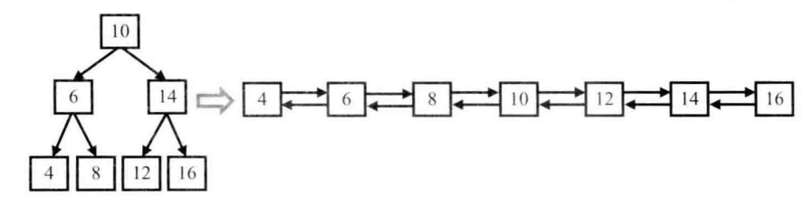

# 题目

输入一棵二叉搜索树，将该二叉搜索树转换成一个排序的双向链表。要求不能创建任何新的结点，只能调整树中结点指针的指向。节点定义：

```java
public class TreeNode {
    int val = 0;
    TreeNode left = null;
    TreeNode right = null;

    public TreeNode(int val) {
        this.val = val;
    }
}
```

一棵二叉搜索树及转换之后的排序双向链表：



# 解法

**分治法**：转换整棵二叉树是一个大问题，我们先把这个大问题分解成转换左子树和右子树两个小问题，然后再把转换左、右子树得到的链表和根节点链接起来，就解决了整棵大问题 。

在搜索二叉树中，左子节点的值总是小于父节点的值，右子节点的值总是大于父节点的值 。因此，我们在将二叉搜索树转换成排序的双向链表时，原先指向左子节点的指针调整为链表中指向前一个节点的指针，原先指向右子节点的指针调整为链表中指向后一个节点的指针。 接下来我们考虑该如何转换 。

由于**中序遍历**是按从小到大的顺序遍历树的节点，遍历转换到根结点时，它的左子树已经转换成一个排序的链表了，需要把链表的最后一个与根节点连接起来，此时链表的最后一个节点就是根节点。接着去遍历转换右子树，并把根节点和右子树中的最小节点连接起来。

```java
public class Solution {

    private TreeNode lastNode;

    public TreeNode convert(TreeNode root) {
        if (root == null) {
            return null;
        }
        convertNode(root);
        // 返回头节点
        while (lastNode.left != null) {
            lastNode = lastNode.left;
        }
        return lastNode;
    }

    private void convertNode(TreeNode node) {
        if (node.left != null) {
            convertNode(node.left);
        }
        // 连接当前节点和链表最后一个节点
        node.left = lastNode;
        if (lastNode != null) {
            lastNode.right = node;
        }
        // 更新链表的最后一个节点
        lastNode = node;
        if (node.right != null) {
            convert(node.right);
        }
    }
}

```

