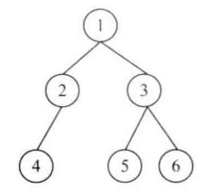

# 题目

请实现两个函数，分别用来序列化和反序列化二叉树。

# 解法

把二叉树分解成3部分：根节点、左子树和右子树 。 我们在处理（序列化或反序列化）它的根节点之后再分别处理它的左、右子树。

通过分析解决面试题7 "重建二叉树”，我们知道可以从前序遍历序列和中序遍历序列中构造出一棵二叉树。受此启发，我们可以先把一棵二叉树序列化成 一 个前序遍历序列和 一 个中序遍历序列，然后在反序列化时通过这两个序列重构出原二叉树。这种思路有两个缺点：一是该方法要求二叉树中不能有数值重复的节点；二是有当两个序列中所有数据都读出后才能开始反序列化 。如果两个遍历序列的数据是从一个流里读出来的，那么可能需要等待较长的时间 。

实际上，如果二叉树的序列化是从根节点开始的，那么相应的反序列化在根节点的数值读出来的时候就可以开始了。因此，我们可以根据前序遍历的顺序来序列化二叉树，因为前序遍历是从根节点开始的。在遍历二叉树碰到null时，这些null序列化为 一个特殊的字符（如 '$')。另外，节点的数值之间要用一个特殊字符（如，',' ）隔开。一棵被序列化成`1,2,4,$,$,$,3,5,$,$,6,$,$`的二叉树：



反序列化按照前序遍历，重建根节点、左子节点、右子节点

```java
public class Solution {

    private int index = 0;

    public String serialize(TreeNode root) {
        String result = serializeTree(root);
        // 去掉末尾的,
        return result.substring(0, result.length() - 1);
    }

    private String serializeTree(TreeNode node) {
        if (node == null) {
            return "$,";
        }
        return node.val + "," + serializeTree(node.left) + serializeTree(node.right);
    }

    public TreeNode deserialize(String str) {
        if (str == null || str.length() == 0) {
            return null;
        }
        return deserialize(str.split(","));
    }

    private TreeNode deserialize(String[] strs) {
        if (index >= strs.length || strs[index].equals("$")) {
            return null;
        }
        TreeNode node = new TreeNode(Integer.parseInt(strs[index]));
        index++;
        node.left = deserialize(strs);
        index++;
        node.right = deserialize(strs);
        return node;
    }
}

```