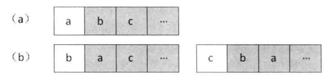

# 题目

输入一个字符串，按字典序打印出该字符串中字符的所有排列。例如输入字符串abc，则打印出由字符a,b,c所能排列出来的所有字符串abc,acb,bac,bca,cab和cba。

# 解法

考虑把这个复杂的问题分解成小的问题。我们把一个字符串看成由两部分组成：第一部分是它的第一个字符；第二部分是后面的所有字符。我们求整个字符串的排列，可以看成两步：

1.   求所有可能出现在第一个位置的字符，即把第一个字符和后面所有的字符交换 。
2.   第二步固定第一个字符，求后面所有字符的排列（阴影部分）



```java
    public static ArrayList<String> permutation(String str) {
        ArrayList<String> result = new ArrayList<>();
        if (str == null || str.length() == 0) {
            return result;
        }
        permutation(str.toCharArray(), 0, result);
        return result;
    }

    private static void permutation(char[] chars, int start, ArrayList<String> result) {
        if (start == chars.length) {
            result.add(new String(chars));
        } else {
            for (int i = start; i < chars.length; i++) {
                // 和后面字符交换位置
                if (chars[start] != chars[i]) {
                    swap(chars, start, i);
                }
                // 固定这个字符，求后面字符串的排列
                // 对于重复的字母不重复输出
                if (i == start || chars[start] != chars[i]) {
                    permutation(chars, start + 1, result);
                }
                // 交换回来，为了下一次交换
                if (chars[start] != chars[i]) {
                    swap(chars, start, i);
                }
            }
        }
    }

    private static void swap(char[] chars, int i, int j) {
        char temp = chars[i];
        chars[i] = chars[j];
        chars[j] = temp;
    }
```

# 扩展

如果不是求字符的所有排列，而是求字符的所有组合， 应该怎么办呢？还是输入三个字符 a 、b 、c,
则它们的组合有 a、b、c、ab、ac 、bc、abc 。当交换字符串中的两个字符时，虽然能得到两个不同的排列，但却是同一个组合 。比如 ab 和 ba 是不同的排列，但只算一个组合。

还是把字符串分为两部分：第一个字符和其余所有字符。有两种情况：组合里包含这个字符、组合里不包含这个字符。如果看出二叉树的话，每个节点都可以选择要或者不要：


```java
    public static void combination(String str) {
        if (str == null || str.length() == 0) {
            return;
        }
        combination(str.toCharArray(), "", 0);
    }

    private static void combination(char[] chars, String pre, int i) {
        if (i == chars.length) {
            System.out.println(pre);
        } else {
            // 不要当前字符
            combination(chars, pre, i + 1);
            // 要当前字符
            combination(chars, pre + chars[i], i + 1);
        }
    }
```

# 相关题目

-   输入一个含有8个数字的数组，判断有没有可能把这8个数字分别放到正方体的8个顶点上，使得正方体上三组相对的面上的4个顶点的和都相等 。

    

    这相当于先得到a1，a2，a3，a4，a5，a6，a7，a8这几个数字的所有排列。然后再判断有没有某一个排列	符合题目条件，即`a1 + a2 + a3 + a4 = a5 + a6 + a7 + a8`、`a1 + a3 + a5 + a7 = a2 + a4 + a6 + a8` 并且`a1 + a2 + a5 + a6 = a3 + a4 + a7 + a8`

-   在 8 x 8 的国际象棋上摆放8个皇后，使其不能相互攻击，即任意两个皇后不得处在同一行、同一列或者同 一条对角线上。请问总共有多少种符合条件的摆法？

    

    由于8个皇后的任意两个能处在同一行，那么肯定是每一个皇后占据一行。于是 我们可以定义一个数组`Columnlndex[8]`，数组中第i个数字表示位于第i行的皇后的列号。先把数组 `Columnlndex` 的8个数字分别用 0~7 初始化 ，然后对数组进行全排列。 因为我们用不同的数字初始化数组，所以任意两个皇后肯定不同列。只需判断每一个排列对应的8个皇后是不是在同一条对角线上，也就是对于数组的两个下标i和 j, 是否有`i-j == Columnlndex[i]-Columnlndex[j]` 或者`j-i == Columnlndex[i]-Columnlndex[j]`（i-j是纵坐标上的差，另一个是横坐标上的差，两个相等时在同一条对角线上）

# 举一反三

如果面试题是按照一定要求摆放若干个数字，则可以先求出这些数字的所有排列，然后一一判断每个排列是不是满足题目给定的要求。