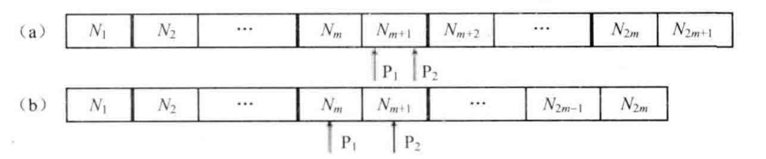

# 题目

如何得到一个数据流中的中位数？如果从数据流中读出奇数个数值，那么中位数就是所有数值排序之后位于中间的数值。如果从数据流中读出偶数个数值，那么中位数就是所有数值排序之后中间两个数的平均值。

# 解法

不同的数据容器的插入和查询时间复杂度对于这道题是不一样的

| 数据结构       | 插入的时间复杂度                   | 得到中位数的时间复杂度    |
| -------------- | ---------------------------------- | ------------------------- |
| 没有排序的数组 | O(1)                               | O(n) 使用Partition函数    |
| 排序的数组     | O(n)                               | O(1)                      |
| 排序的链表     | O(n)                               | O(1) 使用指针指向中间结点 |
| 二叉搜索树     | 平均O(logn),最差O(n)               | 平均O(logn),最差O(n)      |
| AVL树          | O(logn) 平衡因子改为左右子树数目差 | O(1)                      |
| 大顶堆和小顶堆 | O(logn)                            | O(1)                      |

## 大顶堆和小顶堆法

如果数据在容器中已经排序，那么中位数可以由 P1 和 P2 指向的数得到。 如果容器中数据的数目是奇数， 那么P1 和 P2 指向同 一个数据。注意到整个数据容器被分隔成两部分。位于容器左边部分的数据比右边的数据小。另外，P1 指向的数据是左边部分最大的数，P2 指向的数据是左边部分最小的数 。



如果能够保证数据容器左边的数据都小于右边的数据，那么即使左 、右两边内部的数据没有排序，也可以根据左边最大的数及右边最小的数得到中位数。 如何快速从一个数据容器中找出最大数？用最大堆实现这个数据容器，因为位于堆顶的就是最大的数据 。同样，也可以快速从最小堆中找出最小数 。

接下来考虑实现细节：

1.   首先要保证数据平均分配到两个堆中，因此两个堆中数据的数目之差不能超过1。为了实现平均分配，可以在数据的总数目是偶数时把新数据插入最大堆，否则插入最小堆。

2.   还要保证最大堆中的所有数据都要小于最小堆中的数据。（如果不考虑这个的话，就是原数组的奇数位置上的数成堆，偶数位置上的数字成堆，不能找到整体的中位数）

     当数据的总数目是奇数时，按照前面的分配规则会把新的数据插入最小堆 。如果此时这个新的数据比最大堆中的一些数据要小，那该怎么办呢？可以先把这个新的数据插入最大堆，接着把最大堆中最大的数字拿出来插入最小堆 。由于最终插入最小堆的数字是原最大堆中最大的数字、这样就保证了最小堆中所有数字都大于最大堆中的数字。当需要把一个数据插入最大堆，但这个数据大于最小堆里的一些数据时，这个情形和前面类似。

```java
public class Solution {
    
    private PriorityQueue<Integer> minQueue = new PriorityQueue<>();
    private PriorityQueue<Integer> maxQueue = new PriorityQueue<>((n1, n2) -> n2 - n1);

    public void insert(Integer num) {
        // 数据总数目是偶数
        if ((minQueue.size() + maxQueue.size() & 1) == 0) {
            // 新数据比最小堆的一些数据大
            if (!minQueue.isEmpty() && num > minQueue.peek()) {
                minQueue.offer(num);
                num = minQueue.poll();
            }
            // 插入最大堆
            maxQueue.offer(num);
        }
        // 数据总数目是奇数
        else {
            // 新数据比最大堆的一些数据小
            if (!maxQueue.isEmpty() && num < maxQueue.peek()) {
                maxQueue.add(num);
                num = maxQueue.poll();
            }
            // 插入最小堆
            minQueue.offer(num);
        }
    }

    public Double getMedian() {
        int size = maxQueue.size() + minQueue.size();
        if (size == 0) {
            return 0.0;
        }
        if ((size & 1) == 1) {
            return (double) maxQueue.peek();
        } else {
            return (maxQueue.peek() + minQueue.peek()) / 2.0;
        }
    }
}

```

