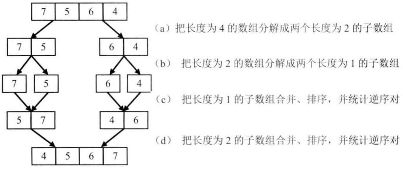
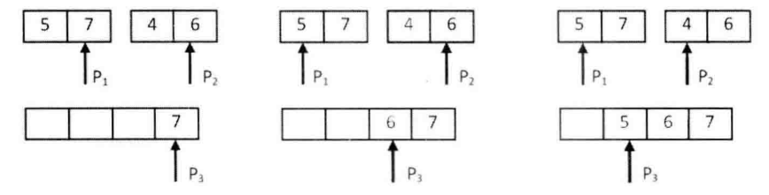

# 题目

在数组中的两个数字，如果前面一个数字大于后面的数字，则这两个数字组成一个逆序对。输入一个数组，求出这个数组中的逆序对的总数。例如，在数组 {7, 5, 6, 4} 中，一共存在 5 个逆序对，分别是 (7, 6)、(7, 5)、(7, 4)、(6, 4) 和 (5, 4)。

# 解法

第一反应是顺序扫描整个数组。 每扫描到一 个数字，逐个比较该数字和它后面的数字的大小。如果后面的数字比它小，则 这两个数字就组成一个逆序对。时间复杂度O(n^2)。

可以使用分治法。以{7, 5, 6, 4}为例，先把数组分解成两个长度为2的子数组，再把这两个子数组分别拆分成两个长度为1的子数组。



接下来边合并相邻的子数组，一 边统计逆序对的数目：先用两个指针分别指向两个子数组的末尾，并每次比较两个指针指向的数字。 如果第一个子数组中的数字大于第二个子数组中的数字，则构成逆序对，并且逆序对的数目等于第二个子数组中剩余数字的个数。如果第一个数组中的数字小于或等于第二个数组中的数字，则不构成逆序对。每次比较的时候，我们都把较大的数字从后往前复制到一个辅助数组，确保辅助数组中的数字是递增排序的。在把较大的数字复制到辅助数组之后，把对应 指针向前移动一位，接下来进行下一轮比较。 



```java
    public static int reversePairs(int[] nums) {
        if (nums == null || nums.length == 0) {
            return 0;
        }
        int[] copy = Arrays.copyOf(nums, nums.length);
        return inverse(nums, copy, 0, nums.length - 1);
    }

    private static int inverse(int[] array, int[] copy, int start, int end) {
        if (start == end) {
            return 0;
        }
        int mid = (start + end) >> 1;
        int left = inverse(copy, array, start, mid);
        int right = inverse(copy, array, mid + 1, end);
        int count = merge(array, copy, start, mid, end);
        return left + right + count;
    }

    private static int merge(int[] array, int[] copy, int start, int mid, int end) {
        int count = 0;
        // 左边最右端下标
        int i = mid;
        // 右边最右端下标
        int j = end;
        // 辅助数组最右端的下标
        int k = end;
        while (i >= start && j > mid) {
            if (array[i] > array[j]) {
                copy[k--] = array[i--];
                count += j - mid;
            } else {
                copy[k--] = array[j--];
            }
        }
        // 如果左边有剩余
        while (i >= start) {
            copy[k--] = array[i--];
        }
        // 如果右边有剩余
        while (j > mid) {
            copy[k--] = array[j--];
        }
        // 临时数组覆盖原数组
        System.arraycopy(copy, start, array, start, end - start + 1);
        return count;
    }
```