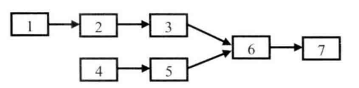

# 题目

输入两个链表，找出他们的第一个公共节点。

链表节点定义如下：

```java
public class ListNode {
    int val = 0;
    ListNode next = null;
    ListNode(int x) {
        val = x;
    }
}
```

# 解法

## 暴力法

第一反应是暴力法：在第 一链表上顺序遍历每个节点，每遍历到一个节点，就在第二个链表上顺序遍历每个节点。 如果在第二个链表上有一个节点和第一个链表上的节点一样，则说明两个链表在这个节点上重合，于是就找到了它们的公共节点。如果第一个链表的长度为 m，第二个链表的长度为 n，那么，显然该方法的时间复杂度是 O(mn) 。

## 栈

有公共节点的两个链表的特点：如果两个单向链表有公共的节点，那么这 两个链表从某一节点开始，它们的next都指向同一个节点 。因此从第一个公共节点开始，之后它们所有的节点都是重合的，不可能再出现分叉 




所以公共节点出现在两个链表的尾部，如果我们从两个链表的尾部开始往前比较，那么最后一个相同的节点就是我们要找的节点 。可以用栈解决这个问题：分别把两个链表的节点放入两个栈里，这样两个链表的尾节点就位于两个栈的栈顶，接下来比较两个栈顶的节点是否相同。 如果相同 ，则把栈顶弹出接着比较下一个栈顶，直到找到最后一个相同的节点 。

## 双指针

之所以需要用到栈，是因为我们想同时遍历到达两个栈的尾节点 。当两个链表的长度不相同时，如果我们从头开始遍历，那么到达尾节点的时间就不一致。 其实解决这个问题还有一种更简单的办法：首先遍历两个链表得到它们的长度，就能知道哪个链表比较长，以及长的链表比短的链表多几个节点。在第二次遍历的时候，在较长的链表先走若干步，接着同时在两个链表上遍历，找到的第一个相同的节点就是它们的第一个公共节点 。

```java
    public static ListNode getIntersectionNode(ListNode headA, ListNode headB) {
        if (headA == null || headB == null) {
            return null;
        }
        int lengthA = length(headA);
        int lengthB = length(headB);
        if (lengthA > lengthB) {
            headA = walk(headA, lengthA - lengthB);
        } else {
            headB = walk(headB, lengthB - lengthA);
        }
        while (headA != null && headB != null) {
            if (headA == headB) {
                return headA;
            }
            headA = headA.next;
            headB = headB.next;
        }
        return null;
    }

    private static int length(ListNode node) {
        int l = 0;
        while (node != null) {
            l++;
            node = node.next;
        }
        return l;
    }

    private static ListNode walk(ListNode node, int step) {
        while (step > 0 && node != null) {
            node = node.next;
            step--;
        }
        return node;
    }
```

还有一个方法是：使用两个指针 node1，node2 分别指向两个链表 headA，headB 的头结点，然后同时分别逐结点遍历，当 node1 到达链表 headA 的末尾时，重新定位到链表 headB 的头结点；当 node2 到达链表 headB 的末尾时，重新定位到链表 headA 的头结点。这样，当它们相遇时，所指向的结点就是第一个公共结点。

原理：两个链表长度分别为L1+C、L2+C， C为公共部分的长度，当两个人走的步数都为L1+L2+C时就两个家伙就相爱了

但是前提是两个链表一定有相交的节点，没有的话会死循环。

```java
    public ListNode getIntersectionNode(ListNode headA, ListNode headB) {
        if (headA == null || headB == null) {
            return null;
        }
        ListNode pA = headA, pB = headB;
        while (pA != pB) {
            pA = pA == null ? headB : pA.next;
            pB = pB == null ? headA : pB.next;
        }
        return pA;
    }
```

