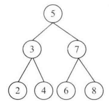

# 题目

给定一棵二叉搜索树，请找出其中的第k小的结点。例如，在下图的二叉搜索树里，按节点数值大小顺序，第三大节点的值是4。



# 解法

中序遍历

```java
public class Solution {
    private int k;

    public TreeNode kthNode(TreeNode root, int k) {
        if (root == null || k == 0) {
            return null;
        }
        this.k = k;
        return kthNodeCore(root);
    }

    private TreeNode kthNodeCore(TreeNode root) {
        TreeNode target = null;
        if (root.left != null) {
            target = kthNodeCore(root.left);
        }
        if (target == null) {
            if (k == 1) {
                target = root;
            }
            k--;
        }
        if (target == null && root.right != null) {
            target = kthNodeCore(root.right);
        }
        return target;
    }
}
```

