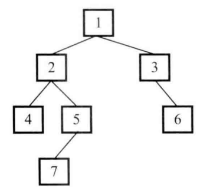

# 题目

输入一棵二叉树，求该树的深度。从根结点到叶结点依次经过的结点（含根、叶结点）形成树的一条路径，最长路径的长度为树的深度。节点定义：

```java
public class TreeNode {
    int val;
    TreeNode left;
    TreeNode right;

    public TreeNode(int x) {
        val = x;
    }

}
```

下图二叉树的深度为 4，因为它从根节点到叶节点最长的路径包含 4 个节点（1,2,5,7）



## 解法

一个树的深度可以理解为左、右子树深度的最大值加1。

```java
    public static int treeDepth(TreeNode node) {
        if (node == null) {
            return 0;
        }
        return Math.max(treeDepth(node.left), treeDepth(node.right)) + 1;
    }
```

# 题目二

输入一棵二叉树，判断该二叉树是否是平衡二叉树。如果某二叉树中任意节点的左、右子树的深度相差不超过1，那么它就是一棵平衡二叉树。

## 解法

最简单的想法是在遍历树的每个节点的时候，调用函数 treeDepth 得到它的左、右子树的深度。 如果每个节点的左、右 子树的深度相差都不超过1，那么它就是一棵平衡二叉树 。但是这会重复遍历很多次。

如果我们用后序遍历的方式遍历二叉树的每个节点，那么在遍历到一个节点之前我们就已经遍历了它的左、右子树 。只要在遍历每个节点的时候记录它的深度 （某一节点的深度等于它到叶节点的路径的长度），我们就可以一边遍历一边判断每个节点是不是平衡的 。

```java
    public static boolean isBalanced(TreeNode root) {
        if (root == null) {
            return true;
        }
        return postOrder(root) != -1;
    }

    // -1 表示不是二叉平衡树
    private static int postOrder(TreeNode node) {
        if (node == null) {
            return 0;
        }
        // 左子树的深度
        int left = postOrder(node.left);
        if (left == -1) {
            return -1;
        }
        // 右子树的深度
        int right = postOrder(node.right);
        if (right == -1) {
            return -1;
        }
        if (Math.abs(left - right) > 1) {
            return -1;
        } else {
            return Math.max(left, right) + 1;
        }
    }
```

