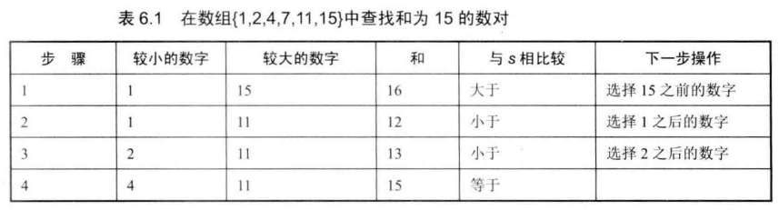
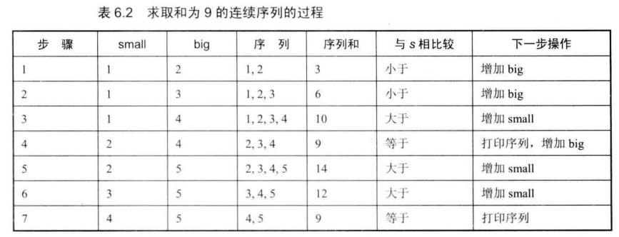

# 题目

输入一个递增排序的数组和一个数字S，在数组中查找两个数，使得他们的和正好是S，如果有多对数字的和等于S，则输出任意一对即可。

例如，输入数组 {1, 2, 4, 7, 11, 15 } 和数字15。由于 4 + 11 = 15 , 因 此输出4和11 。

## 解法

这个问题，很多人都能立即想到O(n^2)的方法，也就是先在数组中固定一个数字，再依次判断数组中其余的n-1个数字与它的和是不是等于s 。面试官会告诉我们这不是最好的办法 。 

我们先在数组中选择两个数字，如果它们的和等于输入的 S, 那么我们就找到了要找的两个数字。 如果和小于 s 呢？我们希望两个数字的和再大一点 。由于数组已经排好序了，我们可以考虑选择较小的数字后面的数字。因为排在后面的数字要大一些，那么两个数字的和也要大一些， 就有可能等于输入的数字 S 了。 同样，当两个数字的和大于输入的数字的时候，我们可以选择较大数字前面的数字，因为排在数组前面的数字要小一些。所以可以：

1.  定义两个指针，一个指向数组的第一个数字，一个指向数组的最后一个数字
2.  如果两个指针指向的数字加起来等于数字s，则返回结果
3.  如果两个指针指向的数字加起来大于数字s，则指向数组后面数字的指针左移
4.  如果两个指针指向的数字加起来小于数字s，则指向数组前面数字的指针右移



```java
    public static ArrayList<Integer> findNumbersWithSum(int[] array, int sum) {
        ArrayList<Integer> result = new ArrayList<>();
        if (array == null || array.length < 2) {
            return result;
        }
        int start = 0;
        int end = array.length - 1;
        while (start < end) {
            int s = array[start] + array[end];
            if (s == sum) {
                result.add(array[start]);
                result.add(array[end]);
                return result;
            } else if (s < sum) {
                start++;
            } else {
                end--;
            }
        }
        return result;
    }
```

# 题目二

输入一个正数S，打印出所有和为 S 的连续正数序列（至少含有两个数）。例如，输入15，由于1+2+3+4+5 = 4+5+6 = 7+8 = 15, 所以打印出 3 个连续序 列 1~5 、4~6 和 7~8 。

## 解法

有了解决前面问题的经验 ，我们也考虑用两个数 small 和 big 分别表示序列的最小值和最大值。 首先 把 small 初始化为1，big初始化为2。如果从small 到 big 的序列的和大于S，则可以从序列中去掉较小的值，也就是增大small的值。如果从small到 big的序列的和小于S,
则可以增大big，让这个序列包含更多的数字。因为这个序列至少要有两个数字，我们一直增加small 到 (1+ S ) / 2 为止。



```java
    public static ArrayList<ArrayList<Integer>> findContinuousSequence(int sum) {
        ArrayList<ArrayList<Integer>> result = new ArrayList<>();
        if (sum < 3) {
            return result;
        }
        int small = 1;
        int big = 2;
        int middle = (1 + sum) / 2;
        int curSum = small + big;
        while (small < middle) {
            if (curSum == sum) {
                result.add(buildContinuousSequence(small, big));
            }
            while (curSum > sum && small < middle) {
                curSum -= small;
                small++;
                if (curSum == sum) {
                    result.add(buildContinuousSequence(small, big));
                }
            }
            big++;
            curSum += big;
        }
        return result;
    }

    private static ArrayList<Integer> buildContinuousSequence(int small, int big) {
        ArrayList<Integer> list = new ArrayList<>();
        for (int i = small; i <= big; i++) {
            list.add(i);
        }
        return list;
    }
```

