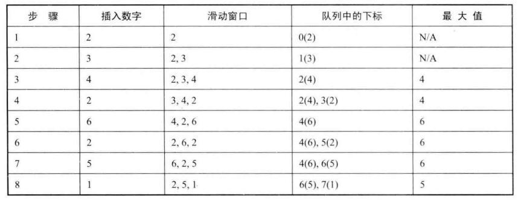

# 题目一：滑动窗口的最大值

给定一个数组和滑动窗口的大小，找出所有滑动窗口里数值的最大值。

例如，如果输入数组 {2, 3, 4, 2, 6, 2, 5, 1} 及滑动窗口的大小 3，那么一共存在 6 个滑动窗口，他们的最大值分别为 {4, 4, 6, 6, 6, 5}。

## 解法一

蛮力法：可以扫描每个滑动窗口的所有数字并找出其中的最大值。如果滑动窗口的大小为 k, 则 需要 O(k)时间才能找出滑动窗口里的最大值。对于长度为 n 的输入数组，这种算法的总时间 复杂度是O(nk)。

实际上，一个滑动窗口可以看成一个队列。当窗口滑动时，处于窗口的第一个数字被删除，同时在窗口的末尾添加一个新的数字。这符合队列的“先进先出”特性。如果能从队列中找出它的最大数，那么这个问题也就解决了。

在面试题30中，我们实现了一个可以用O(1)时间得到最小值的栈。同样，也可以用O(1)时间得到栈的最大值。同时在面试题9中，我们讨论了如何用两个栈实现一个队列。综合这两个问题的解决方案，我们发现，如果把队列用两个栈实现，由于可以用O(1)时间得到栈中的最大值，那么也就可以用O(1)时间得到队列的最大值，因此总的时间复杂度也就降到了O(n)。

但是这个方法需要实现的代码比较多，时间不一定够用。

```java
public class Solution1 {

    // 使用两个栈实现队列
    private Stack<Integer> stack1 = new Stack<>();
    private Stack<Integer> stack2 = new Stack<>();
    // 在O(1)时间得到栈的最大值
    private Stack<Integer> maxStack1 = new Stack<>();
    private Stack<Integer> maxStack2 = new Stack<>();

    public ArrayList<Integer> maxInWindow(int[] num, int size) {
        ArrayList<Integer> result = new ArrayList<>();
        for (int i = 0; i < size; i++) {
            appendTail(num[i]);
        }
        result.add(findMax());
        for (int i = size; i < num.length; i++) {
            // 删除窗口第一个数字
            deleteHead();
            // 末尾添加一个数字
            appendTail(num[i]);
            // 找出队列的最大值
            result.add(findMax());
        }
        return result;
    }

    private void appendTail(Integer i) {
        stack1.push(i);
        pushMax(maxStack1, i);
    }

    private void deleteHead() {
        if (stack2.isEmpty()) {
            // 把stack1的数字压入stack2中，也要同时更新maxStack1
            while (!stack1.isEmpty()) {
                Integer temp = stack1.pop();
                maxStack1.pop();
                stack2.push(temp);
                pushMax(maxStack2, temp);
            }
        }
        if (!stack2.isEmpty()) {
            stack2.pop();
            maxStack2.pop();
        }
    }

    // 更新栈的最大值
    private void pushMax(Stack<Integer> stack, Integer i) {
        if (!stack.isEmpty()) {
            Integer curMax = stack.peek();
            if (curMax < i) {
                stack.push(i);
            } else {
                stack.push(curMax);
            }
        } else {
            stack.push(i);
        }
    }

    // 找出在maxStack1和maxStack2中的最大值
    private int findMax() {
        Integer max1 = Integer.MIN_VALUE;
        Integer max2 = Integer.MIN_VALUE;
        if (!maxStack1.isEmpty()) {
            max1 = maxStack1.peek();
        }
        if (!maxStack2.isEmpty()) {
            max2 = maxStack2.peek();
        }
        return Math.max(max1, max2);
    }
}
```

## 解法二

下面换一种思路。我们并不把滑动窗口的每个数值都存入队列，而是**只把有可能成为滑动窗口最大值的数值存入一个两端开口的队列**。接着以输入数组{2,3,4,2,6,2,5,1}为例一步步分析。

数组的第一个数字是2，把它存入队列。第二个数字是3，由于它比前一个数字2大，因此2不可能成为滑动窗口中的最大值。先把2从队列里删除，再把3存入队列。此时队列中只有一个数字3。针对第三个数字4的步骤类似，最终在队列中只剩下一个数字4。此时滑动窗口中己经有3个数字，而它的最大值4位于队列的头部。

接下来处理第四个数字2。2比队列中的数字4小。当4滑出窗口之后，2还是有可能成为滑动窗口中的最大值，因此把2存入队列的尾部。现在队列中有两个数字4和2，其中最大值4仍然位于队列的头部。

第五个数字是6。由于它比队列中已有的两个数字4和2都大，因此这时4和2已经不可能成为滑动窗口中的最大值了。先把4和2从队列中删除，再把数字6存入队列。这时候最大值6仍然位于队列的头部。

第六个数字是2。由于它比队列中已有的数字6小，所以把2也存入队列的尾部。此时队列中有两个数字，其中最大值6位于队列的头部。

第七个数字是5。在队列中已有的两个数字6和2里，2小于5，因此2不可能是一个滑动窗口的最大值，可以把它从队列的尾部删除。删除数字2之后，再把数字5存入队列。此时队列里剩下两个数字6和5，其中位于队列头部的是最大值6。

数组最后一个数字是1，把1存入队列的尾部。注意到位于队列头部的数字6 是数组的第五个数字，此时的滑动窗口已经不包括这个数字了，因此应该把数字6从队列中删除。那么怎么知道滑动窗口是否包括一个数字? **应该在队列里存入数字在数组里的下标，而不是数值**。当一个数字的下标与当前处理的数字的下标之差大于或者等于滑动窗口的大小时，这个数字已经从窗口中滑出，可以从队列中删除了。

（小括号前面的数字表示—个数字在输入数组中的下标，下标对应的在数组中的数字在后面的小括号中标出）



```java
    public static ArrayList<Integer> maxInWindows(int[] num, int size) {
        ArrayList<Integer> result = new ArrayList<>();
        if (num == null || num.length == 0 || size < 1 || size > num.length) {
            return result;
        }
        // 保存有可能是滑动窗口最大值的数字的下标
        LinkedList<Integer> index = new LinkedList<>();
        // 第一个滑动窗口
        for (int i = 0; i < size; i++) {
            // 如果已有的数字小于待存入的数字，那么这些数字已经不可能是滑动窗口的最大值
            while (!index.isEmpty() && num[index.getLast()] <= num[i]) {
                index.removeLast();
            }
            index.add(i);
        }
        for (int i = size; i < num.length; i++) {
            result.add(num[index.getFirst()]);
            while (!index.isEmpty() && num[index.getLast()] <= num[i]) {
                index.removeLast();
            }
            // 队列头部的数字已经从窗口里滑出，从队列的头部删除
            if (!index.isEmpty() && i - index.getFirst() >= size) {
                index.removeFirst();
            }
            index.add(i);
        }
        // 最后一个滑动窗口
        result.add(num[index.getFirst()]);
        return result;
    }
```

在上述代码中，**index是一个两端开口的队列，用来保存有可能是滑动窗口最大值的数字的下标**。在存入一个数字的下标之前，首先要判断队列里已有数字是否小于待存入的数字。如果已有的数字小于待存入的数字，那么这些数字已经不可能是滑动窗口的最大值，因此它们将会被依次从队列的尾部删除。同时，如果队列头部的数字已经从窗口里滑出，那么滑出的数字也需要从队列的头部删除。由于队列的头部和尾部都有可能删除数字，这也是需要两端开口的队列的原因。

# 题目二：队列的最大值

请定义一个队列并实现函数max得到队列里的最大值，要求函数max、push和pop的时间复杂度都是O(1)。

## 解法

如前所述，滑动窗口可以看成一个队列，因此上题的解法可以用来实现带max函数的队列。

```java
public class MaxQueue {

    private LinkedList<Integer> queue = new LinkedList<>();
    private LinkedList<Integer> maxQueue = new LinkedList<>();

    public int maxValue() {
        return maxQueue.isEmpty() ? -1 : maxQueue.getFirst();
    }

    public void pushBack(int value) {
        queue.add(value);
        while (!maxQueue.isEmpty() && maxQueue.getLast() < value) {
            maxQueue.removeLast();
        }
        maxQueue.add(value);
    }

    public int popFront() {
        if (queue.isEmpty()) {
            return -1;
        }
        int value = queue.removeFirst();
        if (value == maxQueue.getFirst()) {
            maxQueue.removeFirst();
        }
        return value;
    }
}
```

