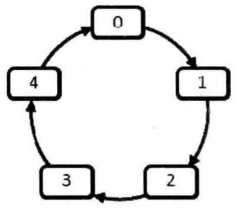

# 题目

0，1，...，n-1这n个数字排成一个圆圈，从数字0开始，每次从这个圆圈里删除第m个数字。求出这个圆圈剩下的最后一个数字。是典型的约瑟夫环问题。

例如，0、1、2、3、4 这5个数字组成一个圆圈，从数字0开始每次删除第3个数字，则删除的前4个数字依次是2、0、4、1，因此最后剩下的数字是3。



## 解法一：用环形链表模拟圆圈

```java
    public static int lastRemaining(int n, int m) {
        if (n < 1 || m < 1) {
            return -1;
        }
        LinkedList<Integer> numbers = new LinkedList<>();
        for (int i = 0; i < n; i++) {
            numbers.add(i);
        }
        int current = 0;
        while (numbers.size() > 1) {
            current = (current + m - 1) % numbers.size();
            numbers.remove(current);
        }
        return numbers.getFirst();
    }
```

## 解法二：数学公式

见书上
