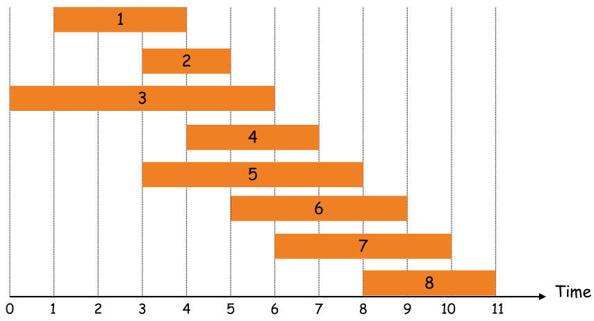
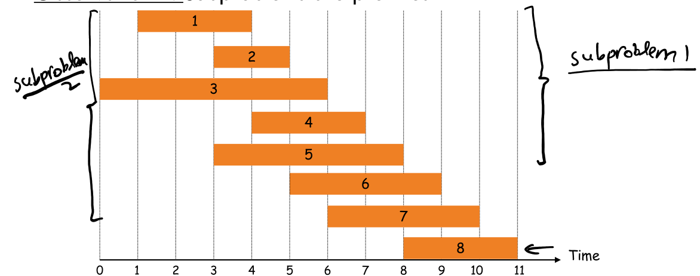
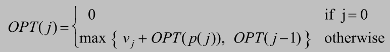

# 问题

Find maximum weight subset of mutually compatible jobs.

-   Job j starts at `sj`, finishes at `fj`, and has weight `vj`.
-   Two jobs compatible if they don't overlap.
-   p(j) = largest index i<j such that job i is compatible with j. Example: p(8) = 5, p(7) = 3, p(2) = 0.



# 分析

Suppose jobs sorted in ascending order of deadlines

-   Observation 1: OPT either includes last job (job 8) or not.
    -   If it does, then it also includes the optimal solution for the remaining jobs compatible with last job —— jobs {1,2,3,4,5}
    -   Else, it is the optimal solution for remaining jobs —— jobs {1,2,3,4,5,6,7}

-   Observation 2: Subproblems are prefixes



# Step 1 : Define subproblems

OPT(j) = value of optimal solution to the problem consisting of job requests 1, 2, ..., j.

# Step 2 : Find recurrences OPT(j)

-   Case 1: OPT selects job j.
    -   can't use incompatible jobs { p(j) + 1, p(j) + 2, ..., j - 1 }
    -   must include optimal solution to problem consisting of remaining compatible jobs 1, 2, ..., p(j)
-   Case 2: OPT does not select job j.
    -   must include optimal solution to problem consisting of remaining compatible jobs 1, 2, ..., j-1

`OPT(j) = max{vj + OPT (p(j)), OPT(j-1)}`

# Step 3: Solve the base cases 

OPT(0) = 0

# 方程



# 伪代码

```
Input: n, s1,…,sn , f1,…,fn , v1,…,vn

Sort jobs by finish times

Compute p(1), p(2), …, p(n)

Iterative-Compute-Opt {
	M[0] = 0
	for j = 1 to n
		M[j] = max(vj + M[p(j)], M[j-1])
	return M[n]
}
```

