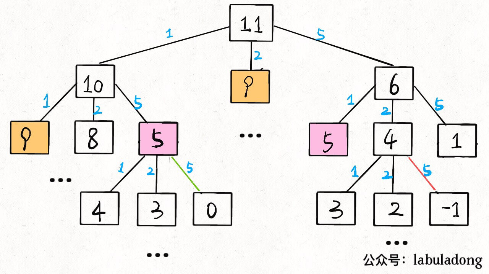

# 题目

给你 `k` 种面值的硬币，面值分别为 `c1, c2 ... ck`，每种硬币的数量无限，再给一个总金额 `amount`，问你**最少**需要几枚硬币凑出这个金额，如果不可能凑出，算法返回 -1 。算法的函数签名如下：

```java
// coins 中是可选硬币面值，amount 是目标金额
int coinChange(int[] coins, int amount);
```

比如说 k = 3，面值分别为 1，2，5，总金额 amount = 11。那么最少需要 3 枚硬币凑出，即 11 = 5 + 5 + 1。

你认为计算机应该如何解决这个问题？显然，就是把所有可能的凑硬币方法都穷举出来，然后找找看最少需要多少枚硬币。

注意：优先用大的硬币在这题中是不行的，比如给定1,4,5,7的硬币，要求凑9，贪心算法会是7+1+1，但是最少的应该是5+4

# 解法

## 暴力递归

首先，这个问题是动态规划问题，因为它具有「最优子结构」的。**要符合「最优子结构」，子问题间必须互相独立**。啥叫相互独立？

比如说，假设你考试，每门科目的成绩都是互相独立的。你的原问题是考出最高的总成绩，那么你的子问题就是要把语文考到最高，数学考到最高…… 为了每门课考到最高，你要把每门课相应的选择题分数拿到最高，填空题分数拿到最高…… 当然，最终就是你每门课都是满分，这就是最高的总成绩。

得到了正确的结果：最高的总成绩就是总分。因为这个过程符合最优子结构，“每门科目考到最高”这些子问题是互相独立，互不干扰的。

但是，如果加一个条件：你的语文成绩和数学成绩会互相制约，数学分数高，语文分数就会降低，反之亦然。这样的话，显然你能考到的最高总成绩就达不到总分了，按刚才那个思路就会得到错误的结果。因为子问题并不独立，语文数学成绩无法同时最优，所以最优子结构被破坏。

回到凑零钱问题，为什么说它符合最优子结构呢？比如你想求 `amount = 11` 时的最少硬币数（原问题），如果你知道凑出 `amount = 10` 的最少硬币数（子问题），你只需要把子问题的答案加一（再选一枚面值为 1 的硬币）就是原问题的答案。因为硬币的数量是没有限制的，所以子问题之间没有相互制，是互相独立的。

那么，既然知道了这是个动态规划问题，就要思考如何列出正确的**状态转移方程**？

1、**确定 base case**，这个很简单，显然目标金额 `amount` 为 0 时算法返回 0，因为不需要任何硬币就已经凑出目标金额了。

2、**确定「状态」，也就是原问题和子问题中会变化的变量**。由于硬币数量无限，硬币的面额也是题目给定的，只有目标金额会不断地向 base case 靠近，所以唯一的「状态」就是目标金额 `amount`。

3、**确定「选择」，也就是导致「状态」产生变化的行为**。目标金额为什么变化呢，因为你在选择硬币，你每选择一枚硬币，就相当于减少了目标金额。所以说所有硬币的面值，就是你的「选择」。

4、**明确 `dp` 函数/数组的定义**。我们这里讲的是自顶向下的解法，所以会有一个递归的 `dp` 函数，一般来说函数的参数就是状态转移中会变化的量，也就是上面说到的「状态」；函数的返回值就是题目要求我们计算的量。就本题来说，状态只有一个，即「目标金额」，题目要求我们计算凑出目标金额所需的最少硬币数量。

**所以我们可以这样定义 `dp` 函数：`dp(n)` 表示，输入一个目标金额 `n`，返回凑出目标金额 `n` 所需的最少硬币数量**。

```java
int coinChange(int[] coins, int amount) {
    // 题目要求的最终结果是 dp(amount)
    return dp(coins, amount)
}

// 定义：要凑出金额 n，至少要 dp(coins, n) 个硬币
int dp(int[] coins, int amount) {
    // base case
    if (amount == 0) return 0;
    if (amount < 0) return -1;

    int res = Integer.MAX_VALUE;
    for (int coin : coins) {
        // 计算子问题的结果
        int subProblem = dp(coins, amount - coin);
        // 子问题无解则跳过
        if (subProblem == -1) continue;
        // 在子问题中选择最优解，然后加一（加的是这枚硬币）
        res = Math.min(res, subProblem + 1);
    }

    return res == Integer.MAX_VALUE ? -1 : res;
}
```

状态转移方程其实已经完成了，以上算法已经是暴力解法了，以上代码的数学形式就是状态转移方程


但需要消除一下重叠子问题，比如 `amount = 11, coins = {1,2,5}` 时画出递归树看看：



递归算法的时间复杂度分析：子问题总数 x 解决每个子问题所需的时间：

子问题总数为递归树节点个数，这个比较难看出来，是 O(n^k)，k为硬币的数量，总之只要是树形结构，节点个数必然是是指数级别的。每个子问题中含有一个 for 循环，复杂度为 O(k)。所以总时间复杂度为 O(k * n^k)，指数级别。

## 带备忘录的递归

「备忘录」大大减小了子问题数目，完全消除了子问题的冗余，所以子问题总数不会超过金额数 `n`，即子问题数目为 O(n)。处理一个子问题的时间不变，仍是 O(k)，所以总的时间复杂度是 O(kn)。

```java
int[] memo;

int coinChange(int[] coins, int amount) {
    memo = new int[amount + 1];
    // dp 数组全都初始化为特殊值
    Arrays.fill(memo, -666);

    return dp(coins, amount);
}

int dp(int[] coins, int amount) {
    if (amount == 0) return 0;
    if (amount < 0) return -1;
    // 查备忘录，防止重复计算
    if (memo[amount] != -666)
        return memo[amount];

    int res = Integer.MAX_VALUE;
    for (int coin : coins) {
        // 计算子问题的结果
        int subProblem = dp(coins, amount - coin);
        // 子问题无解则跳过
        if (subProblem == -1) continue;
        // 在子问题中选择最优解，然后加一
        res = Math.min(res, subProblem + 1);
    }
    // 把计算结果存入备忘录
    memo[amount] = (res == Integer.MAX_VALUE) ? -1 : res;
    return memo[amount];
}
```

## dp数组的迭代

当然，我们也可以自底向上使用 dp table 来消除重叠子问题，关于「状态」「选择」和 base case 与之前没有区别，`dp` 数组的定义和刚才 `dp` 函数类似，也是把「状态」，也就是目标金额作为变量。不过 `dp` 函数体现在函数参数，而 `dp` 数组体现在数组索引：

**`dp` 数组的定义：当目标金额为 `i` 时，至少需要 `dp[i]` 枚硬币凑出**。

根据我们文章开头给出的动态规划代码框架可以写出如下解法：

```java
int coinChange(int[] coins, int amount) {
    int[] dp = new int[amount + 1];
    // 数组大小为 amount + 1，初始值也为 amount + 1
    // 初始值也为 amount + 1因为凑成 amount 金额的硬币数最多只可能等于 amount（全用 1 元面值的硬币），所以初始化为 amount + 1 就相当于初始化为正无穷，便于后续取最小值。初始化int最大值可能会溢出
    Arrays.fill(dp, amount + 1);

    // base case
    dp[0] = 0;
    // 外层 for 循环在遍历所有状态的所有取值
    for (int i = 0; i < dp.length; i++) {
        // 内层 for 循环在求所有选择的最小值
        for (int coin : coins) {
            // 子问题无解，跳过
            if (i - coin < 0) {
                continue;
            }
            dp[i] = Math.min(dp[i], 1 + dp[i - coin]);
        }
    }
    return (dp[amount] == amount + 1) ? -1 : dp[amount];
}
```

