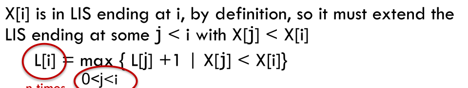

# 题目

最长递增子序列（Longest Increasing Subsequence，简写 LIS）是非常经典的一个算法问题。输入一个无序的整数数组，请你找到其中最长递增子序列的长度，函数签名如下：

```java
int lengthOfLIS(int[] nums);
```

比如说输入 `nums=[10,9,2,5,3,7,101,18]`，其中最长的递增子序列是 `[2,3,7,101]`，所以算法的输出应该是 4。

注意「子序列」和「子串」这两个名词的区别，子串一定是连续的，而子序列不一定是连续的。下面先来设计动态规划算法解决这个问题。

# 解法

## 定义子问题

L[i] = length of the longest increasing subsequence that ends at i, including i itself

## 确定递推公式

假设我们已经知道了 `dp[0..4]` 的所有结果，我们如何通过这些已知结果推出 `dp[5]` 呢？

根据刚才我们对 `dp` 数组的定义，现在想求 `dp[5]` 的值，也就是想求以 `nums[5]` 为结尾的最长递增子序列。

**`nums[5] = 3`，既然是递增子序列，我们只要找到前面那些结尾比 3 小的子序列，然后把 3 接到这些子序列末尾，就可以形成一个新的递增子序列，而且这个新的子序列长度加一**。



举例来说，`nums[0]` 和 `nums[4]` 都是小于 `nums[5]` 的，然后对比 `dp[0]` 和 `dp[4]` 的值，我们让 `nums[5]` 和更长的递增子序列结合，得出 `dp[5] = 3`：


# 代码

```java
int lengthOfLIS(int[] nums) {
    // 定义：dp[i] 表示以 nums[i] 这个数结尾的最长递增子序列的长度
    int[] dp = new int[nums.length];
    // base case：dp 数组全都初始化为 1
    Arrays.fill(dp, 1);
    for (int i = 0; i < nums.length; i++) {
        for (int j = 0; j < i; j++) {
            if (nums[i] > nums[j]) 
                dp[i] = Math.max(dp[i], dp[j] + 1);
        }
    }
    
    int res = 0;
    for (int i = 0; i < dp.length; i++) {
        res = Math.max(res, dp[i]);
    }
    return res;
}
```

# 总结

至此，这道题就解决了，时间复杂度 O(N^2)。总结一下如何找到动态规划的状态转移关系：

1.   明确 `dp` 数组的定义。这一步对于任何动态规划问题都很重要，如果不得当或者不够清晰，会阻碍之后的步骤。
2.   根据 `dp` 数组的定义，运用数学归纳法的思想，假设 `dp[0...i-1]` 都已知，想办法求出 `dp[i]`，一旦这一步完成，整个题目基本就解决了。

但如果无法完成这一步，很可能就是 `dp` 数组的定义不够恰当，需要重新定义 `dp` 数组的含义；或者可能是 `dp` 数组存储的信息还不够，不足以推出下一步的答案，需要把 `dp` 数组扩大成二维数组甚至三维数组。

