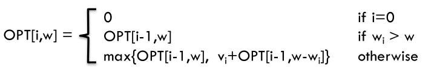

# 题目

给你一个可装载重量为 `W` 的背包和 `N` 个物品，每个物品有重量和价值两个属性。其中第 `i` 个物品的重量为 `weight[i]`，价值为 `value[i]`，每件物品只能用一次，现在让你用这个背包装物品，最多能装的价值是多少？

举个简单的例子，输入如下：

```
N = 3, W = 4
weight = [2, 1, 3]
valu = [4, 2, 3]
```

返回 6，选择前两件物品装进背包，总重量 3 小于 `W`，可以获得最大价值 6。

# 解法

## Define subproblems

OPT(i, w) = max profit subset of items 1, …, i with weight limit w.

`dp[i][j]` 的含义：从下标为[0-i]的物品里任意取，放进容量为j的背包，价值总和最大是多少。

## Find recurrences

-   Case 1: OPT does not select item i.
    OPT selects best of { 1, 2, …, i-1 } using weight limit w
-   Case 2: OPT selects item i.
    -   new weight limit = w – wi
    -   OPT selects best of { 1, 2, …, i–1 } using this new weight limit

两个方向推出来dp[i] [j]：

-   **不放物品i**：由`dp[i - 1][j]`推出。即背包容量为j，里面不放物品i的最大价值。此时`dp[i][j]`就是`dp[i - 1] [j]`。(其实就是当物品i的重量大于背包j的重量时，物品i无法放进背包中，所以被背包内的价值依然和前面相同。)
-   **放物品i**：由`dp[i - 1] [j - weight[i]]`推出。`dp[i - 1][j - weight[i]]` 为背包容量为`j - weight[i]` 的时候不放物品i的最大价值，那么`dp[i - 1][j - weight[i]] + value[i]` （物品i的价值），就是背包放物品i得到的最大价值

## Base Case

OPT[0,w] = 0



# 代码

```java
    public static int knapsack(int[] weight, int[] value, int bagSize) {
        int n = weight.length;
        // dp[i][w]表示用前i个物品，背包容量为w能获得的最大价值
        int[][] dp = new int[n + 1][bagSize + 1];

        // 先遍历物品，再遍历背包容量
        for (int i = 1; i <= n; i++) {
            for (int w = 1; w <= bagSize; w++) {
                // 物品重量大于背包的重量，这种情况下只能选择不装入背包
                if (w < weight[i - 1]) {
                    dp[i][w] = dp[i - 1][w];
                }
                // 装入或者不装入背包，择优
                else {
                    dp[i][w] = Math.max(dp[i - 1][w], 
                            value[i - 1] + dp[i - 1][w - weight[i - 1]]);
                }
            }
        }
        return dp[n][bagSize];
    }
```

# 滚动数组

对于背包问题其实状态都是可以压缩的。

在使用二维数组的时候，递推公式：`dp[i][j] = max(dp[i - 1][j], dp[i - 1][j - weight[i]] + value[i]);`

其实可以发现如果先把dp[i - 1]那一层拷贝到dp[i]上，表达式完全可以是：`dp[i][j] = max(dp[i][j], dp[i][j - weight[i]] + value[i]);`

**与其把dp[i - 1]这一层拷贝到dp[i]上，不如只用一个一维数组了**，只用dp[j]（一维数组，也可以理解是一个滚动数组）。

这就是滚动数组的由来，需要满足的条件是上一层可以重复利用，直接拷贝到当前层。

## 分析

1.  确定dp数组的定义

    在一维dp数组中，dp[j]表示：容量为j的背包，所背的物品价值可以最大为`dp[j]`。

2.  一维dp数组的递推公式

    `dp[j]`为 容量为j的背包所背的最大价值，那么如何推导`dp[j]`呢？

    `dp[j]`可以通过`dp[j - weight[i]]`推导出来。`dp[j - weight[i]]`表示容量为（j - weight[i]） 的背包所背的最大价值。`dp[j - weight[i]] + value[i]` 表示 容量为（j - 物品i重量）的背包 加上物品i的价值。（也就是容量为j的背包，放入物品i了之后的价值即dp[j]）

    此时`dp[j]`有两个选择：一个是取自己`dp[j]` 相当于 二维dp数组中的`dp[i-1][j]`，即不放物品i；一个是取`dp[j - weight[i]] + value[i]`，即放物品i

    所以递归公式为：

    ```java
    dp[j] = max(dp[j], dp[j - weight[i]] + value[i]);
    ```

    可以看出相对于二维dp数组的写法，就是把`dp[i][j]`中 i 的维度去掉了。

3.  一维dp数组初始化

    `dp[j]`表示：容量为j的背包，所背的物品价值可以最大为`dp[j]`，那么`dp[0]`就应该是0，因为背包容量为0所背的物品的最大价值就是0。

4.  一维dp数组遍历顺序

    ```java
    // 遍历物品，对于每件物品，求出在不同背包容量下的放法
    for(int i = 0; i < weight.size(); i++) { 
    	// 遍历背包容量
        for(int j = bagWeight; j >= weight[i]; j--) { 
            dp[j] = max(dp[j], dp[j - weight[i]] + value[i]);
    
        }
    }
    ```

    **这里大家发现和二维dp的写法中，遍历背包的顺序是不一样的！**

    二维dp遍历的时候，背包容量是从小到大，而一维dp遍历的时候，背包是从大到小。

    为什么呢？

    **倒序遍历是为了保证物品i只被放入一次！**。但如果一旦正序遍历了，那么物品0就会被重复加入多次！(前面容量背包的解可能已经放过了，容量够的话后面的还可能再放一遍)

    举一个例子：物品0的重量weight[0] = 1，价值value[0] = 15

    -   如果正序遍历

        `dp[1] = dp[1 - weight[0]] + value[0] = 15`

        `dp[2] = dp[2 - weight[0]] + value[0] = 30`

        此时dp[2]就已经是30了，意味着物品0，被放入了两次，所以不能正序遍历。

    -   为什么倒序遍历，就可以保证物品只放入一次呢？

        倒序就是先算dp[2]

        `dp[2] = dp[2 - weight[0]] + value[0] = 15` （dp数组已经都初始化为0）

        `dp[1] = dp[1 - weight[0]] + value[0] = 15`

        所以从后往前循环，每次取得状态不会和之前取得状态重合，这样每种物品就只取一次了。

    **那么问题又来了，为什么二维dp数组历的时候不用倒序呢？**

    因为对于二维dp，`dp[i][j]`都是通过上一层即`dp[i - 1][j]`计算而来，本层的`dp[i][j]`并不会被覆盖！

    **再来看看两个嵌套for循环的顺序，代码中是先遍历物品嵌套遍历背包容量，那可不可以先遍历背包容量嵌套遍历物品呢？**

    不可以！

    因为一维dp的写法，背包容量一定是要倒序遍历（原因上面已经讲了），如果遍历背包容量放在上一层，那么每个dp[j]就只会放入一个物品，即：背包里只放入了一个物品。

