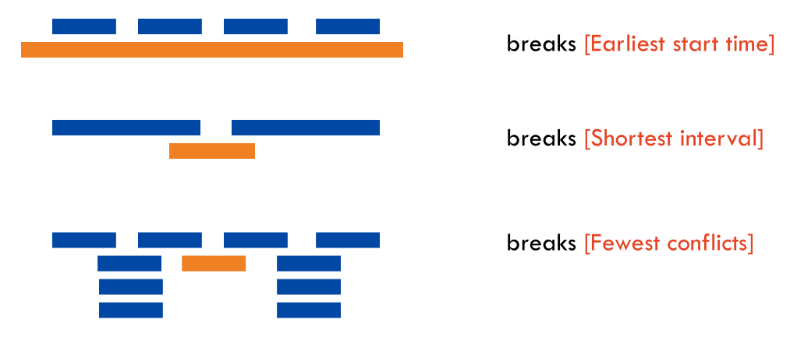
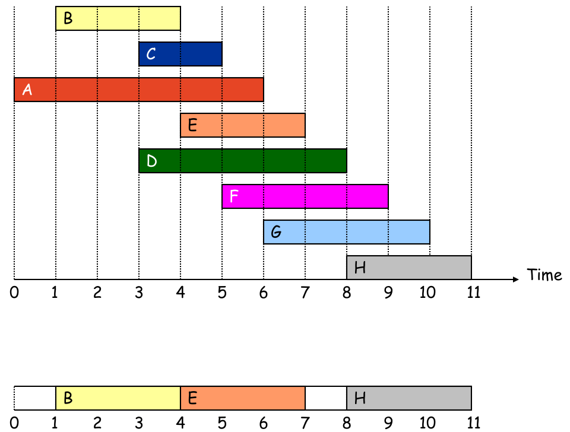
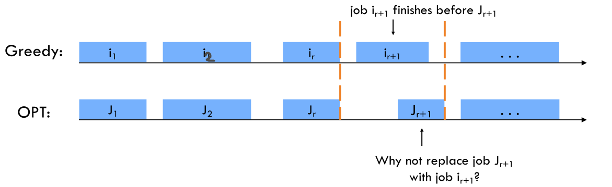
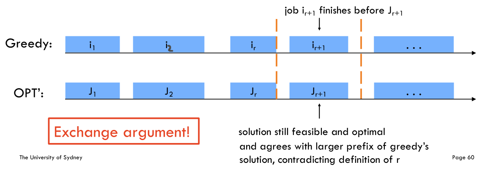
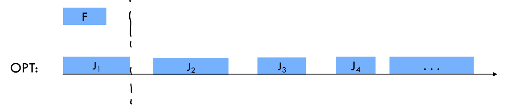
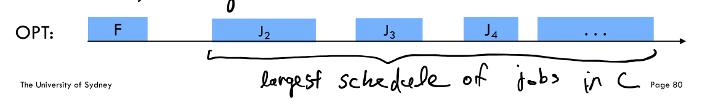

# 问题概述

很经典的贪心算法问题 Interval Scheduling（区间调度问题）。

给你很多形如 `[start, end]` 的闭区间，请你设计一个算法，**算出这些区间中最多有几个互不相交的区间**。

```java
int intervalSchedule(int[][] intervals);
```

举个例子，`intervals= [[1,3], [2,4], [3,6]]`，这些区间最多有 2 个区间互不相交，即 `[[1,3], [3,6]]`，你的算法应该返回 2。注意边界相同并不算相交。

这个问题在生活中的应用广泛，比如你今天有好几个活动，每个活动都可以用区间 `[start, end]` 表示开始和结束的时间，请问你今天**最多能参加几个活动呢**？显然你一个人不能同时参加两个活动，所以说这个问题就是求这些时间区间的最大不相交子集。

# 贪心算法

这个问题有许多看起来不错的贪心思路，却都不能得到正确答案。比如说：

-   最早开始时间：优先选择开始时间早的区间
-   最短区间：优先选择时间短的区间
-   最少冲突：优先选择与其他区间时间冲突少的区间



正确做法是优先选择结束时间早的区间

1、从区间集合 `intervals` 中选择一个区间 `x`，这个 `x` 是在当前所有区间中**结束最早的**（`end` 最小）。

2、把所有与 `x` 区间相交的区间从区间集合 `intervals` 中删除。（如果一个区间不想与 `x`，它的 `start` 必须要大于（或等于）`x` 的 `end`）

3、重复步骤 1 和 2，直到 `intervals` 为空为止。之前选出的那些 `x` 就是最大不相交子集。

把这个思路实现成算法的话，可以按每个区间的 `end` 数值升序排序，因为这样处理之后实现步骤 1 和步骤 2 都方便很多



```java
    public int intervalSchedule(int[][] intervals) {
        if (intervals.length == 0) return 0;
        // 按 end 升序排序
        Arrays.sort(intervals, Comparator.comparingInt(a -> a[1]));
        
        // 至少有一个区间不相交
        int count = 1;
        // 排序后，第一个区间就是 x
        int xEnd = intervals[0][1];
        
        for (int[] interval : intervals) {
            int start = interval[0];
            if (start >= xEnd) {
                // 找到下一个选择的区间了
                count++;
                // 更新xEnd为新区间的结束时间
                xEnd = interval[1];
            }
        }
        return count;
    }
```

# 最优解证明

## Exchange Argument

1.   假设存在一个最优解OPT，求它的调度与贪心算法得出来的不一样
2.   把贪心算法得出来的区间调度记作`i1,i2,i3,...,ik`。把OPT的调度记作`J1,J2,...,Jm`
3.   假设贪心算法和最优解的前`r`个区间的调度都相同，第`r+1`个调度的区间不同
4.   由于在贪心算法中，优先选择结束时间早的调度，`i_r+1`的结束时间肯定早于`J_r+1`的结束时间
5.   我们把OPT的`J_r+1` 替换成`i_r+1`，不会影响其他区间，互不相交区间的数量也不会减少
6.   重复替换步骤，OPT最终会变成贪心算法的结果，所以贪心算法得出来的结果是最优解





## Induction

贪心算法的递归定义：`Greedy(J) = F + Greedy(C) `  。其中J是所有区间，F是有最早结束时间的区间，C是所有跟F不相交的区间

证明一：至少有一个最优解包含有最早结束时间的区间

1.   假设`F`是有最早结束时间的区间
2.   假设最优解OPT的调度没有包含`F`
3.   根据题意，`J2`的开始时间肯定在`J1`后，所以我们完全可以把`J1` 换成 `F`



证明二：贪心算法是最优解

`n`为区间数量

1.   当`n = 1`时，贪心算法得到的肯定是最优解
2.   假设当`n < k` 时，贪心算法得出的都是最优解
3.   假设存在一个最优解OPT，根据证明一，他包含有最早结束时间的区间`F`
4.   `C`为跟`F`互不相交的其他区间（`C`的数量小于`n`。）
5.   所以`OPT = F + largest schedule of jobs in C`
6.   根据贪心算法的递归定义，`Greedy = F + Greedy(C)`
7.   根据假设，当`n < k` 时，贪心算法得出的都是最优解，所以`Greedy(C) = largest schedule of jobs in C`，所以可以推出`OPT = Greedy`，贪心算法是最优解



# 无重叠的区间

## 题目

给定一个区间的集合 intervals ，其中` intervals[i] = [starti, endi] `。返回 需要移除区间的最小数量，使剩余区间互不重叠 。比如说输入是 `intervals= [[1,2],[2,3],[3,4],[1,3]]`，算法返回 1，因为只要移除 `[1,3]` 后，剩下的区间就没有重叠了。

## 解法

我们已经会求最多有几个区间不会重叠了，那么剩下的不就是至少需要去除的区间吗？

```java
int eraseOverlapIntervals(int[][] intervals) {
    int n = intervals.length;
    return n - intervalSchedule(intervals);
}
```

# 用最少数量的箭引爆气球

## 题目

在二维空间中有许多球形的气球。对于每个气球，提供的输入是水平方向上，气球直径的开始和结束坐标。由于它是水平的，所以纵坐标并不重要，因此只要知道开始和结束的横坐标就足够了。开始坐标总是小于结束坐标。

一支弓箭可以沿着 x 轴从不同点完全垂直地射出。在坐标 x 处射出一支箭，若有一个气球的直径的开始和结束坐标为 `x_start`，`x_end`， 且满足  `x_start ≤ x ≤ x_end`，则该气球会被引爆。可以射出的弓箭的数量没有限制。 弓箭一旦被射出之后，可以无限地前进。我们想找到使得所有气球全部被引爆，所需的弓箭的最小数量。

给你一个数组 points ，其中 `points [i] = [x_start,x_end]` ，返回引爆所有气球所必须射出的最小弓箭数。

比如说输入为 `[[10,16],[2,8],[1,6],[7,12]]`，算法应该返回 2，因为我们可以在 `x` 为 6 的地方射一箭，射爆 `[2,8]` 和 `[1,6]` 两个气球，然后在 `x` 为 10，11 或 12 的地方射一箭，射爆 `[10,16]` 和 `[7,12]` 两个气球。

## 解法

这个问题和区间调度算法一模一样！如果最多有 `n` 个不重叠的区间，那么就至少需要 `n` 个箭头穿透所有区间。只是有一点不一样，在 `intervalSchedule` 算法中，如果两个区间的边界触碰，不算重叠；而按照这道题目的描述，箭头如果碰到气球的边界气球也会爆炸，所以说相当于区间的边界触碰也算重叠

```java
int findMinArrowShots(int[][] intvs) {
    // ...

    for (int[] interval : intvs) {
        int start = interval[0];
        // 把 >= 改成 > 就行了
        if (start > x_end) {
            count++;
            x_end = interval[1];
        }
    }
    return count;
}
```
