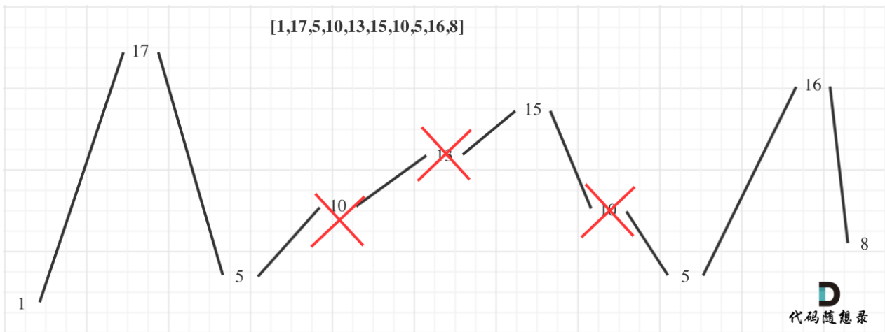

# 题目

如果连续数字之间的差严格地在正数和负数之间交替，则数字序列称为 **摆动序列** 。第一个差（如果存在的话）可能是正数或负数。仅有一个元素或者含两个不等元素的序列也视作摆动序列。

例如， `[1, 7, 4, 9, 2, 5]` 是一个 摆动序列 ，因为差值 `(6, -3, 5, -7, 3)` 是正负交替出现的。

相反，`[1, 4, 7, 2, 5]` 和 `[1, 7, 4, 5, 5]` 不是摆动序列，第一个序列是因为它的前两个差值都是正数，第二个序列是因为它的最后一个差值为零。

子序列可以通过从原始序列中删除一些（也可以不删除）元素来获得，剩下的元素保持其原始顺序。

给你一个整数数组 `nums` ，返回 `nums` 中作为 摆动序列 的 最长子序列的长度 。

-   示例 1：

    输入：nums = [1,7,4,9,2,5]
    输出：6
    解释：整个序列均为摆动序列，各元素之间的差值为 (6, -3, 5, -7, 3) 。

-   示例 2：

    输入：nums = [1,17,5,10,13,15,10,5,16,8]
    输出：7
    解释：这个序列包含几个长度为 7 摆动序列。
    其中一个是 [1, 17, 10, 13, 10, 16, 8] ，各元素之间的差值为 (16, -7, 3, -3, 6, -8) 。

-   示例 3：

    输入：nums = [1,2,3,4,5,6,7,8,9]
    输出：2

# 解法

## 贪心算法

本题要求通过从原始序列中删除一些（也可以不删除）元素来获得子序列，剩下的元素保持其原始顺序，应该删除什么元素呢？

**局部最优**：删除单调坡度上的节点（不包括单调坡度两端的节点），那么这个坡度就可以有两个局部峰值。

**整体最优**：整个序列有最多的局部峰值，从而达到最长摆动序列。

实际操作上，其实连删除的操作都不用做，因为题目要求的是最长摆动子序列的长度，所以只需要统计数组的峰值数量就可以了（相当于是删除单一坡度上的节点，然后统计长度）

**这就是贪心所贪的地方，让峰值尽可能的保持峰值，然后删除单一坡度上的节点**。



```java
    public int wiggleMaxLength(int[] nums) {
        if (nums.length <= 1) {
            return nums.length;
        }
        //当前差值
        int curDiff = 0;
        //上一个差值
        int preDiff = 0;
        int count = 1;
        for (int i = 1; i < nums.length; i++) {
            //得到当前差值
            curDiff = nums[i] - nums[i - 1];
            //如果当前差值和上一个差值为一正一负
            //等于0的情况表示初始时的preDiff
            if ((curDiff > 0 && preDiff <= 0) || (curDiff < 0 && preDiff >= 0)) {
                count++;
                preDiff = curDiff;
            }
        }
        return count;
    }
```

## 动态规划

从图可以看出，摆动序列中的数要么是山峰（即nums[i] > nums[i-1]），要么是山谷（即nums[i] < nums[i - 1]）

-   设dp状态`dp[i][0]`，表示考虑前i个数，第i个数作为山峰的摆动子序列的最长长度
-   设dp状态`dp[i][1]`，表示考虑前i个数，第i个数作为山谷的摆动子序列的最长长度

则转移方程为：

-   `dp[i][0] = max(dp[i][0], dp[j][1] + 1)`，其中`0 < j < i`且`nums[j] < nums[i]`，表示将nums[i]接到前面某个山谷后面，作为山峰。
-   `dp[i][1] = max(dp[i][1], dp[j][0] + 1)`，其中`0 < j < i`且`nums[j] > nums[i]`，表示将nums[i]接到前面某个山峰后面，作为山谷。

初始状态：

由于一个数可以接到前面的某个数后面，也可以以自身为子序列的起点，所以初始状态为：`dp[0][0] = dp[0][1] = 1`。

```java
    public int wiggleMaxLength(int[] nums) {
        // 0 i 作为波峰的最大长度
        // 1 i 作为波谷的最大长度
        int dp[][] = new int[nums.length][2];

        dp[0][0] = dp[0][1] = 1;
        for (int i = 1; i < nums.length; i++){
            //i 自己可以成为波峰或者波谷
            dp[i][0] = dp[i][1] = 1;

            for (int j = 0; j < i; j++){
                if (nums[j] > nums[i]){
                    // i 是波谷
                    dp[i][1] = Math.max(dp[i][1], dp[j][0] + 1);
                }
                if (nums[j] < nums[i]){
                    // i 是波峰
                    dp[i][0] = Math.max(dp[i][0], dp[j][1] + 1);
                }
            }
        }

        return Math.max(dp[nums.length - 1][0], dp[nums.length - 1][1]);
    }
```

