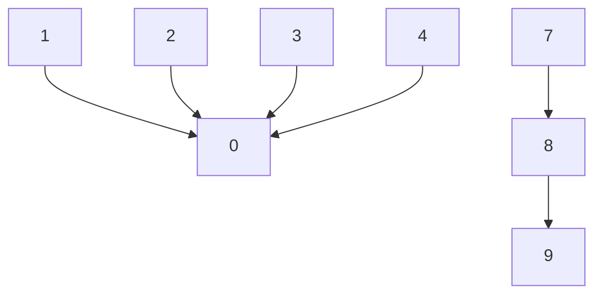

# 并查集

## quick-find

把在同一个连通分量中的所有点的id设为一样（根结点）。当且仅当id[p]等于id[q]时p和q是连通的。为此在每次union时，必须将两个集合中的所有点对应的id[]元素变为同一个值。

查找速度很快，但union需要扫描整个数组，无法处理大型问题。

```java
public class QuickFindUF {
    private int[] id;    // id[i] = component identifier of i
    private int count;   // number of components

    public QuickFindUF(int n) {
        count = n;
        id = new int[n];
        for (int i = 0; i < n; i++)
            id[i] = i;
    }
    
    public int find(int p) {
        return id[p];
    }

    public void union(int p, int q) {
        int pID = id[p];   // needed for correctness
        int qID = id[q];   // to reduce the number of array accesses

        // p and q are already in the same component
        if (pID == qID) return;

        for (int i = 0; i < id.length; i++)
            if (id[i] == pID) id[i] = qID;
        count--;
    }
    
    public boolean connected(int p, int q) {
        return id[p] == id[q];
    }
    
    public int count() {
        return count;
    }
}
```

## quick-union

每一个节点指向自己的父节点。查找过程, 查找元素所对应的id，不断去查询自己的父亲节点, 直到到达根节点，O(h) 复杂度, h 为树的高度。合并元素 p 和元素 q 所属的集合，分别查询两个元素的根节点，使其中一个根节点指向另外一个根节点，两个集合就合并了。这个操作是 O(h) 的时间复杂度，h 为树的高度。

```java
public class QuickUnionUF {
    private int[] parent;  // parent[i] = parent of i
    private int count;     // number of components
    
    public QuickUnionUF(int n) {
        parent = new int[n];
        count = n;
        for (int i = 0; i < n; i++) {
            parent[i] = i;
        }
    }

    public int find(int p) {
        validate(p);
        while (p != parent[p])
            p = parent[p];
        return p;
    }

    public void union(int p, int q) {
        int rootP = find(p);
        int rootQ = find(q);
        if (rootP == rootQ) return;
        parent[rootP] = rootQ; 
        count--;
    }
    
    public int count() {
        return count;
    }
    
    public boolean connected(int p, int q) {
        return find(p) == find(q);
    }
}
```

## union优化

如果执行的是，union(1,2), union(2, 3), union(3, 4)...，树的高度就会变成O(n)。树的高度可以由union by size 或者 union by rank 来控制

### union by size

与其在union()中随意将一棵树连接到另一棵树，现在记录每一课树的大小并总是将较小的树连接到较大的树上。

In the case of union by size, a node stores its size, which is simply its number of descendants (including the node itself). When the trees with roots *x* and *y* are merged, the node with more descendants becomes the parent. If the two nodes have the same number of descendants, then either one can become the parent. In both cases, the size of the new parent node is set to its new total number of descendants.

```java
public class WeightedQuickUnionUF {
    private int[] parent;   // parent[i] = parent of i
    private int[] size;     // size[i] = number of elements in subtree rooted at i
    private int count;      // number of components

    public WeightedQuickUnionUF(int n) {
        count = n;
        parent = new int[n];
        size = new int[n];
        for (int i = 0; i < n; i++) {
            parent[i] = i;
            size[i] = 1;
        }
    }

    public int count() {
        return count;
    }
  
    public int find(int p) {
        while (p != parent[p])
            p = parent[p];
        return p;
    }

    public boolean connected(int p, int q) {
        return find(p) == find(q);
    }


    public void union(int p, int q) {
        int rootP = find(p);
        int rootQ = find(q);
        if (rootP == rootQ) return;

        // make smaller root point to larger one
        if (size[rootP] < size[rootQ]) {
            parent[rootP] = rootQ;
            size[rootQ] += size[rootP];
        }
        else {
            parent[rootQ] = rootP;
            size[rootP] += size[rootQ];
        }
        count--;
    }
}

```

### union by rank

union by size可能会出现一个树size大但是高度小



可以使用union by rank

For union by rank, a node stores its *rank*, which is an **upper bound for its height**. When a node is initialized, its rank is set to zero. To merge trees with roots *x* and *y*, first compare their ranks. If the ranks are different, then the larger rank tree becomes the parent, and the ranks of *x* and *y* do not change. If the ranks are the same, then either one can become the parent, but the new parent's rank is incremented by one. While the rank of a node is clearly related to its height, storing ranks is more efficient than storing heights. The height of a node can change during a *Find* operation (路径压缩), so storing ranks avoids the extra effort of keeping the height correct.

```java
...
private int[] rank;   // rank[i]表示以i为根的集合所表示的树的层数
private int[] parent; // parent[i]表示第i个元素所指向的父节点
private int count;    // 数据个数
...
// 构造函数
public UnionFind(int count){
    rank = new int[count];
    parent = new int[count];
    this.count = count;
    // 初始化, 每一个parent[i]指向自己, 表示每一个元素自己自成一个集合
    for( int i = 0 ; i < count ; i ++ ){
        parent[i] = i;
        rank[i] = 1;
    }
}
...
public void union(int p, int q){
    int pRoot = find(p);
    int qRoot = find(q);
    if( pRoot == qRoot )
        return;

    if( rank[pRoot] < rank[qRoot] ){
        parent[pRoot] = qRoot;
    }
    else if( rank[qRoot] < rank[pRoot]){
        parent[qRoot] = pRoot;
    }
    else{ // rank[pRoot] == rank[qRoot]
        parent[pRoot] = qRoot;
        rank[qRoot] += 1;   // 此时, 我维护rank的值
    }
}
...
```

注意：只有根节点的rank有意义，非根节点的rank是没有意义的。

## find优化

理想状态下，我们希望每个结点都直接连接到它的根结点上，但我们又不想像quick-find算法那样通过修改大量连接做到这点。要实现路径压缩，只需要为find()添加一个循环，将在路径上所有遇到的结点都直接链接到根结点。得到的结果是几乎完全扁平的树，和quick-find算法理想情况下所得到的树非常接近。

```java
private int find(int p) {
    if (p != parent[p])
        parent[p] = find(parent[p]);
    return parent[p];
}
```

## 最优解

```java
public class UF {
    private int[] parent;  // parent[i] = parent of i
    private int[] rank;
    private int count;     // number of components

    public UF(int n) {
        count = n;
        parent = new int[n];
        rank = new int[n];
        for (int i = 0; i < n; i++) {
            parent[i] = i;
            rank[i] = 0;
        }
    }

    public int find(int p) {
        if (p != parent[p])
            parent[p] = find(parent[p]);
        return parent[p];
    }

    public int count() {
        return count;
    }

    public boolean connected(int p, int q) {
        return find(p) == find(q);
    }

    public void union(int p, int q) {
        int rootP = find(p);
        int rootQ = find(q);
        if (rootP == rootQ) return;

        // make root of smaller rank point to root of larger rank
        if (rank[rootP] < rank[rootQ]) {
            parent[rootP] = rootQ;
        } 
        else if (rank[rootP] > rank[rootQ]) {
            parent[rootQ] = rootP;
        } 
        else {
            parent[rootQ] = rootP;
            rank[rootP]++;
        }
        count--;
    }
}
```

