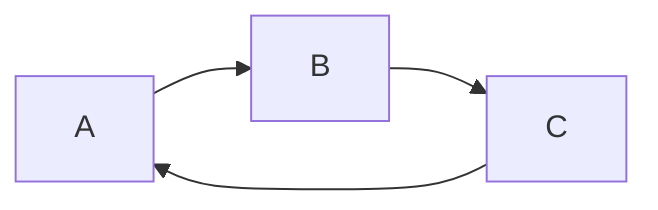
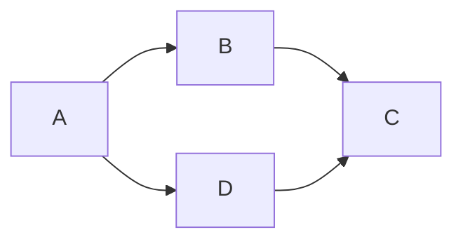

# 有向图

>   一幅有方向性的图（或有向图）是由一组顶点和一组有方向的边组成的，每条有方向的边都连接着有序的一对顶点。

>   在一幅有向图中，有向路径由一系列顶点组成，对于其中的每个顶点都存在一条有向边从它指向序列中的下一个顶点。有向环为一条至少含有一条边且起点和终点相同的有向路径。简单有向环是一条（除了起点和终点必须相同之外）不含有重复的顶点和边的环。路径或环的长度即为其中所包含的边数。

```java
import Chapter1.Bag;

public class Digraph {
    private final int V;
    private int E;
    private Bag<Integer>[] adj;

    public Digraph(int v) {
        this.V = v;
        this.E = 0;
        adj = (Bag<Integer>[]) new Bag[V];
        for (int v = 0; v < V; v++) {
            adj[v] = new Bag<>();
        }
    }

    public int V() {
        return V;
    }

    public int E() {
        return E;
    }

    public void addEdge(int v, int w) {
        adj[v].add(w);
        E++;
    }

    public Iterable<Integer> adj(int v) {
        return adj[v];
    }

    public Digraph reverse() {
        Digraph R = new Digraph(V);
        for (int v = 0; v < V; v++) {
            for (int w : adj(v)) {
                R.addEdge(w, v);
            }
        }
        return R;
    }
}
```

## 有向环

判断是否有环不能用跟无向图一样的方法，因为a->b不意味着b->a（w : G.adj(b)，w不可能为上个结点，G.adj(b)中无a）。系统递归调用的栈表示的是正在遍历的有向路径，一旦找到一条边v->w且w已经在栈中，就找到了一个环

撤栈时要onStack[v] = false，因为不reset的话，dfs走完A->B->C，ABC都在栈上，走A->D时，D的邻边其实可以是C，不算环：

环




不是环




```java
import Chapter1.Stack;

public class DirectedCycle {
    private boolean[] marked;
    private int[] edgeTo;
    private Stack<Integer> cycle;   //有向环中的所有顶点（如果存在）
    private boolean[] onStack;  //递归调用的栈上的所有顶点

    public DirectedCycle(Digraph G) {
        marked = new boolean[G.V()];
        edgeTo = new int[G.V()];
        onStack = new boolean[G.V()];
        for (int v = 0; v < G.V(); v++) {
            if (!marked[v])
                dfs(G, v);
        }
    }

    private void dfs(Digraph G, int v) {
        onStack[v] = true;
        marked[v] = true;
        for (int w : G.adj(v)) {
            if (this.hasCycle()) return;
            else if (!marked[w]) {
                edgeTo[w] = v;
                dfs(G, w);
            } else if (onStack[w]) {
                cycle = new Stack<>();
                for (int x = v; x != w; x = edgeTo[x])
                    cycle.push(x);
                cycle.push(w);
                cycle.push(v);
            }
        }
        onStack[v] = false;
    }

    public boolean hasCycle() {
        return cycle != null;
    }

    public Iterable<Integer> cycle() {
        return cycle;
    }
}
```

## 拓扑排序

拓扑排序：给定一幅有向图，将所有的顶点排序，使得所有的有向边均从排在前面的元素指向排在后面的元素。

>   当且仅当一幅有向图是无环图时它才能进行拓扑排序

有向图中基于深度优先搜索的顶点排序的DepthFirstOrder：基本思想是深度优先搜索正好只访问每个顶点一次。如果将dfs的参数保存在一个数据结构中，遍历这个数据结构其实就能访问图中的所有顶点，遍历顺序取决于数据结构性质和保存顺序

-   前序：在递归前将顶点加入队列
-   后序：在递归后将顶点加入队列
-   逆后序：在递归后将顶点压入栈

```java
import Chapter1.Queue;
import Chapter1.Stack;

import java.lang.reflect.Array;
import java.util.Arrays;

public class DepthFirstOrder {
    private boolean[] marked;
    private Queue<Integer> pre; //所有顶点的前序排列
    private Queue<Integer> post;    //所有顶点的后序排列
    private Stack<Integer> reversePost; //所有顶点的逆后序排列
    private int preCounter;

    public DepthFirstOrder(Digraph G) {
        pre = new Queue<>();
        post = new Queue<>();
        reversePost = new Stack<>();
        marked = new boolean[G.V()];

        for (int v = 0; v < G.V(); v++) {
            if (!marked[v])
                dfs(G, v);
        }
    }

    public void dfs(Digraph G, int v) {
        pre.enqueue(v);
        marked[v] = true;
        for (int w : G.adj(v)) {
            if (!marked[w])
                dfs(G, w);
        }
        post.enqueue(v);
        reversePost.push(v);
    }

    public Iterable<Integer> pre() {
        return pre;
    }

    public Iterable<Integer> post() {
        return post;
    }

    public Iterable<Integer> reversePost() {
        return reversePost;
    }
}
```

>   一幅有向无环图的拓扑顺序即为所有顶点的逆后续排列

```java
public class Topological {
    private Iterable<Integer> order;    //顶点的拓扑排序

    public Topological(Digraph G){
        DirectedCycle cycleFinder = new DirectedCycle(G);
        if (!cycleFinder.hasCycle()){
            DepthFirstOrder dfs = new DepthFirstOrder(G);
            order = dfs.reversePost();
        }
    }

    public Iterable<Integer> order(){
        return order;
    }

    public boolean isDAG(){
        return order != null;
    }

    public static void main(String[] args) {
        String fileName = "E:\\project\\IJ_Java\\Algorithms\\src\\DirectedGraph\\jobs.txt";
        String separator = "/";
        SymbolDigraph sg = new SymbolDigraph(fileName, separator);
        Topological top = new Topological(sg.G());
        for (int v : top.order()){
            System.out.println(sg.name(v));
        }
    }
}
```

## 强连通性

>   如果两个顶点v和w是互相可达的，则称他们为强连通。也就是说，既存在一条从v到w的有向路径，也存在一条从w到v的有向路径。如果一幅有向图中的任意两个顶点都是强连通的，则称这幅图是强连通的。

两个顶点是强连通的当且仅当他们都在一个普通的有向环中。

### Kosaraju算法

-   在给定的一幅有向图G中，使用DepthFirstOrder来计算它的反向图$G^R$的逆后续排列
-   给G中进行标准的深度优先搜索，但是要按照刚才计算得到的顺序而非标准的顺序来访问所有未被标记的顶点
-   在构造函数中，所有在同一递归dfs()调用中被访问到的顶点都在同一个强连通分量中。

>   构造函数调用的dfs(G,s)所达到的任意顶点v都必然是和s强连通的
>
>   证明：
>
>   设v为dfs(G,s)到达的某个顶点，那么G中存在s->v，需要证明v->s，也就是证明在$G^R$中有s->v。按照逆后序得出的顺序，s在v前，这意味着在反向图$G^R$中，dfs(v)在dfs(s)前结束，所以反向图中存在s->v

根据拓扑排序定义，所有的有向边均从排在前面的元素指向排在后面的元素，反向图逆后序得出的顺序说明前面的元素到后面的元素在反向图中是有路径的。按照这个顺序在正向图中进行dfs搜索，如果正向图中也有路径，那么他们是强连通的。

```java
import Chapter1.Bag;

public class KosarajuSCC {
    private boolean[] marked;   //已访问过的顶点
    private int[] id;   //强连通分量的标识符
    private int count;	//强连通分量的数量

    public KosarajuSCC(Digraph G) {
        marked = new boolean[G.V()];
        id = new int[G.V()];
        DepthFirstOrder order = new DepthFirstOrder(G.reverse());
        for (int s : order.reversePost()) {
            if (!marked[s]) {
                dfs(G, s);
                count++;
            }
        }
    }

    private void dfs(Digraph G, int v) {
        marked[v] = true;
        id[v] = count;
        for (int w : G.adj(v)) {
            if (!marked[w]) {
                dfs(G, w);
            }
        }
    }

    public boolean stronglyConnected(int v, int w) {
        return id[v] == id[w];
    }

    public int id(int v) {
        return id[v];
    }

    public int count() {
        return count;
    }

    public static void main(String[] args) {
        Digraph graph = new Digraph(5);
        graph.addEdge(0,1);
        graph.addEdge(1,2);
        graph.addEdge(2,0);
        graph.addEdge(3,4);
        graph.addEdge(4,3);
        KosarajuSCC cc = new KosarajuSCC(graph);
        int M = cc.count();
        System.out.println(M + " components");

        Bag<Integer>[] components = (Bag<Integer>[]) new Bag[M];
        for (int i = 0; i < M; i++)
            components[i] = new Bag<>();
        for (int v = 0; v < graph.V(); v++)
            components[cc.id(v)].add(v);
        for (int i = 0; i < M; i++) {
            for (int v : components[i]) {
                System.out.print(v + " ");
            }
            System.out.println();
        }
    }
}
```

