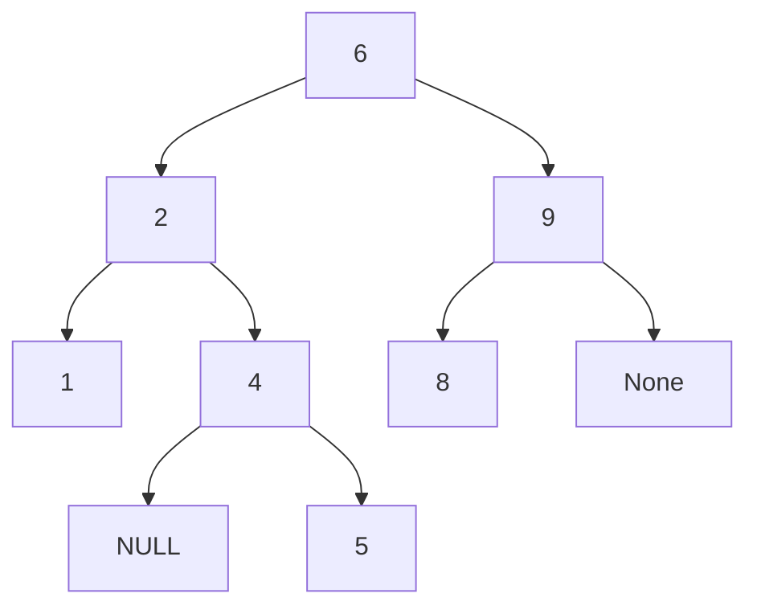
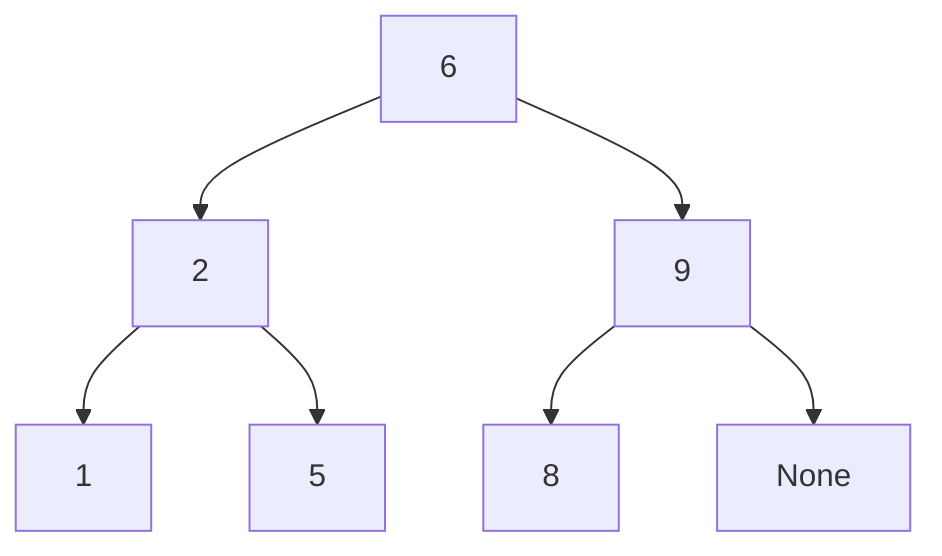
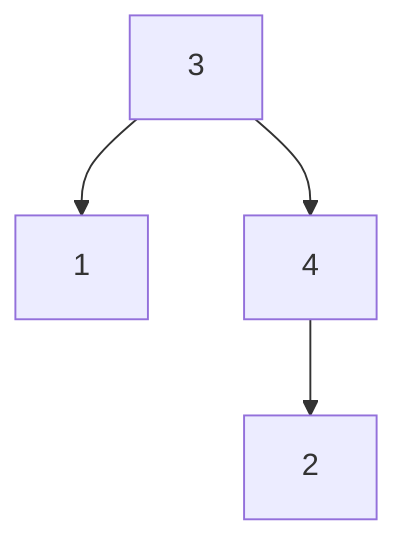

# 二叉查找树

二叉查找树将链表插入的灵活性和有序数组查找的高效性结合了起来。由结点组成，结点包含的链接可以为空或者指向其他结点。每个结点只能有一个父结点（除了根结点），而且每个结点都只有左右两个链接，分别指向自己的左子结点和右子结点，也可以将每个链接看做指向了另一棵二叉树，而这棵树的根结点就是被指向的结点。

>   一棵二叉查找树（BST）一棵二叉树，其中每个结点都含有一个Comparable的键（以及相关联的值）且每个结点的键都大于其左子树中的任意结点的键，而小于右子树的任意结点的键。

>   在一棵二叉查找树中，所有操作在最坏情况下所需的时间都和树的高度成正比

```java
public class BST<Key extends Comparable<Key>, Value> {
    private Node root;
    
    private class Node{
        private Key key;
        private Value val;
        private Node left;
        private Node right;
        private int n;

        public Node(Key key, Value val, int n) {
            this.key = key;
            this.val = val;
            this.n = n;
        }
    }
    
    private int size(){
        return size(root);
    }
    
    private int size(Node x){
        if (x == null) return 0;
        return x.n;
    }
}

```

## 查找

-   如果树是空的，则查找未命中；

-   如果被查找的键和根结点的键相等，查找命中；

-   如果被查找的键较小就选择左子树，较大则选择右子树。

对于命中的查找，路径在含有被查找的键的结点处结束。对于未命中的查找，路径的终点是一个空链接

```java
    public Value get(Key key) {
        return get(root,key);
    }

    private Value get(Node x, Key key) {
        //以X为根结点的子树中查找，并返回key所对应的值
        if (x == null) return null;
        int cmp = key.compareTo(x.key);
        if (cmp < 0) 
            return get(x.left, key);
        if (cmp > 0) 
            return get(x.right, key);
        else 
            return x.val;
    }
```

迭代（无计数器）：

```java
    Value get(Key key) {
        Node x = root;
        while (x != null) {
            int cmp = key.compareTo(x.key);
            if      (cmp < 0) x = x.left;
            else if (cmp > 0) x = x.right;
            else return x.val;
        }
        return null;
    }
```

## 插入

有涉及到修改树的操作时都要x.left = xxx;

-   如果树是空的，就返回一个含有该键值对的新结点

-   如果被查找的键小于根结点的键，继续在左子树中插入该键，否则在右子树中插入该键。

```java
    public void put(Key key, Value val){
        root = put(root, key, val);
    }

    private Node put(Node x, Key key, Value val){
        //如果key存在于以x为结点的子树中，则更新它的值
        //否则，将以key和val为键值对的新结点插入到该子树
        if (x == null) return new Node(key, val, 1);
        int cmp = key.compareTo(x.key);
        if (cmp < 0 )
            x.left = put(x.left, key, val);
        else if (cmp > 0)
            x.right = put(x.right, key, val);
        else
            x.val = val;
        x.n = size(x.left) + size(x.right) + 1;
        return x;
    }
```

迭代（无计数器）：

```java
    public void put(Key key, Value val) {
        Node z = new Node(key, val);
        if (root == null) {
            root = z;
            return;
        }

        Node parent = null, x = root;
        while (x != null) {
            //x == null时，parent记录了其父结点
            parent = x;
            int cmp = key.compareTo(x.key);
            if      (cmp < 0) x = x.left;
            else if (cmp > 0) x = x.right;
            else {
                x.val = val;
                z = null;	//防止对象游离
                return; 
            }
        }
        int cmp = key.compareTo(parent.key);
        if (cmp < 0) parent.left  = z;
        else         parent.right = z;
    }
```

二叉查找树的另一个特性就是插入的实现难度和查找差不多。

可以将递归调用前的代码想象成沿着树向下走，递归后的代码想象成沿着树往上爬。对于get() 方法，这对应着return，对于put()，这意味着<u>重置搜索路径上每个父结点指向子结点的链接</u>，并<u>增加路径上每个结点中的计数器的值</u>。

>在由N个随机键构成的二叉查找树中，查找命中平均所需要的比较次数为2lnN

>   在由N个随机键构成的二叉查找树中插入操作和查找未命中平均所需的比较次数为2lnN

## 最大键和最小键

最小键：

-   如果根结点的左链接为空，那么一棵二叉查找树中最小的键就是根结点

-   如果左链接非空，那么树中最小的就是左子树中的最小键。

```java
    public Key min(){
        return min(root).key;
    }
    
    private Node min(Node x){
        if (x.left == null) return x;
        return min(x.left);
    }
    
    public Key max(){
        return max(root).key;
    }
    
    private Node max(Node x){
        if (x.right == null) return x;
        return max(x.right);
    }
```

### 倒数第二大的键

1.   先找到树中最大的键w
2.   两种情况：
     -   如果w有左子树，那么倒数第二大的键就在这左子树中，在左子树中找到最大结点并返回。（因为w的左子树中的结点肯定比w的父结点大）
     -   如果w没有左子树，倒数第二大的键是它的父结点。

## 向上取整和向下取整

向下取整：

-   如果给定的key小于二叉查找树的根结点的键，小于等于key的最大键一定在根结点的左子树中。（投影到数组来看的话，key一定在根结点索引的左边）

-   如果给定的key大于二叉查找树的根结点的键，那么只有当根结点右子树存在小于等于key的节点时，小于等于key的最大键才会出现在右子树中，否则根结点就是小于等于key的最大键。

例子：3，4，5，查找3.2和4.2，root = 4

```java
    public Key floor(Key key){
        return floor(root, key).key;
    }

    private Node floor(Node x, Key key){
        if (x == null) return null;
        int cmp = key.compareTo(x.key);
        if (cmp == 0)
            return x;
        if (cmp < 0)
            return floor(x.left, key);
        Node t = floor(x.right, key);
        if (t != null)
            return t;
        else
            return x;
    }

    public Key ceiling(Key key){
        return ceiling(root, key).key;
    }

    private Node ceiling(Node x, Key key){
        if (x == null) return null;
        int cmp = key.compareTo(x.key);
        if (cmp == 0)
            return x;
        if (cmp > 0)
            return ceiling(x.right, key);
        Node t = ceiling(x.left, key);
        if (t != null)
            return t;
        else
            return x;
    }
```

## 选择和排名

选择和排名往树的左边走时，位置是一样的，不需要处理。但往右边走时，由于是相对位置，相对于右子数，所以要处理。对于选择就是选择右子树的k - t -1个，对于排名就是加上左子树和根的size。

选择：

-   找到排名为k的键（索引为k / 树中有k个小于它的键）。如果左子树中的结点数 t 大于 k， 那么就继续（递归地）在左子树中查找排名为k的键；

-   t等于k，就返回根结点中的键。
-   t小于k，就（递归地）在右子树中查找排名为（k-t-1）的键。映射在数组上的话，t其实就是当前根结点的索引，搜索右子树是从索引0开始的，所以k-t-1，-t（左子树结点数）-1（根结点）

```java
    public Key select(int k) {
        return select(root, k).key;
    }

    private Node select(Node x, int k) {
        if (x == null) return null;
        int t = size(x.left);
        if (t > k)
            return select(x.left, k);
        else if (t < k)
            return select(x.right, k - t - 1);
        else
            return x;
    }
```

排名：

-   如果给定的键和根结点的键相等，我们返回左子树中的结点总数t
-   如果给定的键小于根结点，返回该键在左子树中的排名
-   如果给定的键大于根结点，返回 t（左边的结点数）+ 1 （根结点）+ 在右子树中的排名

```java
    public int rank(Key key) {
        return rank(root, key);
    }

    private int rank(Node x, Key key){
        if (x == null) return 0;
        int cmp = key.compareTo(x.key);
        if (cmp < 0)
            return rank(x.left, key);
        else if (cmp > 0)
            return size(x.left) + 1 + rank(x.right, key);
        else 
            return size(x.left);
    }
```

## 删除

### 删除最小键

不断深入根结点的左子树中直至遇见一个空链接，然后将指向改结点的链接指向该结点的右子树，并更新它到根结点的路径上的所有结点的计数器

```java
    public void deleteMin(){
        deleteMin(root);
    }

    private Node deleteMin(Node x){
        if (x.left == null) 
            return x.right;
        x.left = deleteMin(x.left);
        x.n = size(x.left) + size(x.right) + 1;
        return x;
    }
    
    public void deleteMax(){
        deleteMax(root);
    }
    
    private Node deleteMax(Node x){
        if (x.right == null)
            return x.left;
        x.right = deleteMax(x.right);
        x.n = size(x.left) + size(x.right) + 1;
        return x;
    }
```

### 删除任意结点

删除情况一：被删除的结点只有一个子结点

删除4。左子结点为空，直接返回右子节点。






删除情况二：被删除的结点有两个结点。删除之后要处理两棵子数，但被删除结点的父结点只有一条空出来的链接。

T.Hibbard 法：在删除结点x后用它的后继结点填补（也可以用前驱结点填）。因为x有一个右子结点，因此它的后继结点就是其右子数中最小结点。这样的替换依然能保证树的有序性，因为x.key和后继结点的键之间不存在其他键（映射在数组中，两个是相邻的元素）

-   将指向即将被删除的结点的链接保存为t
-   将x 指向它的后继结点 min(t.right)
-   将x 右链接（原本指向一棵所有结点都大于x.key的二叉树）指向deleteMin(t.right)，也就是在删除后所有结点仍大于x.key的子二叉查找树。
-   将x的左链接（原本为空）设为t.left （其下所有的键都小于被删除的结点和它的后继结点）

```java
    public void delete(Key key){
        delete(root, key);
    }

    private Node delete(Node x, Key key){
        if (x == null) return null;
        int cmp = key.compareTo(x.key);
        if (cmp < 0)
            x.left = delete(x.left, key);
        else if (cmp > 0)
            x.right = delete(x.right, key);
        else{
            if (x.right == null)
                return x.left;
            if (x.left == null)
                return x.right;
            Node t = x;
            x = min(x.right);
            x.right = deleteMin(t.right);
            x.left = t.left;
        }
        x.n = size(x.left) + size(x.right) + 1;
        return x;
    }
```

## 遍历

按顺序打印二叉查找树中所有的键

```java
private void print(Node x){
    if (x == null) return;
    print(x.left);
    System.out.println(x.key);
    print(x.right);
}
```

将所有落在给定范围以内的键加入一个队列Queue。递归地查找根结点地左子树，然后查找根结点，然后递归地查找根结点地右子树（类似in order）。

```java
    public Iterable<Key> keys(){
        return keys(min(),max());
    }
    
    public Iterable<Key> keys(Key lo, Key hi){
        Queue<Key> queue = new Queue<>();
        keys(root, queue, lo ,hi);
        return queue;
    }
    
    private void keys(Node x, Queue<Key> queue, Key lo, Key hi){
        if (x == null) return;
        int cmpLo = lo.compareTo(x.key);
        int cmpHi = hi.compareTo(x.key);
        if (cmpLo < 0)
            keys(x.left, queue, lo, hi);
        //当前结点在lo和hi之中
        if (cmpLo <= 0 && cmpHi >= 0)
            queue.enqueue(x.key);
        if (cmpHi > 0)
            keys(x.right, queue, lo, hi);
    }
```

返回所有keys的迭代实现：

```java
   public Iterable<Key> keys() {
        Stack<Node> stack = new Stack<Node>();
        Queue<Key> queue = new Queue<Key>();
        Node x = root;
        while (x != null || !stack.isEmpty()) {
            if (x != null) {
                stack.push(x);
                x = x.left;
            }
            else {
                x = stack.pop();
                queue.enqueue(x.key);
                x = x.right;
            }
        }
        return queue;
    }

```

方法二：

A range query is defined by two values k1 and k2. We are to find all keys k stored in T such that k1 ≤ k ≤ k2

The algorithm is a restricted version of in-order traversal. When at node v:

-   if key(v) < k1: Recursively search right subtree
-   if k1 ≤ key(v) ≤ k2: Recursively search left subtree, add v to range output, search right subtree
-   if k2 < key(v): Recursively search left subtree

```java
public Iterable<Key> range(Key lo, Key hi) {
    Queue<Key> queue = new Queue<>();
    range(root, queue, lo, hi);
    return queue;
}

private void range(Node x, Queue<Key> queue, Key lo, Key hi) {
    if (x == null) return;
    int cmpLo = lo.compareTo(x.key);
    int cmpHi = hi.compareTo(x.key);
    if (cmpHi < 0)
        range(x.left, queue, lo, hi);
    else if (cmpLo > 0)
        range(x.right, queue, lo, hi);
    else {
        range(x.left, queue, lo, hi);
        queue.enqueue(x.key);
        range(x.right, queue, lo, hi);
    }
}
```

## 前驱结点与后继结点

前驱结点

```java
public Node predecessor(Node node) {
    if (node == null) {
        return null;
    }
    // 有左子树，前驱结点就是左子树的最大结点
    else if (node.left != null) {
        Node p = node.left;
        while (p.right != null) {
            p = p.right;
        }
        return p;
    }
    // 无左子树，向上寻找前驱
    else {
        Node p = node.parent;
        Node ch = node;
        while (p != null && ch == p.left) {
            ch = p;
            p = p.parent;
        }
        return p;
    }
    
}
```

后继结点

```java
public Node decessor(Node node) {
    if (node == null) {
        return null;
    }
    // 有右子树，后继结点就是右子树的最小结点
    else if (node.right != null) {
        Node p = node.right;
        while (p.left != null) {
            p = p.left;
        }
        return p;
    }
    // 无右子树，向上寻找后继
    else {
        Node p = node.parent;
        Node ch = node;
        while (p != null && ch == p.right) {
            ch = p;
            p = p.parent;
        }
        return p;
    }
    
}
```


## 检查

只检查每个结点的左子结点小于当前结点，右子结点大于当前结点是不行的。

```
def test-bst(T)
	for u in T do
		if u.left ̸= nil and u.key < u.left.key then
			return False
		if u.right ̸= nil and u.key > u.right.key then
			return False
	return True
```

会出现这种情况：



正确的检查BST方式：对于每个BST的结点来说，keys(左子树) < key(node) < keys(右子树)，所以左子树的最大值是当前结点，右子树的最小值是当前结点。

```java
    // does this binary tree satisfy symmetric order?
    // Note: this test also ensures that data structure is a binary tree since order is strict
    private boolean isBST() {
        return isBST(root, null, null);
    }

    // is the tree rooted at x a BST with all keys strictly between min and max
    // (if min or max is null, treat as empty constraint)
    private boolean isBST(Node x, Key min, Key max) {
        if (x == null) return true;
        if (min != null && x.key.compareTo(min) <= 0) return false;
        if (max != null && x.key.compareTo(max) >= 0) return false;
        return isBST(x.left, min, x.key) && isBST(x.right, x.key, max);
    }        
```

```java
    // are the size fields correct?
    private boolean isSizeConsistent() { return isSizeConsistent(root); }
    private boolean isSizeConsistent(Node x) {
        if (x == null) return true;
        if (x.size != size(x.left) + size(x.right) + 1) return false;
        return isSizeConsistent(x.left) && isSizeConsistent(x.right);
    } 

    // check that ranks are consistent
    private boolean isRankConsistent() {
        for (int i = 0; i < size(); i++)
            if (i != rank(select(i))) return false;
        for (Key key : keys())
            if (key.compareTo(select(rank(key))) != 0) return false;
```

## Morris遍历

通过O(1)空间实现树的遍历

### 中序

二叉搜索树的中序遍历的结果是一个有序数组，中序遍历可以转化为对后继节点的计算过程，后继节点的计算方法为：

1.  对于存在右子树的节点A，其后继节点是其右子树中最左侧的节点
2.  对于没有右子树的节点B，其后继节点是其自下而上的父节点中第一个将其作为左子树的节点

节点A的后继计算非常简单。然而由于二叉树的信息中不包括父节点的信息，因此第2条操作起来非常困难，这也是为何之前采用了栈/队列的方式存储父节点的信息。

但是我们注意到，虽然对于这样的节点B，求取其后继节点非常困难；但是其后继节点来说，由于节点B是其子树中的一个节点，因此求前驱节点就很容易了！为了使得访问到节点B时能够直接得到后继信息，我们可以暂时使用B节点右子树的链接，存储后继节点，以实现对后继节点的直接获取，同时不占用额外的空间。这就是Morris遍历算法的主要思想。

计算过程：

1.  从根节点开始访问。
2.  如果当前节点C不存在左子树，按中序遍历的规则，应当访问节点C，并进入其右子树进行遍历。
3.  如果当前节点C存在左子树，就找到C的前驱节点B，并将B的右孩子指向C（存储后继），同时当前节点转入左子树进行遍历。
4.  步骤2中访问右子树时，如果节点本身没有右子树，则会直接转入其后继节点C。根据中序遍历的规则，说明此时C的左子树遍历完成。为了还原树结构，我们需要重新找到C的前驱节点，并将其右孩子设置为null。之后我们访问节点C，并进入其右子树进行遍历。

```java
public void morrisInOrderTraversal(TreeNode root) {
	TreeNode node = root, prev = null; // 仅存放两个临时变量，O(1)空间复杂度
	while (node != null) { // 当前节点为空时，说明访问完成
		if (node.left == null) { // 左子树不存在时，访问+进入右节点
			visit(node);
			node = node.right;
		} else { // 左子树存在，寻找前驱节点。注意寻找前驱节点时，会不断深入右子树。不加判断时，若前驱节点的右子树已指向自己，会引起死循环
			prev = node.left;
			while (prev.right != null && prev.right != node) prev = prev.right;
			if (prev.right == null) { // 前驱节点未访问过，存放后继节点
				prev.right = node;
				node = node.left;
			} else { // 前驱节点已访问过，恢复树结构
				visit(node); // 确定访问过左子树后，访问当前节点
				prev.right = null;
				node = node.right;
			}
		}
	}
}
```

### 先序

```java
public void morrisPreOrderTraversal(TreeNode root) {
	TreeNode node = root, prev = null; // 仅存放两个临时变量，O(1)空间复杂度
	while (node != null) { // 当前节点为空时，说明访问完成
		if (node.left == null) { // 左子树不存在时，访问+进入右节点
			visit(node);
			node = node.right;
		} else { // 左子树存在，寻找前驱节点。注意寻找前驱节点时，会不断深入右子树。不加判断时，若前驱节点的右子树已指向自己，会引起死循环
			prev = node.left;
			while (prev.right != null && prev.right != node) prev = prev.right;
			if (prev.right == null) { // 前驱节点未访问过，存放后继节点
				visit(node); // 在确定前驱节点未访问过时，访问当前节点（注意与中序遍历的区别）
				prev.right = node;
				node = node.left;
			} else { // 前驱节点已访问过，恢复树结构
				prev.right = null;
				node = node.right;
			}
		}
	}
}
```

### 后序

若一个节点是右孩子，或该节点是左孩子但是没有兄弟节点，则访问完该节点后立刻会访问该节点的父节点

推广到Morris遍历里，可以得到：当访问到任何节点C的前驱节点B时，由B到C的路径（不包括节点C）即为之后的访问顺序。

注意为了保证程序能够顺利访问右子树，为根节点添加了一个哨兵节点：

```java
public void morrisPostOrderTraversal(TreeNode root) {
	TreeNode temp = new TreeNode(new Value(Value.INVALID_VALUE)), node = temp, prev = null; // 仅存放一个“哨兵”节点和两个临时变量，O(1)空间复杂度
	temp.left = root;
	while (node != null) { // 当前节点为空时，说明访问完成
		if (node.left == null) { // 左子树不存在时，进入右节点
			node = node.right;
		} else { // 左子树存在，寻找前驱节点。注意寻找前驱节点时，会不断深入右子树。不加判断时，若前驱节点的右子树已指向自己，会引起死循环
			prev = node.left;
			while (prev.right != null && prev.right != node) prev = prev.right;
			if (prev.right == null) { // 前驱节点未访问过，存放后继节点
				prev.right = node;
				node = node.left;
			} else { // 前驱节点已访问过，恢复树结构
				visitReverse(node.left, prev); // 确定访问过左子树后，逆序访问沿路节点（注意与中序遍历的区别）
				prev.right = null;
				node = node.right;
			}
		}
	}
}

public void visitReverse(TreeNode node1, TreeNode node2) {
	reverse(node1, node2); // 首先进行翻转
	TreeNode node = node2; // 之后进行顺序访问
	while (node != node1) {
		visit(node);
		node = node.right;
	}
	visit(node1);
	reverse(node2, node1); // 恢复结构
}

public void reverse(TreeNode node1, TreeNode node2) {
	// 实现链表翻转
	TreeNode prev = node1;
	TreeNode current = prev.right;
	TreeNode next = current.right;
	while (prev != node2) {
		current.right = prev;
		prev = current;
		current = next;
		next = next.right;
	}
}
```

