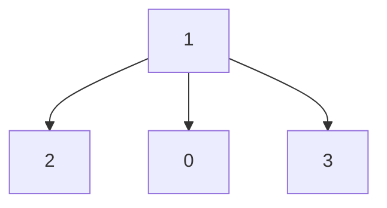
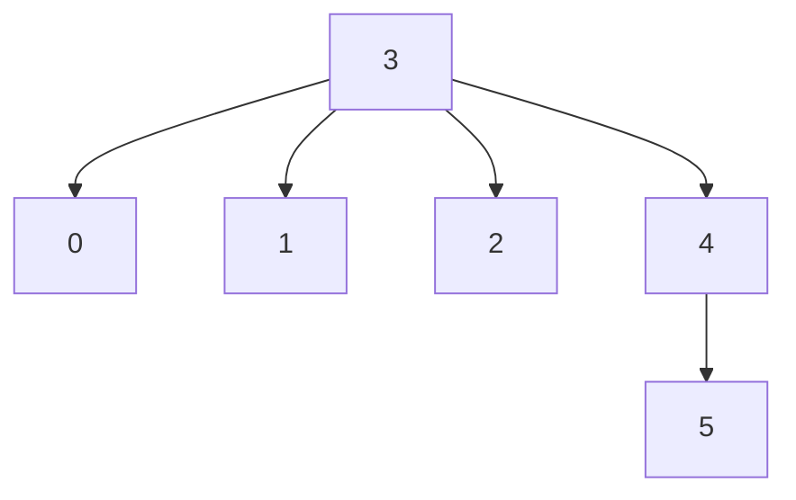
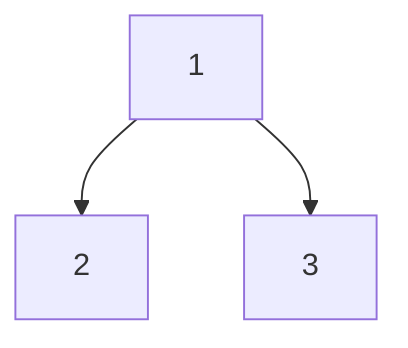
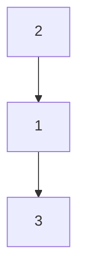
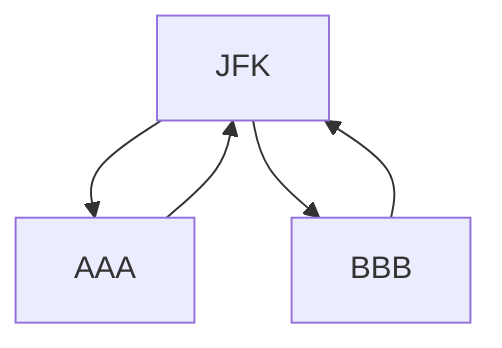
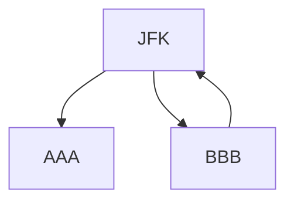

[toc]

# 图

## 岛屿的周长

>   给定一个 row x col 的二维网格地图 grid ，其中：grid [ i ] [ j ] = 1 表示陆地， grid [ i ] [ j ] = 0 表示水域。
>
>   网格中的格子 水平和垂直 方向相连（对角线方向不相连）。整个网格被水完全包围，但其中恰好有一个岛屿（或者说，一个或多个表示陆地的格子相连组成的岛屿）。
>
>   岛屿中没有“湖”（“湖” 指水域在岛屿内部且不和岛屿周围的水相连）。格子是边长为 1 的正方形。网格为长方形，且宽度和高度均不超过 100 。计算这个岛屿的周长。
>
>   输入：grid = [[0,1,0,0],[1,1,1,0],[0,1,0,0],[1,1,0,0]]
>   输出：16
>
>   输入：grid = [[1]]
>   输出：4

法一：暴力

```java
class Solution {
    public int islandPerimeter(int[][] grid) {
        int perimeter = 0;
        for (int i = 0; i < grid.length; i++) {
            for (int j = 0; j < grid[i].length; j++) {
                if (grid[i][j] == 1) {
                    perimeter += 4;
                    //左
                    if (j != 0 && grid[i][j-1] == 1) perimeter -= 1;
                    //右
                    if (j != grid[i].length - 1 && grid[i][j+1] == 1) perimeter -= 1;
                    //上
                    if (i != 0 && grid[i-1][j] == 1) perimeter -= 1;
                    //下
                    if (i != grid.length-1 && grid[i+1][j] == 1) perimeter -= 1;
                }
            }
        }
        return perimeter;
    }
}
```

法二：深度优先搜索

值为 0 表示非岛屿（不可遍历），值为 1 表示岛屿（可遍历），我们用 2 表示已遍历过的岛屿。

岛屿的周长就是岛屿方格和非岛屿方格相邻的边的数量。注意，这里的非岛屿方格，既包括水域方格，也包括网格的边界。所以每当在 DFS 遍历中，从一个岛屿方格走向一个非岛屿方格，就将周长加 1。

```java
public int islandPerimeter(int[][] grid) {
    for (int r = 0; r < grid.length; r++) {
        for (int c = 0; c < grid[0].length; c++) {
            if (grid[r][c] == 1) {
                // 题目限制只有一个岛屿，计算一个即可
                return dfs(grid, r, c);
            }
        }
    }
    return 0;
}

int dfs(int[][] grid, int r, int c) {
    // 从一个岛屿方格走向网格边界，周长加 1
    if (!(0 <= r && r < grid.length && 0 <= c && c < grid[0].length)) {
        return 1;
    }
    // 从一个岛屿方格走向水域方格，周长加 1
    if (grid[r][c] == 0) {
        return 1;
    }
    // 已遍历过（值为2）的岛屿在这里会直接返回，不会重复遍历
    if (grid[r][c] != 1) {
        return 0;
    }
    // 将方格标记为"已遍历"
    grid[r][c] = 2;
    return dfs(grid, r - 1, c)
        + dfs(grid, r + 1, c)
        + dfs(grid, r, c - 1)
        + dfs(grid, r, c + 1);
}
```

## 找到小镇法官

>   在一个小镇里，按从 1 到 N 标记了 N 个人。传言称，这些人中有一个是小镇上的秘密法官。
>
>   如果小镇的法官真的存在，那么：
>
>   -   小镇的法官不相信任何人。
>
>   -   每个人（除了小镇法官外）都信任小镇的法官。
>
>   -   只有一个人同时满足属性 1 和属性 2 。
>
>   给定数组 trust，该数组由信任对 trust[i] = [a, b] 组成，表示标记为 a 的人信任标记为 b 的人。如果小镇存在秘密法官并且可以确定他的身份，请返回该法官的标记。否则，返回 -1。
>
>   示例 1：
>
>   输入：N = 2, trust = [[1,2]]
>   输出：2
>
>   示例 2：
>
>   输入：N = 3, trust = [[1,3],[2,3]]
>   输出：3
>
>   示例 3：
>
>   输入：N = 3, trust = [[1,3],[2,3],[3,1]]
>   输出：-1
>
>   示例 4：
>
>   输入：N = 3, trust = [[1,2],[2,3]]
>   输出：-1
>
>   示例 5：
>
>   输入：N = 4, trust = [[1,3],[1,4],[2,3],[2,4],[4,3]]
>   输出：3

这是一道有向图问题，法官实际上就是出度为0，入度为 N - 1的节点。统计所有人的入度和出度信息，将满足出度为0，入度为 N - 1的节点输出。

-   遍历 trust，如果 trust[i] 为 [a, b] 说明 a 信任 b，那么更新 a 的出度 + 1，b 的入读 + 1。
-   遍历所有节点，将满足出度为0，入度为 N - 1的节点输出

```java
class Solution {
    public int findJudge(int N, int[][] trust) {
        int[] inDegree = new int[N];
        int[] outDegree = new int[N];
        for (int[] man : trust) {
            int from = man[0];
            int to = man[1];
            inDegree[to - 1]++;
            outDegree[from - 1]++;
        }
        for (int i = 0; i < N; i++) {
            if (inDegree[i] == N - 1 && outDegree[i] == 0) {
                return i + 1;
            }
        }
        return -1;
    }
}
```

可以优化成只用一个数组。法官是 入度 - 出度 == N - 1 的点，并且不是法官的人差值不可能是 N - 1。这样我们无需同时维护入度和出度的信息，转而维护入读和出度的差值即可。

```java
class Solution {
    public int findJudge(int N, int[][] trust) {
        int[] degree = new int[N + 1];    // 总票数
        
        for (int[] relation : trust) {
            degree[relation[1]]++;          // 获得投票
            degree[relation[0]]--;          // 投出一票
        }
        
        int judge = -1; 
        for (int i = 1; i <= N; i++) {
            // 没有给其他人投过票
            if (degree[i] == N - 1) {    
                judge = i;
                break;
            }
        }
        return judge;
    }
}
```

## 克隆图

>   给你无向连通图中一个节点的引用，请你返回该图的深拷贝。
>
>   图中的每个节点都包含它的值 val（int） 和其邻居的列表（list[Node]）。
>
>   简单起见，每个节点的值都和它的索引相同。例如，第一个节点值为 1（val = 1），第二个节点值为 2（val = 2），以此类推。该图在测试用例中使用邻接列表表示。
>
>   邻接列表 是用于表示有限图的无序列表的集合。每个列表都描述了图中节点的邻居集。
>
>   给定节点将始终是图中的第一个节点（值为 1）。你必须将 给定节点的拷贝 作为对克隆图的引用返回。
>
>   示例一：
>
>   输入：adjList = [[2,4],[1,3],[2,4],[1,3]]
>   输出：[[2,4],[1,3],[2,4],[1,3]]
>   解释：
>   图中有 4 个节点。
>   节点 1 的值是 1，它有两个邻居：节点 2 和 4 。
>   节点 2 的值是 2，它有两个邻居：节点 1 和 3 。
>   节点 3 的值是 3，它有两个邻居：节点 2 和 4 。
>   节点 4 的值是 4，它有两个邻居：节点 1 和 3 。
>
>   示例二：
>
>   输入：adjList = [[]]
>   输出：[[]]
>   解释：输入包含一个空列表。该图仅仅只有一个值为 1 的节点，它没有任何邻居。
>
>   示例三：
>
>   输入：adjList = []
>   输出：[]
>   解释：这个图是空的，它不含任何节点。

dfs

1.  使用一个哈希表存储所有已被访问和克隆的节点。哈希表中的 key 是原始图中的节点，value 是克隆图中的对应节点。
2.  从给定节点开始遍历图。如果某个节点已经被访问过，则返回其克隆图中的对应节点。
3.  如果当前访问的节点不在哈希表中，则创建它的克隆节点并存储在哈希表中。
4.  递归调用每个节点的邻接点。

```java
class Solution {
    private HashMap <Node, Node> visited = new HashMap <> ();
    public Node cloneGraph(Node node) {
        if (node == null) {
            return node;
        }

        // 如果该节点已经被访问过了，则直接从哈希表中取出对应的克隆节点返回
        if (visited.containsKey(node)) {
            return visited.get(node);
        }

        // 克隆节点，注意到为了深拷贝我们不会克隆它的邻居的列表
        Node cloneNode = new Node(node.val, new ArrayList());
        // 哈希表存储
        visited.put(node, cloneNode);

        // 遍历该节点的邻居并更新克隆节点的邻居列表
        for (Node neighbor: node.neighbors) {
            cloneNode.neighbors.add(cloneGraph(neighbor));
        }
        return cloneNode;
    }
}
```

bfs

```java
class Solution {
    public Node cloneGraph(Node node) {
        if (node == null) {
            return node;
        }

        HashMap<Node, Node> visited = new HashMap();

        // 将题目给定的节点添加到队列
        LinkedList<Node> queue = new LinkedList<Node> ();
        queue.add(node);
        // 克隆第一个节点并存储到哈希表中
        visited.put(node, new Node(node.val, new ArrayList()));

        // 广度优先搜索
        while (!queue.isEmpty()) {
            // 取出队列的头节点
            Node n = queue.remove();
            // 遍历该节点的邻居
            for (Node neighbor: n.neighbors) {
                if (!visited.containsKey(neighbor)) {
                    // 如果没有被访问过，就克隆并存储在哈希表中
                    visited.put(neighbor, new Node(neighbor.val, new ArrayList()));
                    // 将邻居节点加入队列中
                    queue.add(neighbor);
                }
                // 更新当前节点的邻居列表
                visited.get(n).neighbors.add(visited.get(neighbor));
            }
        }

        return visited.get(node);
    }
}
```

## 课程表

>   你这个学期必须选修 numCourses 门课程，记为 0 到 numCourses - 1 。
>
>   在选修某些课程之前需要一些先修课程。 先修课程按数组 prerequisites 给出，其中 prerequisites[i] = [ai, bi] ，表示如果要学习课程 ai 则 必须 先学习课程  bi 。
>
>   例如，先修课程对 [0, 1] 表示：想要学习课程 0 ，你需要先完成课程 1 。
>   请你判断是否可能完成所有课程的学习？如果可以，返回 true ；否则，返回 false 。
>
>   示例 1：
>
>   输入：numCourses = 2, prerequisites = [[1,0]]
>   输出：true
>   解释：总共有 2 门课程。学习课程 1 之前，你需要完成课程 0 。这是可能的。
>
>   示例 2：
>
>   输入：numCourses = 2, prerequisites = [[1,0],[0,1]]
>   输出：false
>   解释：总共有 2 门课程。学习课程 1 之前，你需要先完成课程 0 ；并且学习课程 0 之前，你还应先完成课程 1 。这是不可能的。

一道拓扑排序问题。

如果图 G中存在环，那么图 G不存在拓扑排序。因为x1在排列中必须出现xn前面，但xn也必须出现在x1的前面，不存在满足要求的排列，不存在拓扑排序。如果图G是无环图，它的拓扑排序不止一种（例如，n个没有边的结点，任意一种编号排序都可以是拓扑排序）

我们将每一门课看成一个节点，如果想要学习课程 A之前必须完成课程 B，那么我们从 B 到 A 连接一条有向边。这样以来，在拓扑排序中，B 一定出现在 A 的前面。

法一：dfs

先创建图，再用dfs确定这个图是不是一个无环图

```java
class Solution {
    boolean[] onStack;
    boolean[] marked;
    boolean isCycle;
    public boolean canFinish(int numCourses, int[][] prerequisites) {
        onStack = new boolean[numCourses];
        marked = new boolean[numCourses];
        List[] graph = new List[numCourses];
        for (int i = 0; i < numCourses; i++) {
            graph[i] = new ArrayList<Integer>();
        }
        for (int[] p : prerequisites) {
            graph[p[0]].add(p[1]);
        }
        
        for (int i = 0; i < numCourses; i++) {
            if (!marked[i]) dfs(graph, i);
        }
        return !isCycle;
    }
    private void dfs(List[] graph, int v) {
        onStack[v] = true;
        marked[v] = true;
        for (Object o : graph[v]) {
            int i = (Integer) o;
            if (isCycle) return;
            if (! marked[i]) {
                dfs(graph, i);
            } 
            else if (onStack[i]) {
                isCycle = true;
                return;
            }
        }
        onStack[v] = false; 
    }
}
```

优化：由于我们只需要判断是否存在一种拓扑排序，而栈的作用仅仅是存放最终的拓扑排序结果，因此我们可以只记录每个节点的状态，而省去对应的栈。

对于图中的任意一个节点，它在搜索的过程中有三种状态，即：

-   「未搜索」：我们还没有搜索到这个节点；0
-   「搜索中」：我们搜索过这个节点，但还没有回溯到该节点，即该节点还没有入栈，还有相邻的节点没有搜索完成）；1
-   「已完成」：我们搜索过并且回溯过这个节点，即该节点已经入栈，并且所有该节点的相邻节点都出现在栈的更底部的位置，满足拓扑排序的要求。2

通过上述的三种状态，我们就可以给出使用深度优先搜索得到拓扑排序的算法流程，在每一轮的搜索搜索开始时，我们任取一个「未搜索」的节点开始进行深度优先搜索。

我们将当前搜索的节点 u 标记为「搜索中」，遍历该节点的每一个相邻节点 v：

如果 v 为「未搜索」，那么我们开始搜索 v，待搜索完成回溯到 u；

如果 v 为「搜索中」，那么我们就找到了图中的一个环，因此是不存在拓扑排序的；

如果 v 为「已完成」，那么说明 v 已经在栈中了，而 u 还不在栈中，因此 u 无论何时入栈都不会影响到 (u, v)之前的拓扑关系，以及不用进行任何操作。

当 u 的所有相邻节点都为「已完成」时，我们将 u 放入栈中，并将其标记为「已完成」

```java
class Solution {
    List<List<Integer>> edges;
    int[] visited;
    boolean valid = true;

    public boolean canFinish(int numCourses, int[][] prerequisites) {
        edges = new ArrayList<List<Integer>>();
        for (int i = 0; i < numCourses; ++i) {
            edges.add(new ArrayList<Integer>());
        }
        visited = new int[numCourses];
        for (int[] info : prerequisites) {
            edges.get(info[1]).add(info[0]);
        }
        for (int i = 0; i < numCourses && valid; ++i) {
            if (visited[i] == 0) {
                dfs(i);
            }
        }
        return valid;
    }

    public void dfs(int u) {
        visited[u] = 1;
        for (int v: edges.get(u)) {
            if (visited[v] == 0) {
                dfs(v);
                if (!valid) {
                    return;
                }
            } else if (visited[v] == 1) {
                valid = false;
                return;
            }
        }
        visited[u] = 2;
    }
}
```

法二：bfs

我们也可以顺序地生成拓扑排序，这种方法也更加直观。

我们考虑拓扑排序中最前面的节点，该节点一定不会有任何入边，也就是它没有任何的先修课程要求。当我们将一个节点加入答案中后，我们就可以移除它的所有出边，代表着它的相邻节点少了一门先修课程的要求。如果某个相邻节点变成了「没有任何入边的节点」，那么就代表着这门课可以开始学习了。按照这样的流程，我们不断地将没有入边的节点加入答案，直到答案中包含所有的节点（得到了一种拓扑排序）或者不存在没有入边的节点（图中包含环）。

我们使用一个队列来进行广度优先搜索。初始时，所有入度为 0 的节点都被放入队列中（这门课可以开始学习了），它们就是可以作为拓扑排序最前面的节点，并且它们之间的相对顺序是无关紧要的。

在广度优先搜索的每一步中，我们取出队首的节点 u：我们将 u 放入答案中；

我们移除 u 的所有出边，也就是将 u 的所有相邻节点的入度减少 1。如果某个相邻节点 v 的入度变为 0，那么我们就将 v 放入队列中。

在广度优先搜索的过程结束后。如果答案中包含了这 n 个节点，那么我们就找到了一种拓扑排序，否则说明图中存在环，也就不存在拓扑排序了。

```java
class Solution {
    List<List<Integer>> edges;
    int[] indeg;

    public boolean canFinish(int numCourses, int[][] prerequisites) {
        edges = new ArrayList<List<Integer>>();
        for (int i = 0; i < numCourses; ++i) {
            edges.add(new ArrayList<Integer>());
        }
        indeg = new int[numCourses];
        for (int[] info : prerequisites) {
            edges.get(info[1]).add(info[0]);
            ++indeg[info[0]];
        }

        Queue<Integer> queue = new LinkedList<Integer>();
        for (int i = 0; i < numCourses; ++i) {
            if (indeg[i] == 0) {
                queue.offer(i);
            }
        }

        int visited = 0;
        while (!queue.isEmpty()) {
            ++visited;
            int u = queue.poll();
            for (int v: edges.get(u)) {
                --indeg[v];
                if (indeg[v] == 0) {
                    queue.offer(v);
                }
            }
        }

        return visited == numCourses;
    }
}
```

## 最小高度树

>   树是一个无向图，其中任何两个顶点只通过一条路径连接。 换句话说，一个任何没有简单环路的连通图都是一棵树。
>
>   给你一棵包含 n 个节点的树，标记为 0 到 n - 1 。给定数字 n 和一个有 n - 1 条无向边的 edges 列表（每一个边都是一对标签），其中 edges[i] = [ai, bi] 表示树中节点 ai 和 bi 之间存在一条无向边。
>
>   可选择树中任何一个节点作为根。当选择节点 x 作为根节点时，设结果树的高度为 h 。在所有可能的树中，具有最小高度的树（即，min(h)）被称为 最小高度树 。
>
>   请你找到所有的 最小高度树 并按 任意顺序 返回它们的根节点标签列表。
>
>   树的 高度 是指根节点和叶子节点之间最长向下路径上边的数量。

示例一：

输入：n = 4, edges = [[1,0],[1,2],[1,3]]
输出：[1]



示例二：

输入：n = 6, edges = [[3,0],[3,1],[3,2],[3,4],[5,4]]
输出：[3,4]



示例三：

输入：n = 1, edges = []
输出：[0]

法一：对每个结点都进行一次bfs，记录最小高度，但是超时了

```java
class Solution {
    List<List<Integer>> graph;
    boolean[] visited;
    int min_height = Integer.MAX_VALUE;
    List<Integer> ans;
    public List<Integer> findMinHeightTrees(int n, int[][] edges) {
        graph = new ArrayList<List<Integer>>();
        for (int i = 0; i < n; ++i) {
            graph.add(new ArrayList<Integer>());
        }
        visited = new boolean[n];
        ans = new ArrayList<>();
        for (int[] info : edges) {
            graph.get(info[1]).add(info[0]);
            graph.get(info[0]).add(info[1]);
        }
        for (int i = 0; i < n; ++i) {
            bfs(i);
            visited = new boolean[n];
        }
        return ans;
    }
    private void bfs(int u) {
        int level = 0;
        Queue<Integer> queue = new LinkedList<>();
        visited[u] = true;
        queue.offer(u);
        while (!queue.isEmpty()) {
            int numberInLevel = queue.size();
            for (int i = 0; i < numberInLevel; i++) {
                int v = queue.poll();
                for (int w : graph.get(v)) {
                    if (!visited[w]) {
                        visited[w] = true;
                        queue.offer(w);
                    }
                }
            }
            level++;
        }
        if (level < min_height) {
            min_height = level;
            ans.clear();
            ans.add(u);
        } else if (level == min_height) {
            ans.add(u);
        }
    }
}
```

要想让一棵树的高度最小，应该选择度数较大的结点作为根。使用“剔除边缘结点”的策略，这里的边缘结点就是指连接其它结点最少的结点。每次去除一层叶子节点，（树是无向无环图，删除了它们以后，与之相连的结点的入度也相应地减少 1），最后的节点就是我们所要的。

正确性证明：图由叶子结点和内部结点组成，选择某叶子节点1，以该叶子节点为根结点的树的高度为：叶子1 > 内部节点x > 叶子2，这个肯定大于等于以内部结点为根结点的树的高度：max(内部x > 叶子1，内部x > 叶子2)，所以相比于叶子节点，解空间只能出现在内部节点，每层情况都是这样，所以我们要剥开叶子节点直到再无可分的内部节点为止。

最后答案只可能是1个或者2个，由于是一圈圈删除的，最后只有两种情况，第一种：一个度数为n的根结点，其他结点的度数都是1，剔除后得到唯一的结果。第二种：两个度数相等为n的根结点，其余的结点度数为1，剔除后得到两个答案。不可能有三个度数相等，因为三个连接的点必会有个度数大于其他两个。

这是一个理论：每棵树的中心由一个点或两个相邻点组成。





```java
class Solution {
    public List<Integer> findMinHeightTrees(int n, int[][] edges) {
        List<Integer>minHeightTreeToot = new ArrayList<>();
        if (n == 1) {
            minHeightTreeToot.add(0);
            return minHeightTreeToot;
        }
        int first,second;
        int[] degree = new int[n];
        List<List<Integer>>adjacencyList = new ArrayList<>();
        
        for (int i = 0; i < n; i++) {
            adjacencyList.add(new ArrayList<>());
        }
        
        for (int[] cur : edges) {
            first = cur[0];
            second = cur[1];
            degree[first]++;
            degree[second]++;
            adjacencyList.get(first).add(second);
            adjacencyList.get(second).add(first);
        }
        //把所有出度为1的节点，也就是叶子节点入队
        Queue<Integer>queue = new LinkedList<>();
        for (int i = 0; i < n; i++) {
            if (degree[i] == 1) {
                queue.add(i);
            }
        }
        
        List<Integer>nextNode;
        int size, curNode;
        while (!queue.isEmpty()) {
            size = queue.size();
            minHeightTreeToot.clear();
            for (int j = 0; j < size; j++) {
                curNode = queue.poll();
                //因为我们每次循环都会新建一个list，所以最后保存的就是最后一个状态下的叶子节点
                minHeightTreeToot.add(curNode);
                nextNode = adjacencyList.get(curNode);
                for (int node : nextNode) {
                    //相邻的结点度数都减一
                    degree[node]--;
                    //如果变成叶子节点就入队
                    if (degree[node] == 1) {
                        queue.add(node);
                    }
                }
            }
        }
        return minHeightTreeToot;
    }
}
```

## 重新安排行程

>   给定一个机票的字符串二维数组 [from, to]，子数组中的两个成员分别表示飞机出发和降落的机场地点，对该行程进行重新规划排序。所有这些机票都属于一个从 JFK（肯尼迪国际机场）出发的先生，所以该行程必须从 JFK 开始。
>
>   提示：
>
>   如果存在多种有效的行程，请你按字符自然排序返回最小的行程组合。例如，行程 ["JFK", "LGA"] 与 ["JFK", "LGB"] 相比就更小，排序更靠前
>   所有的机场都用三个大写字母表示（机场代码）。
>   假定所有机票至少存在一种合理的行程。
>   所有的机票必须都用一次 且 只能用一次。
>
>
>   示例 1：
>
>   输入：[["MUC", "LHR"], ["JFK", "MUC"], ["SFO", "SJC"], ["LHR", "SFO"]]
>   输出：["JFK", "MUC", "LHR", "SFO", "SJC"]
>
>   示例 2：
>
>   输入：[["JFK","SFO"],["JFK","ATL"],["SFO","ATL"],["ATL","JFK"],["ATL","SFO"]]
>   输出：["JFK","ATL","JFK","SFO","ATL","SFO"]
>   解释：另一种有效的行程是 ["JFK","SFO","ATL","JFK","ATL","SFO"]。但是它自然排序更大更靠后。

化简本题题意：给定一个 n 个点 m 条边的图，要求从指定的顶点出发，经过所有的边恰好一次（可以理解为给定起点的「一笔画」问题），使得路径的字典序最小。这种「一笔画」问题与欧拉图或者半欧拉图有着紧密的联系

>   通过图中所有边恰好一次且行遍所有顶点的通路称为欧拉通路。
>
>   通过图中所有边恰好一次且行遍所有顶点的回路称为欧拉回路。
>
>   具有欧拉回路的无向图称为欧拉图。
>
>   具有欧拉通路但不具有欧拉回路的无向图称为半欧拉图。

因为本题保证至少存在一种合理的路径，也就告诉了我们，这张图是一个欧拉图或者半欧拉图。我们只需要输出这条欧拉通路的路径即可。

如果没有保证至少存在一种合理的路径，我们需要判别这张图是否是欧拉图或者半欧拉图，具体地：

>   对于无向图 G，G 是欧拉图当且仅当 G 是连通的且没有奇度顶点。
>
>   对于无向图 G，G 是半欧拉图当且仅当 G 是连通的且 G 中恰有 2 个奇度顶点。
>
>   对于有向图 G，G 是欧拉图当且仅当G为连通图，且所有顶点的入度等于出度。
>
>   对于有向图 G，G 是半欧拉图当且仅当G为连通图，且存在顶点u的入度比出度大1，v的入度比出度小1，其它所有顶点的入度等于出度

我们从起点 JFK 出发，合法路径有两条：

JFK→AAA→JFK→BBB→JFK

JFK→BBB→JFK→AAA→JFK

既然要求字典序最小，那么我们每次应该贪心地选择当前节点所连的节点中字典序最小的那一个，并将其入栈。最后栈中就保存了我们遍历的顺序。



特殊情况：当我们先访问AAA 时，我们无法回到JFK，这样我们就无法访问剩余的边了。也就是说，当我们贪心地选择字典序最小的节点前进时，我们可能先走入「死胡同」，从而导致无法遍历到其他还未访问的边。于是我们希望能够遍历完当前节点所连接的其他节点后再进入「死胡同」。



Hierholzer 算法

Hierholzer 算法用于在连通图中寻找欧拉路径，其流程如下：

1.  从起点出发，进行深度优先搜索。

2.  每次沿着某条边从某个顶点移动到另外一个顶点的时候，都需要删除这条边。

3.  如果没有可移动的路径，则将所在节点加入到栈中，并返回。

我们注意到只有那个入度与出度差为 1 的节点会导致死胡同。而该节点必然是最后一个遍历到的节点。我们可以改变入栈的规则，当我们遍历完一个节点所连的所有节点后，我们才将该节点入栈（即逆序入栈）。

对于当前节点而言，从它的每一个非「死胡同」分支出发进行深度优先搜索，都将会搜回到当前节点。而从它的「死胡同」分支出发进行深度优先搜索将不会搜回到当前节点。也就是说当前节点的死胡同分支将会优先于其他非「死胡同」分支入栈。

这样就能保证我们可以「一笔画」地走完所有边，最终的栈中逆序地保存了「一笔画」的结果。我们只要将栈中的内容反转，即可得到答案。

```java
class Solution {
    Map<String, PriorityQueue<String>> map = new HashMap<String, PriorityQueue<String>>();
    List<String> itinerary = new LinkedList<String>();

    public List<String> findItinerary(List<List<String>> tickets) {
        for (List<String> ticket : tickets) {
            String src = ticket.get(0);
            String dst = ticket.get(1);
            if (!map.containsKey(src)) {
                map.put(src, new PriorityQueue<String>());
            }
            map.get(src).offer(dst);
        }
        dfs("JFK");
        return itinerary;
    }

    public void dfs(String curr) {
        while (map.containsKey(curr) && map.get(curr).size() > 0) {
            String tmp = map.get(curr).poll();
            dfs(tmp);
        }
        itinerary.add(0, curr);
    }
}
```

