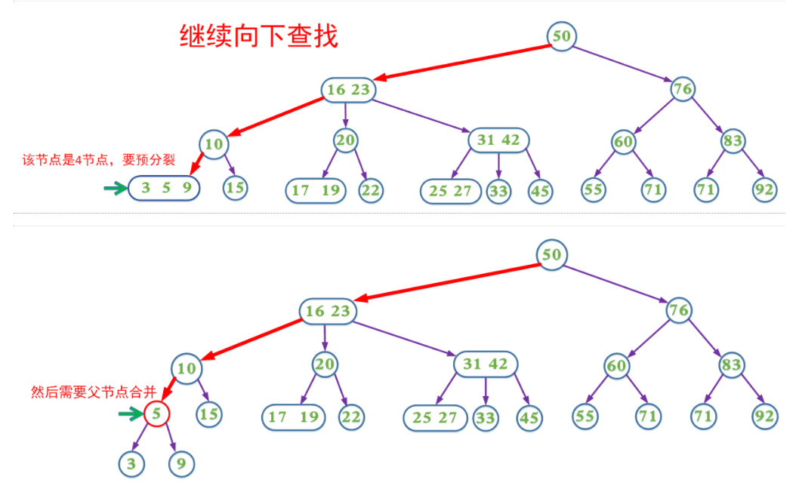

# 平衡查找树

虽然二叉查找树已经能很好地用于许多应用程序中，但它在最坏情况下的性能还是很糟糕。理想情况下我们希望保持二分查找树的平衡性，保证无论如何构造它，它的运行时间都是对数级别。

# 2-3查找树

一棵2-3查找树或为一棵空树，或由以下结点组成：

-   2-结点，含有一个键（以及其对应的值）和两条链接，左链接指向的2-3树中的键都小于该结点，右链接指向的2-3树的键都大于该结点

-   3-结点，含有两个键（以及其对应的值）和三条链接，左链接指向的2-3树中的键都小于该结点，中链接指向的2-3树中的键都位于该结点的两个键之间，右链接指向的2-3树的键都大于该结点

    

一棵完美平衡的2-3查找树中的所有空链接到根结点的距离应该是相同的。

## 查找

要判断一个键是否在树中，我们先将它和根结点中的键比较。如果它和其中任意一个相等，查找命中；否则我们就根据比较的结果找到指向相应区间的链接，并在其指向的子树中递归地继续查找。如果这是个空链接，查找未命中。

## 插入

向2-结点中插入新键：进行一次未命中查找，如果结束于一个2-结点，把这个2-结点替换为一个3-结点

向3-结点中插入新键：先临时将新键存入该结点中，使之成为一个4-结点，再将它转换为一棵由3个2-结点组成的2-3树


如果父节点因此变成了4-结点，也做同样的操作，就这样一直向上不断分解临时的4-结点并将中键插入更高层的父结点，直到遇到一个2-结点并将它替换为一个不需要继续分解的3-结点，或者是达到3-结点的根。

但是，这离真正的实现还有一段距离。尽管我们可以用不同的数据类型来表示2-结点和3-结点并写出交换所需的代码，但用这种直白的表示方式实现大多数操作并不方便，因为需要处理的情况实在太多（复制信息、数据类型转换等），额外开销可能会比标准二叉树更慢。

# 2-3版红黑树

红黑二叉查找树背后的基本思想是用标准的二叉查找树（完全由2-结点构成）和一些额外的信息（替换3-结点）。红链接将两个2-结点连接起来构成一个3-结点，黑链接则是2-3树中的普通链接。

红黑树另一种定义是含有红黑链接并满足下列条件的二叉查找树：

-   红链接均为左链接
-   没有任何一个结点同时和两条红链接相连
-   该树是完美黑色平衡的，即任意空链接到根结点的路径上的黑链接数量相同。


## 旋转

在某些操作中可能会出现红色右链接或者两条连续的红链接，旋转操作可以改变红链接的指向。

-   左旋转：将红色的右链接转化为左链接。接受一条指向红黑树中的某个结点的链接作为参数，返回一条链接（用来重置父结点中相应的链接，h = rotateLeft(h)）。如图，左旋转其实只是将两个键中的较小者作为根结点变为较大者作为根结点。
-   右旋转：将left和right互换即可

```java
private Node rotateLeft(Node h){
    Node x = h.right;
    h.right = x.left;
    x.left = h;
    x.color = h.color;
    h.color = RED;
    x.n = h.n;
    h.n = 1 + size(h.left) + size(h.right);
    return x;
}

private Node rotateRight(Node h){
    Node x = h.left;
    h.left = x.right;
    x.right = h;
    x.color = h.color;
    h.color = RED;
    x.n = h.n;
    h.n = 1 + size(h.left) + size(h.right);
    return x;
}
```


## 插入

在沿着插入点到根结点的路径向上移动时（通过h.left = put(..)和return h来向上移动）在所经过的每个结点中顺序完成一下操作，我们就能完成插入操作：

1.  如果右子结点是红色的而左子结点是黑色的，左旋转
2.  如果左子结点是红色的且它的左子结点也是红色的，右旋转
3.  如果左右子子结点均为红色，颜色转换


第一个if会将任意含有红色右链接的3-结点（或临时4-结点）左旋转，第二条if语句会将临时的4-结点中的两条连续红链接中的上层链接右旋转。第三条if进行颜色转换并将红链接向上传递。

```java
public void put(Key key, Value val) {
    root = put(root, key, val);
    root.color = BLACK;
}

private Node put(Node h, Key key, Value val) {
    if (h == null)
        // 插入的都是红色结点
        return new Node(key, val, 1, RED);
    int cmp = key.compareTo(h.key);
    if (cmp < 0)
        h.left = put(h.left, key, val);
    else if (cmp > 0)
        h.right = put(h.right, key, val);
    else
        h.val = val;
    if (isRed(h.right) && !isRed(h.left))
        h = rotateLeft(h);
    if (isRed(h.left) && isRed(h.left.left))
        h = rotateRight(h);
    if (!isRed(h.left) && !isRed(h.right))
        flipColors(h);
    h.n = size(h.left) + size(h.right) + 1;
    return h;
}
```


# 2-3-4树

参考文章：[2-3-4树](https://www.cnblogs.com/nullzx/p/6111175.html) （文章里的实现跟书上有点不一样，文章里允许红色右边链接）

2-3-4树是一种阶为4的B树。它是一种自平衡的数据结构，可以保证在O(lgn)的时间内完成查找、插入和删除操作。它主要满足以下性质：

（1）每个节点每个节点有1、2或3个key，分别称为2（孩子）节点，3（孩子）节点，4（孩子）节点。

（2）所有叶子节点到根节点的长度一致（也就是说叶子节点都在同一层）。

（3）每个节点的key从左到右保持了从小到大的顺序，两个key之间的子树中所有的

key一定大于它的父节点的左key，小于父节点的右key。


## 插入

### 插后分裂式

（1）如果2-3-4树中已存在当前插入的key，则插入失败，否则最终一定是在叶子节点中进行插入操作

（2）如果待插入的节点不是4节点，那么直接在该节点插入

（3）如果待插入的节点是个4节点，那么应该先分裂该节点然后再插入。一个4节点可以分裂成一个根节点和两个子节点（这三个节点各含一个key）然后在子节点中插入，我们把分裂形成的根节点中的key看成向上层插入的key，然后重复第2步和第3步。

### 预分裂式

由于在某些情况需要不断回溯来调整树的结构以达到平衡，所以可以使用预分裂。

思想：在插入的搜索路径中，遇到4节点就分裂，这样可以保证找到需要插入节点时可以直接插入（即该节点一定不是4节点）





## 预合并式删除最小键

从树底部的3-结点删除键是很简单的，直接删除即可，但2-结点则不然。从2-结点中删除一个键会留下一个空结点，如果替换成空链接，会影响树的完美平衡性。为了保证我们不会删除一个2-结点，沿着左链接向下（因为是删除最小键，最小键在最左边）进行变换，确保当前结点不是2-结点。

首先根结点有两种情况：

1.  如果根是2-结点且它的两个子结点都是2-结点，直接将这三个结点变成4-结点
2.  如果不是第一种情况，则需保证根结点的左子结点不是2-结点，如有必要可以从它右侧的兄弟结点“借”一个键。

如图，在沿着左链接向下的过程中，保证以下情况之一成立：

-   如果当前结点的左子结点不是2-结点，完成
-   如果当前结点的左子结点是2-结点而它的亲兄弟结点不是2-结点，将左子结点的兄弟结点中的一个键移动到左子结点中
-   如果当前结点的左子结点和它的亲兄弟结点都是2-结点，将父结点中的最小键和左子结点最近的兄弟结合合并为一个4-结点，使父结点由3-结点变为2-结点或者由4-结点变为3-结点


在遍历的过程执行这个过程，最后能得到一个含有最小键的3-结点或4-结点，然后将其删除。将3-结点变为2-结点，或者将4-结点变为3-结点，然后再往上分解临时4-结点

## 删除

### 删后合并式

（1）如果2-3-4树中不存在当前需要删除的key，则删除失败。

（2）如果当前需要删除的key不位于叶子节点上，则用后继key覆盖，然后在它后继

key所在的子支中删除该后继key。

（3）如果当前需要删除的key位于叶子节点上:

​    （3.1）该节点不是2节点，删除key，结束

​    （3.2）该节点是2节点，删除该节点：

​       （3.2.1）如果兄弟节点不是2节点，则父节点中的key下移到该节点，兄弟节点中的一个key上移

​       （3.2.2）如果兄弟节点是2节点，父节点是个3节点或4节点，父节点中的key与兄弟节点合并

​       （3.2.3）如果兄弟节点是2节点，父节点是个2节点，父节点中的key与兄弟节点中的key合并，形成一个3节点，把此节点看成当前节点（此节点实际上是下一层的节点），重复步骤3.2.1到3.2.3

### 预合并式

主要思想：在删除的搜索路径中（除根节点，因为根节点没有兄弟节点和父节点），遇到当前节点是2节点，

-   如果兄弟节点也是2节点就合并（该节点的父节点中的key下移，与自身和兄弟节点合并）；
-   如果兄弟节点不是2节点，则父节点的key下移，兄弟节点中的key上移。

这样可以保证，找到需要删除的key所在的节点时可以直接删除（即要删除的key所在的节点一定不是2节点）。


# 2-3-4版红黑树

2-3-4树和红黑树是完全等价的，由于绝大多数编程语言直接实现2-3-4树会非常繁琐，所以一般是通过实现红黑树来实现替代2-3-4树，而红黑树本也同样保证在O(lgn)的时间内完成查找、插入和删除操作。

红黑树是每个节点都带有颜色属性的平衡二叉查找树 ，颜色为红色或黑色。除了二叉查找树一般要求以外，对于任何有效的红黑树我们增加了如下的额外要求:

（1） 节点是要么红色或要么是黑色。

（2） 根一定是黑色节点。

（3） 每个叶子结点都带有两个空的黑色结点（称之为NIL节点，它又被称为黑哨兵）。

（4） 每个红色节点的两个子节点都是黑色（或者说从每个叶子到根的所有路径上不能有两个连续的红色节点）。

（5） 从任一节点到它所能到达得叶子节点的所有简单路径都包含相同数目的黑色节点。（For each node，all simple paths from the node to descendant leaves ... 是对于一个结点来说，他到其叶子结点的路径上有相同数目的黑色节点。不是说所有结点到其叶子结点的黑色结点数都相同的意思）

这些性质保证了**根节点到任意叶子节点的路径长度，最多相差一半**（因为路径上的黑色节点相等，差别只是不能相邻的红色节点个数），所以红黑树是一个基本平衡的二叉搜索树，它没有AVL树那么绝对平衡，但是同样的关键字组成的红黑树相比AVL旋转操作要少，而且删除操作也比AVL树效率更高，实际应用效果也比AVL树更出众。当然红黑树的具体实现也复杂的多

## 等价性

一颗红黑树对应唯一形态的2-3-4树，但是一颗2-3-4树可以对应多种形态的红黑树（主要是3节点可以对应两种不同的红黑树形态）


## 插入

### 插后分裂式

比2-3版多了个连续两个右红色链接的情况

### 预分裂式

要用红黑树实现这个算法，需要：

-   将4-结点表示为由三个2-结点组成的一棵平衡的子树，根结点和两个子结点都用红链接相连
-   在向下的过程中分解所有4-结点并进行颜色转换。如果根结点是4-结点，将他分成三个2结点，树高加一；如果遇到父结点为2结点的4结点，4-结点分解为两个2-结点并将中间键传递给它的父结点，父结点变成3-结点；如果遇到父结点为3-结点的4-结点，4-结点分解为两个2-结点并将中间键传递给它的父结点，父结点变成一个4结点。
-   向上的过程中利用旋转将4-结点配平（注：4结点可以存在，所有允许一个结点同时连接到两条链接）


只需要将flipColors()语句（及其if语句）移动到递归调用之前（null测试和比较操作之间）就可以实现2-3-4树中的插入操作。

flipColors：把自己变红=2-3-4树中的向上插入，把两个孩子变黑=变成2-3-4中的两个2-结点

```java
public void put(Key key, Value val) {
    root = put(root, key, val);
    root.color = BLACK;
}

private Node put(Node h, Key key, Value val) {
    if (h == null)
        return new Node(key, val, 1, RED);
    
    // 预分裂
    if (!isRed(h.left) && !isRed(h.right))
        flipColors(h);
    
    int cmp = key.compareTo(h.key);
    if (cmp < 0)
        h.left = put(h.left, key, val);
    else if (cmp > 0)
        h.right = put(h.right, key, val);
    else
        h.val = val;
    
    if (isRed(h.right) && !isRed(h.left))
        h = rotateLeft(h);
    if (isRed(h.left) && isRed(h.left.left))
        h = rotateRight(h);
    h.n = size(h.left) + size(h.right) + 1;
    return h;
}
```


## 预合并删除最小/大键

### 合并操作

```java
private Node moveRedLeft(Node h) {
    //假设结点h为红色，h.left和h.left都是黑色 => 当前是个3/4-结点，h.left是个2-结点
    //将h.left或h.left的子结点之一变红
    
    //h变成黑色，h.left变成红色，h.right变成红色
    flipColors(h);
    // 右孩子原来就是个3/4-结点。由于flipColors，h.right和h.right.left都是红色，需要变化
    if (isRed(h.right.left)) { 
        h.right = rotateRight(h.right);
        h = rotateLeft(h);
        flipColors(h);
    }
    return h;
}
```

左子是2-结点，右子也是2-结点，与父亲合并：

-16450507367641.png)

左子是2-结点，右子是3/4-结点，向兄弟借：

.png)

```java
	private Node moveRedRight(Node h) {
        //假设结点h为红色，h.right和h.right.left都是黑色
        //将h.right或h.right的子结点之一变红
        flipColors(h);
        if (isRed(h.left.left)) { 
            h = rotateRight(h);
            flipColors(h);
        }
        return h;
    }
```


### 删除最小键

```java
public void deleteMin() {
    if (isEmpty()) throw new NoSuchElementException("BST underflow");

    // if both children of root are black, set root to red
    // 肯定需要moveRedLeft了，为flipColors准备
    if (!isRed(root.left) && !isRed(root.right))
        root.color = RED;

    root = deleteMin(root);
    if (!isEmpty()) root.color = BLACK;
    // assert check();
}

private Node deleteMin(Node h) { 
    if (h.left == null)
        return null;
	// 左孩子是个2-结点，需要与合并
    if (!isRed(h.left) && !isRed(h.left.left))
        h = moveRedLeft(h)	;

    h.left = deleteMin(h.left);
    return balance(h);
}

private void flipColors(Node h) {
    h.color = !h.color;
    h.left.color = !h.left.color;
    h.right.color = !h.right.color;
}

private Node balance(Node h) {
    if (isRed(h.right) && !isRed(h.left))    h = rotateLeft(h);
    if (isRed(h.left) && isRed(h.left.left)) h = rotateRight(h);
    if (isRed(h.left) && isRed(h.right))     flipColors(h);

    h.size = size(h.left) + size(h.right) + 1;
    return h;
}
```

### 删除最大键

```java
    public void deleteMax() {
        if (isEmpty()) throw new NoSuchElementException("BST underflow");

        // if both children of root are black, set root to red
        if (!isRed(root.left) && !isRed(root.right))
            root.color = RED;

        root = deleteMax(root);
        if (!isEmpty()) root.color = BLACK;
    }

    private Node deleteMax(Node h) {
        // 当前结点是3/4-结点。如果当前结点是最大的话，不能直接删（会损失子树），需要rotateRight调整
        if (isRed(h.left))
            h = rotateRight(h);

        if (h.right == null)
            return null;
		// 右孩子是2-结点，需要预合并
        if (!isRed(h.right) && !isRed(h.right.left))
            h = moveRedRight(h);

        h.right = deleteMax(h.right);

        return balance(h);
    }    
```

## 删除

### 预合并式

```java
   public void delete(Key key) { 
        if (key == null) throw new IllegalArgumentException("argument to delete() is null");
        if (!contains(key)) return;

        // if both children of root are black, set root to red
        if (!isRed(root.left) && !isRed(root.right))
            root.color = RED;

        root = delete(root, key);
        if (!isEmpty()) root.color = BLACK;
    }

    private Node delete(Node h, Key key) { 
        if (key.compareTo(h.key) < 0)  {
            if (!isRed(h.left) && !isRed(h.left.left))
                h = moveRedLeft(h);
            h.left = delete(h.left, key);
        }
        else {
            if (isRed(h.left))
                h = rotateRight(h);
            if (key.compareTo(h.key) == 0 && (h.right == null))
                return null;
            if (!isRed(h.right) && !isRed(h.right.left))
                h = moveRedRight(h);
            if (key.compareTo(h.key) == 0) {
                Node x = min(h.right);
                h.key = x.key;
                h.val = x.val;
                h.right = deleteMin(h.right);
            }
            else h.right = delete(h.right, key);
        }
        return balance(h);
    }
```

