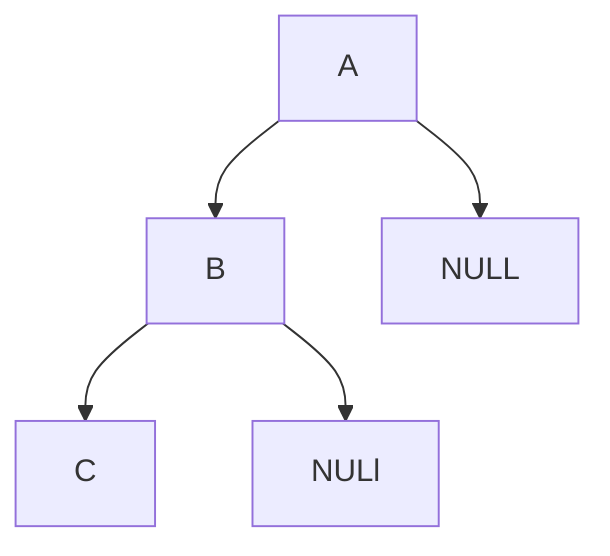
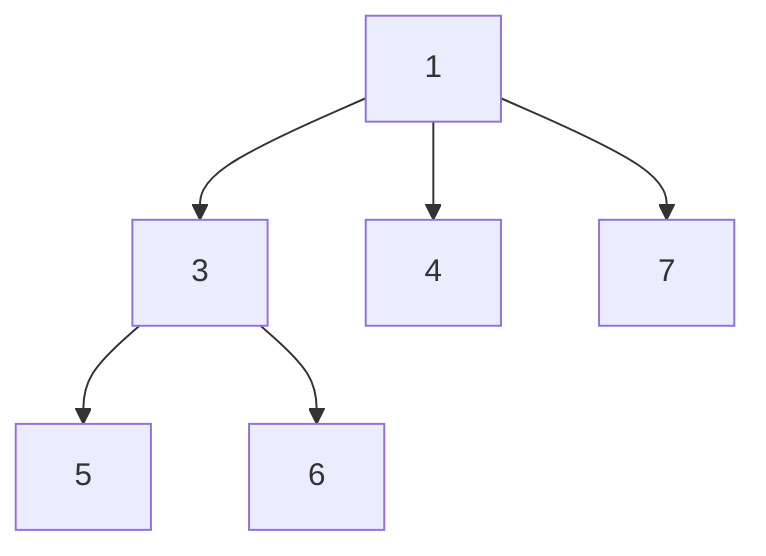
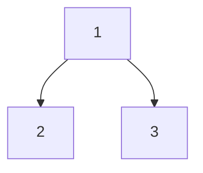
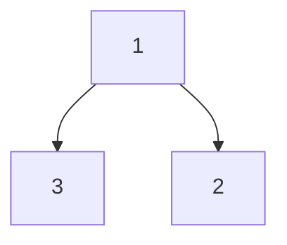
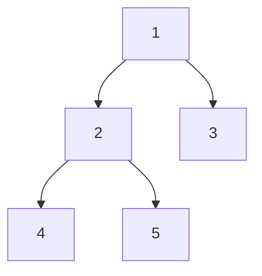

[toc]

# 树

## 二叉树的最大深度

>   给定一个二叉树，找出其最大深度。单节点的深度为1。

递归

```java
public int maxDepth(TreeNode root) {
    if (root == null){
        return 0;
    }
    return 1 + Math.max(maxDepth(root.left), maxDepth(root.right));
}
```

广度优先搜索

此时我们广度优先搜索的队列里存放的是「当前层的所有节点」。每次拓展下一层的时候，不同于广度优先搜索的每次只从队列里拿出一个节点，我们需要将队列里的所有节点都拿出来进行拓展，这样能保证每次拓展完的时候队列里存放的是当前层的所有节点，即我们是一层一层地进行拓展，最后我们用一个变量 ans 来维护拓展的次数，该二叉树的最大深度即为ans。

```java
public int maxDepth(TreeNode root) {
    if (root == null) {
        return 0;
    }
    Queue<TreeNode> queue = new LinkedList<TreeNode>();
    queue.offer(root);
    int ans = 0;
    while (!queue.isEmpty()) {
        int size = queue.size();
        while (size > 0) {
            TreeNode node = queue.poll();
            if (node.left != null) {
                queue.offer(node.left);
            }
            if (node.right != null) {
                queue.offer(node.right);
            }
            size--;
        }
        ans++;
    }
    return ans;
}
```

## 二叉树最小深度

不能直接Math.min(left,right)，这个的最小深度应该是3而不是1。




```java
public int minDepth(TreeNode root) {
        if(root == null) return 0;
        int m1 = minDepth(root.left);
        int m2 = minDepth(root.right);
        //1.如果左孩子和右孩子有为空的情况，直接返回m1+m2+1
        //2.如果都不为空，返回较小深度+1
        return root.left == null || root.right == null ? m1 + m2 + 1 : Math.min(m1,m2) + 1;
    }
```


## N叉树的最大深度

```java
// 节点定义
/*
class Node {
  public int val;
  public List<Node> children;

  public Node() {}

  public Node(int _val,List<Node> _children) {
    val = _val;
    children = _children;
  }
}
*/
public int maxDepth(Node root) {
    if (root == null) {
      return 0;
    } else if (root.children.isEmpty()) {
      return 1;  
    } else {
      List<Integer> heights = new LinkedList<>();
      for (Node item : root.children) {
        heights.add(maxDepth(item)); 
      }
      return Collections.max(heights) + 1;
    }
  }
```

## 递增顺序查找树

>   给你一个树，请你 按中序遍历 重新排列树，使树中最左边的结点现在是树的根，并且每个结点没有左子结点，只有一个右子结点。
>
>   示例 ：
>
>   输入：[5,3,6,2,4,null,8,1,null,null,null,7,9]
>     5
>       / \
>      3    6
>     / \    \
>    2   4    8
>   /        / \ 
>   1        7   9
>
>   输出：[1,null,2,null,3,null,4,null,5,null,6,null,7,null,8,null,9]
>
>   1
>   \
>     2
>      \
>       3
>        \
>         4
>          \
>           5
>            \
>             6
>              \
>               7
>                \
>                 8
>                  \
>                   9  

方法一：中序遍历 + 构造新的树
我们在树上进行中序遍历，就可以从小到大得到树上的节点。我们把这些节点的对应的值存放在数组中，它们已经有序。接着我们直接根据数组构件题目要求的树即可。

```java
public TreeNode increasingBST(TreeNode root) {
    List<Integer> vals = new ArrayList();
    inorder(root, vals);
    TreeNode ans = new TreeNode(0), cur = ans;
    for (int v: vals) {
        cur.right = new TreeNode(v);
        cur = cur.right;
    }
    return ans.right;
}

public void inorder(TreeNode node, List<Integer> vals) {
    if (node == null) return;
    inorder(node.left, vals);
    vals.add(node.val);
    inorder(node.right, vals);
}
```

方法二：中序遍历 + 更改树的连接方式
和方法一类似，我们在树上进行中序遍历，但会将树中的节点之间重新连接而不使用额外的空间。具体地，当我们遍历到一个节点时，把它的左孩子设为空，并将其本身作为上一个遍历到的节点的右孩子。

不修改方式可能会有环

```java
    TreeNode cur;
    public TreeNode increasingBST(TreeNode root) {
        TreeNode ans = new TreeNode(0);
        cur = ans;
        inorder(root);
        return ans.right;
    }

    public void inorder(TreeNode node) {
        if (node == null) return;
        inorder(node.left);
        node.left = null;
        cur.right = node;
        cur = node;
        inorder(node.right);
    }
```

## 二叉搜索树的第k大结点

>给定一棵二叉搜索树，请找出其中第k大的节点。
>
>输入: root = [5,3,6,2,4,null,null,1], k = 3
>5
>/ \
>3   6
>/ \
>2   4
>/
>1
>输出: 4

二叉搜索树的中序遍历为递增序列 , 中序遍历倒序 为递减序列。求 “二叉搜索树第 k大的节点” 可转化为求 “此树的中序遍历倒序的第 k 个节点”。

```java
// 打印中序遍历
void dfs(TreeNode root) {
    if(root == null) return;
    dfs(root.left); // 左
    System.out.println(root.val); // 根
    dfs(root.right); // 右
}

// 打印中序遍历倒序
void dfs(TreeNode root) {
    if(root == null) return;
    dfs(root.right); // 右
    System.out.println(root.val); // 根
    dfs(root.left); // 左
}
```

```java
    int ans = 0;
    int count = 0;
    int rank = 0;
    public int kthLargest(TreeNode root, int k) {
        rank = k;
        dfs(root);
        return ans;
    }
    private void dfs(TreeNode x){
        if (x == null) {
            return;
        }
        dfs(x.right);
        count++;
        if (count == rank){
            ans = x.val;
            return;
        }
        dfs(x.left);
    }
```

## N叉树的前序遍历

>   给定一个 N 叉树，返回其节点值的前序遍历。
>
>   输出：1 3 5 6 4 7




```java
/*
class Node {
    public int val;
    public List<Node> children;
    public Node() {}
    public Node(int _val) {
        val = _val;
    }
    public Node(int _val, List<Node> _children) {
        val = _val;
        children = _children;
    }
};
*/
	List<Integer> ans = new ArrayList<>();
    public List<Integer> preorder(Node root) {
        if (root == null) return ans;
        ans.add(root.val);
        for (Node x : root.children){
            preorder(x);
        }
        return ans;
    }
```

## 路径总和

>   给你二叉树的根节点 root 和一个表示目标和的整数 targetSum ，判断该树中是否存在 根节点到叶子节点 的路径，这条路径上所有节点值相加等于目标和 targetSum 。
>
>   叶子节点 是指没有子节点的节点。
>
>   输入：root，3
>
>   输出：true



使用广度优先搜索的方式，记录从根节点到当前节点的路径和，以防止重复计算。这样我们使用两个队列，分别存储将要遍历的节点，以及根节点到这些节点的路径和即可。

```java
    public boolean hasPathSum(TreeNode root, int targetSum) {
        if (root == null) return false;
        Queue<TreeNode> q = new LinkedList<>();
        Queue<Integer> vals = new LinkedList<>();
        q.offer(root);
        vals.offer(root.val);
        while (!q.isEmpty()){
            TreeNode node = q.poll();
            int a = vals.poll();
            if (node.left == null && node.right == null){
                if (a == targetSum) return true;
            }
            if (node.left != null){
                q.offer(node.left);
                vals.offer(node.left.val + a);
            }
            if (node.right != null){
                q.offer(node.right);
                vals.offer(node.right.val + a);
            }
        }
        return false;
    }
```

观察要求我们完成的函数，我们可以归纳出它的功能：询问是否存在从当前节点 root 到叶子节点的路径，满足其路径和为 sum。

假定从根节点到当前节点的值之和为 val，我们可以将这个大问题转化为一个小问题：是否存在从当前节点的子节点到叶子的路径，满足其路径和为 sum - val。

不难发现这满足递归的性质，若当前节点就是叶子节点，那么我们直接判断 sum 是否等于 val 即可（因为路径和已经确定，就是当前节点的值，我们只需要判断该路径和是否满足条件）。若当前节点不是叶子节点，我们只需要递归地询问它的子节点是否能满足条件即可。

```java
public boolean hasPathSum(TreeNode root, int sum) {
    if (root == null) {
        return false;
    }
    if (root.left == null && root.right == null) {
        return sum == root.val;
    }
    return hasPathSum(root.left, sum - root.val) || hasPathSum(root.right, sum - root.val);
}
```

## 从根到叶的二进制数之和

>   给出一棵二叉树，其上每个结点的值都是 0 或 1 。每一条从根到叶的路径都代表一个从最高有效位开始的二进制数。例如，如果路径为 0 -> 1 -> 1 -> 0 -> 1，那么它表示二进制数 01101，也就是 13 。
>
>   对树上的每一片叶子，我们都要找出从根到该叶子的路径所表示的数字。
>
>   返回这些数字之和。题目数据保证答案是一个 32 位 整数。
>
>   输入：root = [1,0,1,0,1,0,1]
>   输出：22
>   解释：(100) + (101) + (110) + (111) = 4 + 5 + 6 + 7 = 22

BFS:

```java
public int sumRootToLeaf(TreeNode root) {
    if(root == null){
        return 0;
    }
    int res = 0;
    Queue<TreeNode> nodeQueue = new LinkedList<>();
    Queue<Integer> queue = new LinkedList<>();
    nodeQueue.add(root);
    queue.add(root.val);
    while(!nodeQueue.isEmpty()){
        // 同时维护两个队列
        TreeNode node = nodeQueue.poll();
        int tmp = queue.poll();

        // 如果该节点是叶子节点，加到res中
        if(node.left==null && node.right==null){
            res += tmp;
        } else {
            // 左节点不为空时，左节点进入队列，左节点对应的值是当前节点tmp<<1+node.left.val
            if(node.left != null){
                nodeQueue.add(node.left);
                queue.add((tmp<<1) + node.left.val);
            }
            if(node.right != null){
                nodeQueue.add(node.right);
                queue.add((tmp<<1) + node.right.val);
            }
        }
    }
    return res;
} 

```

DFS

```java
int res = 0;
public int sumRootToLeaf(TreeNode root){
    preOrder(root,0);
    return res;
}
public void preOrder(TreeNode root, int val){
    if(root != null){
        // 值先移位，后相加
        int tmp = (val<<1) + root.val;
            
        // 当前节点是叶子节点
        if(root.left == null && root.right == null){
            res += tmp;
        } else {
            // 当前节点的左子节点不为空，继续递归，val的值是父节点的值，也就是tmp
            if(root.left != null){
                preOrder(root.left, tmp);
            }
            if(root.right != null){
                preOrder(root.right, tmp);
            }
        }
    }
}

```


## 叶子相似的树

>   请考虑一棵二叉树上所有的叶子，这些叶子的值按从左到右的顺序排列形成一个叶值序列 。如果有两棵二叉树的叶值序列是相同，那么我们就认为它们是叶相似的。
>
>   输入：root1 = [1,2,3], root2 = [1,3,2]
>   输出：false




```java
    public boolean leafSimilar(TreeNode root1, TreeNode root2) {
        ArrayList<Integer> a1 = new ArrayList<>();
        ArrayList<Integer> a2 = new ArrayList<>();
        dfs(root1,a1);
        dfs(root2,a2);
        return a1.equals(a2);
    }

    private void dfs(TreeNode x, ArrayList<Integer> arr){
        if (x==null) return;
        if (x.left == null && x.right == null){
            arr.add(x.val);
        }
        dfs(x.left, arr);
        dfs(x.right, arr);
    }
```

## 二叉树直径

>   给定一棵二叉树，你需要计算它的直径长度。一棵二叉树的直径长度是任意两个结点路径长度中的最大值。这条路径可能穿过也可能不穿过根结点。
>
>   下面这个例子返回3，它的长度是路径 [4,2,1,3] 或者 [5,2,1,3]。	



任意一条路径均可以被看作由某个节点为起点，从其左儿子和右儿子向下遍历的路径拼接得到

```java
class Solution {
    int maxd = 0;
    public int diameterOfBinaryTree(TreeNode root) {
        depth(root);
        return maxd;
    }
    public int depth(TreeNode node){
        if(node == null){
            return 0;
        }
        int Left = depth(node.left);
        int Right = depth(node.right);
        maxd = Math.max(Left + Right, maxd);//将每个节点最大直径(左子树深度+右子树深度)当前最大值比较并取大者
        return Math.max(Left, Right) + 1;//返回节点深度
    }
}
```

//单结点（例如4）会返回深度1，因为是相较于父结点（例如2）的深度

## 对称的二叉树

>   请实现一个函数，用来判断一棵二叉树是不是对称的。如果一棵二叉树和它的镜像一样，那么它是对称的。
>
>   对称[1,2,2,3,4,4,3]：
>
>   ​     1
>      /    \
>     2     2
>    / \   /  \
>   3 4 4   3
>
>   不对称 [1,2,2,null,3,null,3]：
>
>     1
>     / \
>    2  2
>     \    \
>     3    3

法一：递归

对称二叉树定义： 对于树中任意两个对称节点 L 和 R ，一定有：

-   L.val = R.val ：即此两对称节点值相等。
-   L.left.val = R.right.val ：即 L 的 左子节点 和 R 的 右子节点 对称；
-   L.right.val =R.left.val ：即 L 的 右子节点 和 R 的 左子节点 对称

```java
class Solution {
    public boolean isSymmetric(TreeNode root) {
        return root == null ? true : recur(root.left, root.right);
    }
    boolean recur(TreeNode L, TreeNode R) {
        if(L == null && R == null) return true;
        if(L == null || R == null || L.val != R.val) return false;
        return recur(L.left, R.right) && recur(L.right, R.left);
    }
}
```

法二：BFS一层层检查是否对称

```java
class Solution {
    public boolean isSymmetric(TreeNode root) {
        ArrayList<TreeNode> arr = new ArrayList<>();
        if (root != null) arr.add(root);
        while (!arr.isEmpty()) {
            int len = arr.size();
            for (int i =0; i < len; i++) {
                TreeNode tmp = arr.remove(0);
                if (tmp != null) {
                    //需要把null也加入进arr中（因为不加的话，相对位置是错的，见情况二）
                    arr.add(tmp.left);
                    arr.add(tmp.right);
                }
            }
            for (int j = 0; j < arr.size()/2; j++) {
                //检查是否为null
                if (arr.get(j)==null || arr.get(arr.size()-j-1) == null) {
                    if (arr.get(j) != arr.get(arr.size()-j-1)) {
                        return false;
                    }
                    continue;
                }
                else if (arr.get(j).val != arr.get(arr.size()-j-1).val) {
                    return false;
                }
            }
        }
        return true;
    }
}
```

## 合并二叉树

>   给定两个二叉树，想象当你将它们中的一个覆盖到另一个上时，两个二叉树的一些节点便会重叠。
>
>   你需要将他们合并为一个新的二叉树。合并的规则是如果两个节点重叠，那么将他们的值相加作为节点合并后的新值，否则不为 NULL 的节点将直接作为新二叉树的节点。
>
>   输入: 
>             1                         2 
>            / \                       / \ 
>           3   2                    1   3
>          /                           \     \ 
>         5                             4   7 
>   输出: 
>   合并后的树:
>   	     3
>   	    / \
>   	   4   5
>   	  / \   \ 
>   	 5   4   7

使用深度优先搜索合并两个二叉树。从根节点开始同时遍历两个二叉树，并将对应的节点进行合并。

两个二叉树的对应节点可能存在以下三种情况，对于每种情况使用不同的合并方式。

-   如果两个二叉树的对应节点都为空，则合并后的二叉树的对应节点也为空；

-   如果两个二叉树的对应节点只有一个为空，则合并后的二叉树的对应节点为其中的非空节点；

-   如果两个二叉树的对应节点都不为空，则合并后的二叉树的对应节点的值为两个二叉树的对应节点的值之和，此时需要显性合并两个节点。

```java
class Solution {
    public TreeNode mergeTrees(TreeNode t1, TreeNode t2) {
        if (t1 == null) {
            return t2;
        }
        if (t2 == null) {
            return t1;
        }
        TreeNode merged = new TreeNode(t1.val + t2.val);
        merged.left = mergeTrees(t1.left, t2.left);
        merged.right = mergeTrees(t1.right, t2.right);
        return merged;
    }
}
```

BFS迭代：

只要两颗树的左节点都不为 null，就把将他们放入队列中；同理只要两棵树的右节点都不为 null 了，也将他们放入队列中。
然后我们不断的从队列中取出节点，把他们相加。
如果出现 树 1 的 left 节点为 null，树 2 的 left 不为 null，直接将树 2 的 left 赋给树 1 就可以了；同理如果树 1 的 right 节点为 null，树 2 的不为 null，将树 2 的 right 节点赋给树 1。

```java
class Solution {
	public TreeNode mergeTrees(TreeNode t1, TreeNode t2) {
	//如果 t1和t2中，只要有一个是null，函数就直接返回
		if(t1==null || t2==null) {
			return t1==null? t2 : t1;
		}
		java.util.LinkedList<TreeNode> queue = new java.util.LinkedList<TreeNode>();
		queue.add(t1);
		queue.add(t2);
		while(queue.size()>0) {
			TreeNode r1 = queue.remove();
			TreeNode r2 = queue.remove();
			r1.val += r2.val;
			//如果r1和r2的左子树都不为空，就放到队列中
			//如果r1的左子树为空，就把r2的左子树挂到r1的左子树上
			if(r1.left!=null && r2.left!=null){
				queue.add(r1.left);
				queue.add(r2.left);
			}
			else if(r1.left==null) {
				r1.left = r2.left;
			}
			//对于右子树也是一样的
			if(r1.right!=null && r2.right!=null) {
				queue.add(r1.right);
				queue.add(r2.right);
			}
			else if(r1.right==null) {
				r1.right = r2.right;
			}
		}
		return t1;
	}
}
```

## 修剪二叉搜索树

>   给你二叉搜索树的根节点 root ，同时给定最小边界low 和最大边界 high。通过修剪二叉搜索树，使得所有节点的值在[low, high]中。修剪树不应该改变保留在树中的元素的相对结构（即，如果没有被移除，原有的父代子代关系都应当保留）。 可以证明，存在唯一的答案。
>
>   所以结果应当返回修剪好的二叉搜索树的新的根节点。注意，根节点可能会根据给定的边界发生改变。

当node.val > R，那么修剪后的二叉树必定出现在节点的左边。

类似地，当node.val < L，那么修剪后的二叉树出现在节点的右边。否则，我们将会修剪树的两边。

```java
class Solution {
    public TreeNode trimBST(TreeNode root, int L, int R) {
        if (root == null) return root;
        //如果数字比high大,就把右节点全部裁掉，继续看左节点的剪裁情况
        if (root.val > R) return trimBST(root.left, L, R);
        //节点数字比low小,就把左节点全部裁掉，继续看右节点的剪裁情况
        if (root.val < L) return trimBST(root.right, L, R);
		//如果数字在区间内,就去裁剪左右子节点
        root.left = trimBST(root.left, L, R);
        root.right = trimBST(root.right, L, R);
        return root;
    }
}
```

