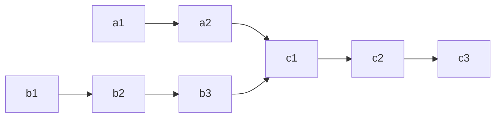

[toc]

# 链表

## 链表中的倒数第k个结点

>   输入一个链表，输出该链表中倒数第k个节点。为了符合大多数人的习惯，本题从1开始计数，即链表的尾节点是倒数第1个节点。例如，一个链表有6个节点，从头节点开始，它们的值依次是1、2、3、4、5、6。这个链表的倒数第3个节点是值为4的节点。
>
>   
>
>   示例：
>
>   给定一个链表: 1->2->3->4->5, 和 k = 2.
>
>   返回链表 4->5.

双指针：first指针在second指针前k个位置，当first为null时，返回second指针

```java
    public ListNode getKthFromEnd(ListNode head, int k) {
        ListNode first = head;
        ListNode second = head;
        while(k-- > 0){
            first = first.next;
        }
        while(first != null){
            first = first.next;
            second = second.next;
        }
        return second;
    }
```

## 环形链表

>   给定一个链表，判断链表中是否有环。
>
>   如果链表中有某个节点，可以通过连续跟踪 `next` 指针再次到达，则链表中存在环。
>
>   如果链表中存在环，则返回 `true` 。 否则，返回 `false` 。

本方法需要读者对「Floyd 判圈算法」（又称龟兔赛跑算法）有所了解。

假想「乌龟」和「兔子」在链表上移动，「兔子」跑得快，「乌龟」跑得慢。当「乌龟」和「兔子」从链表上的同一个节点开始移动时，如果该链表中没有环，那么「兔子」将一直处于「乌龟」的前方；如果该链表中有环，那么「兔子」会先于「乌龟」进入环，并且一直在环内移动。等到「乌龟」进入环时，由于「兔子」的速度快，它一定会在某个时刻与乌龟相遇，即套了「乌龟」若干圈。

我们可以根据上述思路来解决本题。具体地，我们定义两个指针，一快一满。慢指针每次只移动一步，而快指针每次移动两步。初始时，慢指针在位置 head，而快指针在位置 head.next。这样一来，如果在移动的过程中，快指针反过来追上慢指针，就说明该链表为环形链表。否则快指针将到达链表尾部，该链表不为环形链表。

```java
public class Solution {
    public boolean hasCycle(ListNode head) {
        if (head == null || head.next == null) {
            return false;
        }
        ListNode slow = head;
        ListNode fast = head.next;
        while (slow != fast) {
            if (fast == null || fast.next == null) {
                return false;
            }
            slow = slow.next;
            fast = fast.next.next;
        }
        return true;
    }
}
```

## 反转链表

>   输入: 1->2->3->4->5->NULL
>   输出: 5->4->3->2->1->NULL

### 链表栈法

x按顺序遍历原链表，把元素用头插入的方式插入reverseHead

```java
/**
 * Definition for singly-linked list.
 * public class ListNode {
 *     int val;
 *     ListNode next;
 *     ListNode() {}
 *     ListNode(int val) { this.val = val; }
 *     ListNode(int val, ListNode next) { this.val = val; this.next = next; }
 * }
 */
    public ListNode reverseList(ListNode head) {
        ListNode reverseHead = null;
        for (ListNode x = head; x != null; x = x.next){
            reverseHead = new ListNode(x.val, reverseHead);
        }
        return reverseHead;
    }
```

### 迭代

三个指针prev，curr，next

```java
    public ListNode reverseList(ListNode head) {
        ListNode prev = null;
        ListNode curr = head;
        while (curr != null) {
            ListNode next = curr.next;
            curr.next = prev;
            prev = curr;
            curr = next;
        }
        return prev;
    }
```

### 递归

递归到尾结点，他是新头结点，每次都return他并且修改指针（希望$x_{k+1}$指向$x_k$：$x_k.next.next = x_k$）

正序倒二.next.next = 倒二

正序倒二.next = null;

```java
    public ListNode reverseList(ListNode head) {
        if (head == null || head.next == null) {
            return head;
        }
        ListNode newHead = reverseList(head.next);
        head.next.next = head;
        head.next = null;
        return newHead;
    }
```

## 合并链表

>   输入两个递增排序的链表，合并这两个链表并使新链表中的节点仍然是递增排序的。
>
>   示例1：
>
>   输入：1->2->4, 1->3->4
>   输出：1->1->2->3->4->4

这种做法会修改原先的链表l1，l2

```java
public ListNode mergeTwoLists(ListNode l1, ListNode l2) {
    ListNode dum = new ListNode(0), cur = dum;
    while(l1 != null && l2 != null) {
        if(l1.val < l2.val) {
            cur.next = l1;
            l1 = l1.next;
        }
        else {
            cur.next = l2;
            l2 = l2.next;
        }
        cur = cur.next;
    }
    cur.next = l1 != null ? l1 : l2;	//单边补全
    return dum.next;
}
```

递归写法：

```java
public ListNode mergeTwoLists(ListNode l1, ListNode l2) {
    if (l1 == null) {
        return l2;
    } else if (l2 == null) {
        return l1;
    } else if (l1.val < l2.val) {
        l1.next = mergeTwoLists(l1.next, l2);
        return l1;
    } else {
        l2.next = mergeTwoLists(l1, l2.next);
        return l2;
    }

}
```

这种不会修改

```java
 public ListNode mergeTwoLists(ListNode l1, ListNode l2) {
        ListNode p = new ListNode(0);
        ListNode head = p;
        while (l1 != null || l2 != null) {
            if (l1 == null) {
                p.next = new ListNode(l2.val);
                p = p.next;
                l2 = l2.next;
            } else if (l2 == null) {
                p.next = new ListNode(l1.val);
                p = p.next;
                l1 = l1.next;
            } else if (l1.val < l2.val) {
                p.next = new ListNode(l1.val);
                p = p.next;
                l1 = l1.next;
            } else {
                p.next = new ListNode(l2.val);
                p = p.next;
                l2 = l2.next;
            }
        }
        return head.next;
    }
```

## 回文链表

>   请判断一个链表是否为回文链表。
>
>   示例 1:
>
>   输入: 1->2
>   输出: false
>
>   示例 2:
>
>   输入: 1->2->2->1
>   输出: true

法一：

反转链表，一个一个遍历比值

```java
public boolean isPalindrome(ListNode head) {
    ListNode reverseHead = null;
    for (ListNode x = head; x != null; x = x.next){
        reverseHead = new ListNode(x.val, reverseHead);
    }
    for (ListNode x = head; x != null; x = x.next, reverseHead = reverseHead.next){
        if (x.val != reverseHead.val){
            return false;
        }
    }
    return true;
}
```

法二：

currentNode 指针是先到尾节点，由于递归的特性再从后往前进行比较。frontPointer 是递归函数外的指针。若 currentNode.val != frontPointer.val 则返回 false。反之，frontPointer 向前移动并返回 true。

```java
    private ListNode frontPointer;

    private boolean recursivelyCheck(ListNode currentNode) {
        if (currentNode != null) {
            if (!recursivelyCheck(currentNode.next)) {
                return false;
            }
            if (currentNode.val != frontPointer.val) {
                return false;
            }
            frontPointer = frontPointer.next;
        }
        return true;
    }

    public boolean isPalindrome(ListNode head) {
        frontPointer = head;
        return recursivelyCheck(head);
    }

```

法三：

整个流程可以分为以下五个步骤：

1.  找到前半部分链表的尾节点。
2.  反转后半部分链表。
3.  判断是否回文。
4.  恢复链表。
5.  返回结果。

可以使用快慢指针在一次遍历中找到：慢指针一次走一步，快指针一次走两步，快慢指针同时出发。当快指针移动到链表的末尾时，慢指针恰好到链表的中间。通过慢指针将链表分为两部分。

若链表有奇数个节点：1-2-3-2-1 slow会在3停下

若链表有偶数个节点：1-2-4-4-2-1 slow会在4停下

```java
public boolean isPalindrome(ListNode head) {
        if (head == null) {
            return true;
        }

        // 找到前半部分链表的尾节点并反转后半部分链表
        ListNode firstHalfEnd = endOfFirstHalf(head);
        ListNode secondHalfStart = reverseList(firstHalfEnd.next);

        // 判断是否回文
        ListNode p1 = head;
        ListNode p2 = secondHalfStart;
        boolean result = true;
        while (result && p2 != null) {
            if (p1.val != p2.val) {
                result = false;
            }
            p1 = p1.next;
            p2 = p2.next;
        }        

        // 还原链表并返回结果
        firstHalfEnd.next = reverseList(secondHalfStart);
        return result;
    }

    private ListNode reverseList(ListNode head) {
        ListNode prev = null;
        ListNode curr = head;
        while (curr != null) {
            ListNode nextTemp = curr.next;
            curr.next = prev;
            prev = curr;
            curr = nextTemp;
        }
        return prev;
    }

    private ListNode endOfFirstHalf(ListNode head) {
        ListNode fast = head;
        ListNode slow = head;
        while (fast.next != null && fast.next.next != null) {
            fast = fast.next.next;
            slow = slow.next;
        }
        return slow;
    }

```

## 相交链表

>   给你两个单链表的头节点 headA 和 headB ，请你找出并返回两个单链表相交的起始节点。如果两个链表没有交点，返回 null。题目数据保证整个链式结构中不存在环。
>
>   图示两个链表在c1相交



使用双指针的方法，可以将空间复杂度降至 O(1)O(1)。

只有当链表 headA 和 headB 都不为空时，两个链表才可能相交。因此首先判断链表 headA 和 headB 是否为空，如果其中至少有一个链表为空，则两个链表一定不相交，返回 null。

当链表 headA 和 headB 都不为空时，创建两个指针pA 和 pB，初始时分别指向两个链表的头节点 headA 和 headB，然后将两个指针依次遍历两个链表的每个节点。具体做法如下：

-   每步操作需要同时更新指针 pA 和 pB；

-   如果指针 pA 不为空，则将指针 pA 移到下一个节点；如果指针 pB 不为空，则将指针 pB 移到下一个节点。

-   如果指针 pA 为空，则将指针 pA 移到链表 headB 的头节点；如果指针 pB 为空，则将指针 pB 移到链表 headA 的头节点。

-   当指针 pA 和 pB 指向同一个节点或者都为空时，返回它们指向的节点或者 null。

证明

下面提供双指针方法的正确性证明。考虑两种情况，第一种情况是两个链表相交，第二种情况是两个链表不相交。

情况一：两个链表相交

链表 headA 和 headB 的长度分别是 m 和 n。假设链表 headA 的不相交部分有 a 个节点，链表 headB 的不相交部分有 b 个节点，两个链表相交的部分有 c 个节点，则有 a+c=m，b+c=n。

-   如果 a=b，则两个指针会同时到达两个链表相交的节点，此时返回相交的节点；

-   如果 a 不等于 b, 则指针 pA 会遍历完链表 headA，指针 pB 会遍历完链表 headB，两个指针不会同时到达链表的尾节点，然后指针 pA 移到链表 headB 的头节点，指针 pB 移到链表 headA 的头节点，然后两个指针继续移动，在指针 pA 移动了 a+c+b 次、指针 pB 移动了 b+c+a 次之后，两个指针会同时到达两个链表相交的节点，该节点也是两个指针第一次同时指向的节点，此时返回相交的节点。

情况二：两个链表不相交

链表 headA 和 headB 的长度分别是 m 和 n。考虑当 m=n和 m 不等于 n 时，两个指针分别会如何移动：

-   如果 m=n，则两个指针会同时到达两个链表的尾节点，然后同时变成空值 null，此时返回 null；

-   如果 m 不等于 n，则由于两个链表没有公共节点，两个指针也不会同时到达两个链表的尾节点，因此两个指针都会遍历完两个链表，在指针 pA 移动了 m+n 次、指针 pB 移动了 n+m 次之后，两个指针会同时变成空值 null，此时返回 null。

```java
public class Solution {
    public ListNode getIntersectionNode(ListNode headA, ListNode headB) {
        if (headA == null || headB == null) {
            return null;
        }
        ListNode pA = headA, pB = headB;
        while (pA != pB) {
            pA = pA == null ? headB : pA.next;
            pB = pB == null ? headA : pB.next;
        }
        return pA;
    }
}
```

第二种思路是先让两个链表剩余长度相同，然后同步遍历

```java
public class Solution {
    private int getLength(ListNode node) {
        int l = 0;
        while (node != null) {
            node = node.next;
            l++;
        }
        return l;
    }
    
    public ListNode getIntersectionNode(ListNode headA, ListNode headB) {
        if (headA == null || headB == null) {
            return null;
        }
        int ALen = getLength(headA);
        int BLen = getLength(headB);
        //让两个链表剩余长度相同
        if (ALen > BLen) {
            for (int i = 0; i < ALen - BLen; i++) {
                headA = headA.next;
            }
        } else {
            for (int i = 0; i < BLen - ALen; i++) {
                headB = headB.next;
            }
        }
        //同步遍历，遇到一样地址的直接返回
        while (headA != null && headB != null) {
            if (headA == headB) {
                return headA;
            }
            headA = headA.next;
            headB = headB.next;
        }
        return null;
    }
}
```

